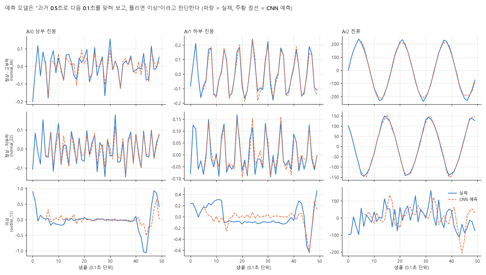
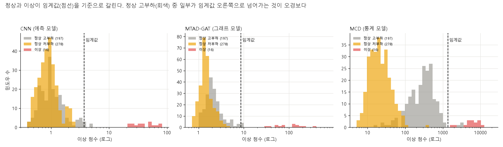

# 우리가 가진 모델 9종 입문서 — 원리, 강점·약점, 그리고 설계에 쓰는 법

> 이 문서의 목적: 모델을 잘 모르는 사람도 "어떤 모델이 어떻게 이상을 판단하고, 우리 데이터에서 뭘 잘하고 못하는지"를 이해한 뒤 다음 기법(앙상블·오경보 줄이기)을 설계할 수 있게 한다.
> 수치는 `results/24~26_*/cv_scores.csv`(2초 윈도우, group_kfold_seg + time_block, 시드·fold 평균)에서 가져왔다. 새로 계산한 것은 §6의 오경보 겹침뿐이다.

---

## 1. 모든 모델이 하는 일은 같다

```
센서 신호 (진동 2 + 전류 1) ──▶ [ 모델 ] ──▶ 이상 점수 ──▶ 임계값보다 크면 "경보"
```

- 모델은 **정상 데이터만** 보고 학습한다. "정상은 이렇게 생겼다"를 배우고, 거기서 얼마나 벗어났는지를 점수로 낸다.
- 임계값은 학습용 정상 점수의 **상위 1% 지점**(q99)이다. 정상 100개 중 1개 정도는 일부러 경보를 허용하는 선이다.
- 달라지는 건 **"벗어난 정도"를 재는 방법** 하나뿐이다. 그 방법에 따라 세 계열로 나뉜다.

| 계열 | 쉽게 말하면 | 모델 |
|---|---|---|
| **예측 계열** | "다음 0.1초를 맞혀 보고, 많이 틀리면 이상" | CNN, LSTM-AD |
| **그래프 계열** | 예측 계열 + "센서끼리의 관계도 같이 본다" | MTAD-GAT, GDN |
| **통계 계열** | "정상 데이터 무리의 한복판에서 얼마나 멀리 떨어졌나" | MCD, OCSVM, HBOS, COPOD, DeepSVDD |

---

## 2. 예측 계열: "다음을 맞혀 보고 틀리면 이상"



**원리.** 과거 0.5초(5샘플)를 보고 다음 0.1초 값을 예측한다. 파랑이 실제, 주황 점선이 예측이다.

- **정상(위 두 행)**: 전류가 깨끗한 사인파라서 예측이 거의 겹친다. 진동은 불규칙하지만 AI1 하부 진동은 규칙적으로 출렁여서 대체로 맞힌다.
- **이상(맨 아래 행)**: 예측이 크게 어긋난다. 이상 세그먼트는 갑자기 −1.0까지 떨어지는 스파이크가 있고, 전류는 사인 모양이 아예 사라졌다.
- 점수 = 예측이 틀린 정도(오차)를 정상 때의 오차로 나눈 값. 정상이면 1 안팎, 이상이면 수십 배.

**왜 이상을 잘 잡나.** 정상 전류는 거의 완벽한 0.6 Hz 사인파다(R² 0.9965). 그래서 예측이 쉽고, 파형이 조금만 깨져도 오차가 눈에 띈다.

| 모델 | 구조 | 특징 |
|---|---|---|
| **CNN (DeepAnT)** | 합성곱 2층 → 다음 값 | 가장 가볍고 빠름(4초/fold), 스파이크·전류에 강함 |
| **LSTM-AD** | LSTM 2층 → 다음 값 | 시간 순서를 기억하는 구조, 진폭 증가에 상대적으로 강함 |

---

## 3. 그래프 계열: "센서끼리의 관계도 본다"

예측 계열과 같지만, 세 센서를 서로 연결된 그래프로 놓고 "이 센서가 변하면 저 센서도 이렇게 변한다"는 관계를 attention으로 학습한다.

| 모델 | 구조 | 점수 |
|---|---|---|
| **MTAD-GAT** | 센서 간 그래프 + 시점 간 그래프 + GRU, 예측 + 복원을 함께 학습 | 예측 오차 + 복원 오차 |
| **GDN** | 센서마다 임베딩을 두고 이웃 센서 정보로 각 센서의 다음 값을 예측 | 센서별 오차 중 **최댓값** |

기대는 "상·하부 진동이 반대로 움직이는(시소) 이상"을 더 잘 잡는 것이었지만, 실제로는 CNN과 거의 같았다(반대 흔들림 탐지율 MTAD-GAT 0.152 vs CNN 0.161). 센서가 3개뿐이라 관계 학습의 이득이 작았다.

---

## 4. 통계 계열: "정상 무리에서 얼마나 멀리 떨어졌나"

이 계열은 신호를 직접 보지 않고, 윈도우 하나를 숫자 18개로 요약한(진폭·첨도·피크 등) **피처**를 입력으로 받는다. 정상 윈도우가 이 18차원 공간에 무리를 이루고, 그 무리에서 멀수록 이상이다.

| 모델 | 거리를 재는 방식 | 우리 결과의 성격 |
|---|---|---|
| **MCD** | 정상 무리의 모양(타원)을 강건하게 추정해 그 타원 기준 거리(마할라노비스) | **오경보 최저**, 고부하·저부하를 따로 학습, 약한 이상엔 약함 |
| OCSVM | 정상 무리를 감싸는 경계면을 학습 | 약한 이상 탐지는 좋지만 오경보 많음, 점수가 포화됨 |
| HBOS | 피처마다 히스토그램으로 따로 보고 합침 | 피처 간 관계를 못 봄 |
| COPOD | 피처마다 꼬리 확률을 따로 보고 합침 | 오경보 최저 수준이나 놓치는 이상 있음 |
| DeepSVDD | 신호 윈도우를 신경망으로 압축해 중심점에서의 거리 | 상·하부 반대 흔들림에 가장 강함, 전체적으로 불안정 |

**MCD가 특별한 이유.** 아래 그림에서 MCD(오른쪽)는 정상 고부하(회색)와 정상 저부하(노랑)를 **서로 다른 덩어리로 인식**한다. 고부하가 저부하보다 점수가 10배 이상 크지만, 둘 다 임계값 왼쪽에 머문다. 예측 모델(왼쪽·가운데)은 둘이 뒤섞여 있어서, 고부하의 꼬리가 임계값을 넘는다.

---

## 5. 점수가 임계값에서 얼마나 떨어져 있나



- 세 모델 모두 이상(빨강)이 임계값(점선) 오른쪽에 **확실히 떨어져** 있다. 실제 이상은 어느 모델이든 잘 잡힌다.
- 문제는 **회색(정상 고부하)의 꼬리**다. 예측 모델은 회색 일부가 임계값을 넘는다 = 오경보.
- MCD는 회색과 노랑이 분리돼 있지만 둘 다 임계값 안쪽이라 오경보가 거의 없다.

---

## 6. 모델별 성적표 (2초 윈도우, 시드·fold 평균)

| 모델 | AUC | 오경보 (샘플) | 오경보 (세그먼트) | 고부하 FP | 저부하 FP | 약한 이상 탐지 | 소요/fold |
|---|---|---|---|---|---|---|---|
| CNN (DeepAnT) | 1.000 | 1.2% | 2.4% | 2.7% | 0.0% | **0.308** | 4초 |
| MTAD-GAT | 1.000 | 1.3% | 2.4% | 3.0% | 0.0% | 0.306 | 13초 |
| LSTM-AD | 1.000 | 1.2% | 2.2% | 2.9% | 0.0% | 0.289 | 8초 |
| GDN | 0.999 | 1.3% | 3.6% | 3.0% | 0.0% | 0.246 | 4초 |
| OCSVM [amp] | 1.000 | 2.9% | 8.8% | 2.9% | 2.9% | 0.230 | 0.1초 |
| DeepSVDD | 0.958 | 4.2% | 13.5% | 3.4% | 4.6% | 0.176 | 0.2초 |
| **MCD [amp]** | 1.000 | **0.9%** | 3.5% | **1.4%** | 0.4% | 0.102 | 21초 |
| HBOS [amp] | 0.989 | 1.2% | 4.2% | 2.7% | 0.3% | 0.101 | 0.1초 |
| COPOD [amp] | 0.994 | **0.5%** | **1.5%** | 1.1% | 0.0% | 0.055 | 0.1초 |

"약한 이상 탐지"는 정상 데이터에 일부러 약한 이상(스파이크·진폭 증가·반대 흔들림·전류 불규칙)을 넣고, 오경보율 1% 임계에서 얼마나 잡는지 본 값이다.

### 이상 유형별로 누가 강한가

| 이상 유형 | 1위 | 2위 | 약한 모델 |
|---|---|---|---|
| 진동 스파이크 | CNN 0.434 | OCSVM 0.364 | COPOD 0.049 |
| 진폭 증가 | MTAD-GAT 0.326 | LSTM 0.304 | MCD 0.080 |
| 반대 흔들림 | **DeepSVDD 0.254** | CNN 0.161 | MCD 0.015 |
| 전류 불규칙 | CNN 0.420 | MTAD-GAT 0.389 | COPOD 0.047 |

**한 모델이 모든 유형을 잡지 못한다.** 모델마다 강한 유형이 다르다는 것이 앙상블의 근거가 된다.

### 오경보는 서로 다른 곳에서 난다 (이번에 새로 계산)

정상 세그먼트 중 모델이 오경보를 낸 세그먼트의 겹침(자카드, 1이면 같은 세그먼트에서 오경보):

| | CNN | LSTM-AD | MTAD-GAT | GDN | **MCD** |
|---|---|---|---|---|---|
| **CNN** | 1.00 | 0.59 | 0.50 | 0.60 | **0.02** |
| LSTM-AD | 0.59 | 1.00 | 0.58 | 0.62 | **0.00** |
| MTAD-GAT | 0.50 | 0.58 | 1.00 | 0.54 | **0.00** |
| GDN | 0.60 | 0.62 | 0.54 | 1.00 | **0.02** |

- **예측·그래프 계열 4종은 오경보가 50~60% 겹친다.** 같은 세그먼트에서 같이 틀리므로, 이 4개를 합쳐도 오경보는 거의 안 줄어든다.
- **MCD의 오경보는 예측 계열과 거의 겹치지 않는다(0.00~0.02).** 두 계열이 서로 다른 이유로 틀린다는 뜻이다.

---

## 7. 한눈에 보는 결론

| 질문 | 답 |
|---|---|
| 실제 이상은 잡히나? | 어느 모델이든 거의 다 잡는다 (AUC 0.99~1.00). 이건 변별력이 없다. |
| 모델을 가르는 기준은? | **오경보**와 **약한 이상 탐지력** 두 가지 |
| 오경보가 가장 적은 모델은? | COPOD, MCD (단, COPOD는 일부 이상을 놓침) |
| 약한 이상을 가장 잘 잡는 모델은? | CNN, MTAD-GAT |
| 오경보는 어디에 몰리나? | 예측 계열은 **고부하 운전 구간** (고부하 2.7~3.0% vs 저부하 0%) |
| 합치면 이득이 큰 조합은? | **예측 계열 + MCD** (오경보가 겹치지 않고, 강한 이상 유형도 다름) |
| 합쳐도 소용없는 조합은? | 예측·그래프 계열끼리 (오경보가 50~60% 겹침) |

---

## 8. 다음 설계로 이어지는 질문

1. **예측 계열의 장점(약한 이상 탐지)과 MCD의 장점(낮은 오경보)을 합칠 수 있나?** 가장 직접적인 후보는 "둘 다 경보일 때만 경보" 같은 결합이다.
2. **고부하 오경보를 운전 상태별 임계값으로 줄일 수 있나?** MCD가 고부하와 저부하를 분리해서 보듯, 예측 오차에도 상태별 기준을 두는 방법이다.
3. **약한 이상(강도 0.25 이하)은 어떤 모델도 못 잡는다.** 이것이 한계선인지, 피처를 바꾸면 넘을 수 있는지 확인한다.
4. **조용한 이상(세그먼트 3·19·20)은 통계 계열 일부(COPOD, HBOS)가 놓친다.** 어느 신호로 잡히는지 분해한다(피처 기여도 분석).

각 질문에 맞는 모델·피처·방법은 별도의 설계 문서(`docs/design_JIW.md`)에서 정한다.
