# 모델링·평가 상세 부록 — 어떻게 평가했고, 왜 이 모델·구조이며, 결과는 어떤가

> `docs/summary_JIW.md`(한눈에 보기)의 상세판이다. 평가 절차, 모델 선택 이유, 구조와 학습 설정, 비교 결과, 혼동행렬·그래프, 가설 검증, 재현 방법을 한곳에 모았다.
> 수치는 `results/`의 CSV와 노트북 출력에서 가져왔다. 근거 표기: **[데이터]** 노트북·CSV로 확인 / **[추정]** 미검증 / **[가정]** 운영 전제.
> 원칙: 이상 이벤트가 **1건**이라 모든 정상 vs 이상 결과는 모집단 추론이 아니라 **이 이벤트의 기술**이다.

| 절 | 내용 |
|---|---|
| 1 | 평가 프로토콜 (데이터 규모, 분할, 임계, 지표, 합성 이상, 누수 방지) |
| 2 | 왜 이 모델, 이 구조인가 (선정 기준, 후보, 기각·채택 이유) |
| 3 | 모델별 구조·학습 설정·파라미터 |
| 4 | 9종 비교 결과와 그래프 |
| 5 | 결합 모델(CNN + MCD): 구조 선택, 혼동행렬, ROC·PR, 점수 분포, 임계 안정성 |
| 6 | 가설 H1~H5 검증 |
| 7 | 오류 분석 (FP·FN 개수로 본 요약) |
| 8 | 조기경보·근거 카드·챗봇의 평가 설정 |
| 9 | 재현 방법 |
| 10 | 한계 |

---

## 1. 평가 프로토콜

### 1.1 데이터와 윈도우

| 항목 | 값 |
|---|---|
| 정상 파일 | 20,000행, 77분(76.93분), 세그먼트(burst) 599개, 2022-07-12 |
| 이상 파일 | 600행, 2분 46초, 세그먼트 21개, 2022-07-17 (이벤트 1건) |
| 입력 신호 | AI0 상부 진동, AI1 하부 진동, AI2 전류 (10 Hz) |
| 전처리 | 팀 표준 전처리 `preprocess.preprocess()`: 진동 6자리·전류 1.19209 격자 형식 통일 + 세그먼트 평균 제거. 모든 모델이 이 결과만 입력으로 받는다(원시값 금지) |
| 윈도우 | 길이 1초·2초, 간격 0.5초. 이 문서의 수치는 **2초**(20샘플) 기준. 2초 윈도우가 하나 이상 있는 세그먼트만 평가 대상: **정상 452개 / 이상 13개**(나머지는 2초보다 짧아 판정 불가) |
| 윈도우 수(2초) | 정상 2,254개 + 이상 63개 |
| 평가 단위 | 윈도우(`fpr_sample`·AUC), 세그먼트(`fpr_segment`·혼동행렬: 윈도우 하나라도 임계 초과면 세그먼트 경보), 탐지 지연 |

### 1.2 분할 (누수 방지)

같은 burst의 윈도우는 값이 거의 같아서 샘플·윈도우 단위로 나누면 train과 test에 같은 세그먼트가 걸려 성능이 부풀려진다. 그래서 분할 키는 항상 세그먼트(`seg_uid`)다. 정상은 하루(77분)뿐이라 시간 추세가 임계를 흔들 수 있어 시간 블록 분할도 함께 본다.

| 분할 | 방식 | train | test |
|---|---|---|---|
| `group_kfold_seg` | 세그먼트 단위 계층화 5-fold (정상·이상 비율 유지) | 다른 4 fold의 **정상** | 해당 fold의 정상 + 이상 |
| `time_block` | 정상 세그먼트를 시작 시각 순으로 5개 블록(약 15분)으로 나눠 forward-chaining, k = 1~4 | block < k 의 정상 | block k의 정상 + **이상 전체** |

| fold (2초) | train 세그먼트 | 학습 시점 수 | train 윈도우 | test 정상 / 이상 세그먼트 | test 정상 / 이상 윈도우 |
|---|---|---|---|---|---|
| group_kfold 0 | 365 | 13,071 | 1,800 | 87 / 3 | 454 / 20 |
| group_kfold 1 | 363 | 13,049 | 1,801 | 89 / 2 | 453 / 11 |
| group_kfold 2 | 366 | 13,220 | 1,830 | 86 / 2 | 424 / 7 |
| group_kfold 3 | 354 | 12,849 | 1,779 | 98 / 3 | 475 / 16 |
| group_kfold 4 | 360 | 13,035 | 1,806 | 92 / 3 | 448 / 9 |
| time_block 1 | **98** | 3,684 | 524 | 85 / 13 | 413 / 63 |
| time_block 2 | 183 | 6,707 | 937 | 87 / 13 | 426 / 63 |
| time_block 3 | 270 | 9,801 | 1,363 | 91 / 13 | 434 / 63 |
| time_block 4 | 361 | 13,013 | 1,797 | 91 / 13 | 457 / 63 |

(`results/35_eval_detail_JIW/` 노트북 35 §5. 학습 시점 수 = lookback 5개를 뺀 학습 샘플 수. time_block 1은 정상 약 15분만으로 학습하는 가장 불리한 설정이다.)

### 1.3 임계값과 점수

- **학습은 정상만.** 이상 데이터는 학습에도 임계 선택에도 쓰지 않는다.
- 임계 = 해당 fold의 **train 정상 윈도우 점수의 99분위수(q99)** (`evaluate.threshold_from_normal`). fold·시드마다 새로 구한다. 이상 데이터로 임계를 조정하지 않는다.
- 모든 점수는 "클수록 이상". 결합 규칙은 점수를 자기 임계로 나눈 **배수 z = 점수 / 임계**에서 만든다(경보는 z > 1).
  - 단독: z, AND: min(z_a, z_b), OR: max(z_a, z_b). 결합 후 임계를 다시 구하지 않는다(**AND-고정**).
- 윈도우 점수 = 윈도우 안 시점별 점수의 평균(시점 점수는 세그먼트 시작 후 lookback 5샘플 이후부터 정의).

### 1.4 지표 정의

| 지표 | 정의 |
|---|---|
| `auc` | 윈도우 단위 ROC AUC (fold별, 평균) |
| `fpr_sample` | 정상 윈도우 중 임계 초과 비율 |
| `fpr_segment` | 정상 세그먼트 중 윈도우 하나라도 임계 초과인 비율 (현장 체감 단위) |
| `recall_window` | 이상 윈도우 중 임계 초과 비율 |
| `n_detected / n_out_seg` | 윈도우 하나라도 초과한 이상 세그먼트 수 / 평가 가능 이상 세그먼트 수 |
| `delay_median_s` | 탐지된 이상 세그먼트에서 첫 초과 윈도우가 **완성되는** 시각(= t_start + 윈도우 − 0.1초)의 중앙값. 2초 윈도우의 하한은 1.9초. 체감 지연은 여기에 burst 간격 중앙값 7.958초를 더함 |
| 운전 상태별 오경보 | 정상 윈도우를 고부하(state 0)/저부하(state 1)로 나눈 오경보율 |
| 혼동행렬 | 양성 = 이상. 세그먼트 단위(정의는 팀 `evaluate.segment_confusion`과 같음)와 윈도우 단위. 시드 3개 평균 개수. group_kfold는 5 fold 합산, time_block은 정상 4블록 합산·이상 블록 평균 |
| 시간당 오경보 | 세그먼트 오경보율 × 시간당 약 352.5 세그먼트(= 평가 정상 세그먼트 452개 / 관측 76.93분) |
| Point Adjustment | **쓰지 않는다** (구간 안 한 점만 맞혀도 구간 전체를 맞힌 것으로 치는 방식은 무작위 점수도 높게 만든다) |

### 1.5 합성 이상(약한 이상 탐지력)

실제 이상이 1건이고 뚜렷해서 AUC가 천장에 닿으므로, **정상 윈도우에 약한 이상을 직접 넣어** 탐지력을 비교했다. 주입 후 세그먼트 평균을 다시 빼서 표준 전처리와 같은 조건을 유지하고, 피처 모델은 주입된 신호에서 피처를 다시 계산한다.

| 유형 | 주입 방식 (강도 s, sd = train 정상 채널 표준편차) | 건드리는 채널 |
|---|---|---|
| 스파이크 | 상부 진동 샘플의 10%에 ±3·s·sd 충격 | AI0 |
| 진폭 증가 | 진동 2채널에 (1 + 0.5·s) 배 | AI0, AI1 |
| 상하 반대 흔들림 | AI1 −= 0.5·s·AI0·(sd1/sd0) | AI1 |
| 전류 불규칙 | 전류에 N(0, (0.2·s·sd)²) 백색잡음 | AI2 |

- 강도 0.25·0.5·1·2(24~26번), 28번은 4·8을 추가(0.25~8, 6단계). 24~26번의 합성 탐지율은 **test 정상 오경보 1% 임계**, 28번은 **train 정상 q99 임계**(운영 임계)로 쟀다.
- 28번 보정: 실제 이상 창의 z 중앙값은 CNN 16.2·MCD 15.1로, 합성 강도 4(CNN 5.9·MCD 1.5)~8(CNN 23.9·MCD 7.3) 이상의 강한 이상이다.

### 1.6 반복과 불확실성

- 시계열 모델은 시드 0·1·2로 각각 학습(분할 9개 × 시드 3 = 27회), 피처 모델은 시드 0(MCD `random_state`, 나머지는 결정적).
- H1은 정상 세그먼트를 복원추출 2,000회(부트스트랩)해 `AND − 단독` 오경보율 차이의 95% 구간을 구한다.
- 이상 이벤트가 1건이라 재현율·AUC의 신뢰구간은 의미가 없다(구할 수 있는 독립 표본이 없음).

---

## 2. 왜 이 모델, 이 구조인가

### 2.1 선정 기준

| 제약 (데이터 특성) | 모델 선택에 주는 의미 |
|---|---|
| 이상 이벤트 1건, 라벨 부족 | 지도학습 불가 → **정상만 학습하는 비지도·준지도** |
| 정상 약 2,300 윈도우, 77분 | 큰 모델은 과적합 → **파라미터 481~13,283개의 작은 네트워크**, 가벼운 통계 모델 |
| 10 Hz, 최대 5초 burst, 공백 2~17초 | 긴 시퀀스 모델 부적합 → 입력은 **과거 5샘플(0.5초)**로 다음 값을 예측, 윈도우 점수 |
| 전류 = 0.6 Hz 사인(60 Hz 에일리어싱, 정상 R² 0.9965) | 정상 전류는 **예측하기 쉽다** → 파형이 흐트러지면 예측 오차가 커진다 (예측 계열의 근거) |
| 상·하부 진동 상관이 정상 +0.28 → 이상 −0.35로 반전 | **채널 관계**가 이상 신호 → 그래프 계열(센서 간 attention)을 후보로 |
| 정상이 고부하 43%/저부하 57% 두 상태 | 상태 구분을 학습하는 통계 모델(MCD)과 단일 분포 모델의 차이를 비교 |
| 하루 데이터, 날짜 = 라벨 | 날짜 교란 가능성이 있는 피처(세그먼트 단위 사인 잔차)는 기본 입력과 **분리**해서 보고 |

계열 구분은 KDD'25 시계열 이상탐지 서베이(Paparrizos 등)의 분류를 따랐고, 계열별 대표는 서베이가 인용한 TSB-AD 벤치마크(NeurIPS 2024)의 다변량 순위(VUS-PR)를 참고했다.

### 2.2 후보와 채택·기각 이유

| 계열 | 모델 | TSB-AD-M VUS-PR | 선택 이유 / 기대 | 결과 |
|---|---|---|---|---|
| 규칙 | 이동 RMS 크기, 상태별 방향 (팀 21) | — | 베이스라인 | AUC 0.78~0.87, 3·19·20 미탐 |
| 예측 | **CNN (DeepAnT 변형)** | 0.31 (원 순위 1위) | 파라미터 효율, 적은 데이터에 유리, 가장 가벼움 | 오경보 최저권 + 약한 이상 탐지 1위(0.308) → **대표로 채택** |
| 예측 | LSTM-AD | 0.31 | 시간 순서 기억 | CNN과 구분 안 됨, 학습 2배 느림 |
| 그래프 | MTAD-GAT | 미포함 | 센서 간 + 시점 간 attention, 예측 + 복원 | CNN과 동률(0.306), 13초/fold |
| 그래프 | GDN | 미포함 | 센서 임베딩 그래프, 센서별 편차 최댓값 | 단일 센서 큰 이탈에 강하나 다센서 작은 이탈에 약함(0.246) |
| 분포 | **MCD** | 0.27 (계열 1위) | 강건 공분산, 고·저부하를 다른 덩어리로 인식 | 샘플 단위 **오경보 최저권(1.0% / 0.8%)**, 고·저부하 분리, 실제 이상 전부 탐지 → **결합 파트너로 채택** |
| 분포 | OC-SVM | 0.26 | 정상 경계면 학습 | 약한 이상 탐지는 좋으나 세그먼트 오경보 7.6% / 10.3% |
| 분포 | HBOS / COPOD | 0.19 / 0.20 | 피처별 독립 가정 | 가볍지만 **이상 일부를 놓침**(recall_window 0.70~0.92) → 파트너 제외 |
| 분포 | DeepSVDD | 미포함 | 신호 윈도우를 잠재공간 중심으로 | 상하 반대 흔들림에 가장 강하나 AUC 0.958·오경보 10% 불안정 |
| 복원 | CNN+LSTM AE, PCA AE (팀 27), 가이드북 LSTM-AE | — | 가이드북 방식, 윈도우 복원 오차 | 단독 오경보 6~9%로 높음(팀 31 비교표) |

- 서베이의 그래프 계열 대표(Series2Graph)는 단변량 전용이고 긴 연속 시계열이 필요해 5초 burst에 맞지 않아 제외하고, 채널 관계를 그래프로 다루는 GNN 계열(MTAD-GAT·GDN)로 대체했다.
- **그래프 계열의 기대는 빗나갔다.** "상하 반대 흔들림에 유리할 것"이라 봤으나 MTAD-GAT 0.152 vs CNN 0.161로 차이가 없었다. 센서가 3개뿐이라 관계 학습의 이득이 작다 [추정].

### 2.3 결합 구조를 이렇게 정한 이유

1. **오경보가 서로 다른 곳에서 난다.** 오경보를 낸 정상 세그먼트의 겹침(자카드)이 예측·그래프 계열끼리는 0.45~0.65, **예측 계열과 MCD는 0.00~0.08**이다. 같은 계열을 합치면(CNN AND LSTM) 오경보가 2.8% → 2.1%로 거의 안 줄지만, 서로 다른 계열을 합치면 2.8% → 0.2%로 줄어든다.
2. **한 모델이 모든 이상 유형을 잡지 못한다.** 유형별 1위가 모두 다르다(스파이크 CNN 0.434, 진폭 MTAD-GAT 0.326, 상하 반대 흔들림 DeepSVDD 0.254, 전류 CNN 0.420).
3. **AND-고정**: 각 모델의 임계(q99)를 그대로 두고 둘 다 넘을 때만 경보. 결합 점수의 q99를 다시 구하면 각 모델이 거른 효과가 사라져 세그먼트 오경보가 4~5%로 오히려 늘었다(탐색에서 확인).
4. **관점이 다르다.** 시계열 모델은 신호의 파형(예측 오차), MCD는 윈도우 통계 18열(진폭·피크·첨도·crest factor 등)의 이탈을 본다. 시계열 모델은 요약 피처를 입력으로 쓸 수 없기 때문에 이 결합은 **점수 단계 결합(late fusion)**이다. 입력 단계 결합(신호 + 피처를 한 신경망에)은 정상 약 2,300 윈도우로 과적합 위험이 커 시도하지 않았다.
5. **포함 관계의 2단계**: 주의 = CNN 단독 초과, 경보 = CNN AND MCD 초과. OR + 연속 규칙은 실험에서 CNN 단독을 넘지 못해 버렸다(§6).

### 2.4 입력 피처 선택

MCD 등 통계 모델의 기본 입력은 **진폭 18열**(채널 3 × RMS·피크·피크-피크·첨도·crest factor·왜도)이다. 날짜 교란 가능성이 없는 피처다.

| 피처 조합 (2초, 두 분할 평균) | MCD 합성 탐지 | MCD 세그먼트 오경보 | OC-SVM 합성 탐지 |
|---|---|---|---|
| amp (기본 18열) | 0.102 | 3.5% | 0.230 |
| amp + 사인 잔차 3열 | **0.228** | 3.6% | **0.384** |
| amp + 형상 9열 | 0.172 | 3.8% | 0.236 |
| amp + 채널 관계 3열 | 0.086 | 2.9% | 0.308 |

사인 잔차는 전류 파형의 0.6 Hz 사인 피팅 이탈이라 약한 전류 이상 탐지를 올리지만, **세그먼트 단위 값**이라 날짜 교란 가능성이 있어 기본(amp)과 분리해 보고한다. 결합 경보의 MCD는 기본 amp를 썼다.

---

## 3. 모델별 구조·학습 설정·파라미터

### 3.1 공통 학습 설정 (시계열 모델)

| 항목 | 값 |
|---|---|
| 입력 | 전처리된 3채널 신호, 채널별 평균·표준편차 표준화(**train 정상으로만 구함**) |
| 과제 | 과거 `lookback` = 5샘플(0.5초)로 **다음 1샘플의 3채널**을 예측 (DeepSVDD 제외) |
| 최적화 | Adam, 학습률 1e-3, 배치 256, **30 에폭**, 조기 종료 없음 |
| 손실 | 예측 MSE (MTAD-GAT는 예측 MSE + 복원 MSE) |
| 시드 | 0, 1, 2 (`torch.manual_seed`, 분할 9개마다 따로 학습) |
| 학습 데이터 | train fold의 정상 세그먼트만, 세그먼트 안에서만 시점을 만들어 경계를 넘지 않음 (약 13,000 시점) |
| 점수 정규화 | 학습 후 train 잔차의 표준편차(`sd`), median, IQR을 저장해 점수 계산에 사용 |
| 하드웨어 | CPU(torch 2.14, CPU 빌드) |

### 3.2 모델별 표

| 모델 | 구조 | 파라미터 수 | 이상 점수 | fold당 학습+평가 시간 |
|---|---|---|---|---|
| **CNN** (DeepAnT 변형) | Conv1d(3→32, k3) → ReLU → Conv1d(32→32, k3) → ReLU → MaxPool(2) → Flatten → Linear(→64) → ReLU → Linear(64→3) | 7,779 | 채널별 오차를 train 오차 표준편차로 나눈 **제곱의 3채널 평균** | 4.2초 |
| LSTM-AD | LSTM(3→32, 2층) → 마지막 시점 → Linear(32→3) | 13,283 | CNN과 같음 | 8.1초 |
| MTAD-GAT | feature-GAT(노드 = 센서 3, 특성 5) + time-GAT(노드 = 시점 5, 특성 3) + 원신호를 이어 붙여 GRU(9→32) → 예측 헤드(32→32→3) + 복원 헤드(32→5×3). 원 논문의 VAE 복원은 결정적 복원 헤드로 단순화 | 5,828 | 예측 오차² 평균 + 복원 오차²(복원 표준편차로 정규화) 평균 | 12.8초 |
| GDN | 센서 임베딩 3×16 + 시계열 투영 Linear(5→16) + attention 그래프 → 센서별 다음 값 | 481 | 센서별 오차를 median/IQR로 정규화한 **절댓값의 최댓값** | 4.3초 |
| DeepSVDD | Conv1d(3→16) → LeakyReLU → Conv1d(16→16) → LeakyReLU → MaxPool(2) → Flatten → Linear(→16), bias 없음, 입력 = 20샘플(2초) 윈도우 | 3,472 | 잠재공간 중심 c까지 거리² (c = 학습 전 임베딩 평균, 손실 = 중심까지 거리² 평균) | 0.2초 |

### 3.3 통계 모델 (PyOD, 윈도우 진폭 18열)

| 모델 | 설정 | 비고 |
|---|---|---|
| **MCD** | `pyod.models.mcd.MCD(random_state=seed)`, 입력은 `StandardScaler`로 표준화 | 점수 = 강건 공분산 기준 마할라노비스 거리 |
| OC-SVM | `OCSVM(nu=0.05, gamma="scale")`, RBF 커널 | |
| HBOS, COPOD | 기본 설정 | 피처 간 독립 가정 |

공통: 결측(평탄 윈도우의 첨도·왜도 등)은 **train 정상 중앙값**으로 채운다. 표준화·결측 대체값·모델 모두 train fold 정상으로만 적합한다. MCD 가중치는 시드 0만 저장돼 있어 모든 시드에서 같은 MCD를 쓴다(시드 변동은 시계열 모델 쪽만 반영).

### 3.4 가중치와 재사용

가중치는 `models/<노트북>/<모델>_<윈도우>_<분할>_f<fold>_s<시드>.(pt|joblib)`로 저장되고 평가 노트북은 있으면 불러온다(`RETRAIN = False`). 24: 108개, 25: 108개, 26: 342개(약 138MB, git 제외). 28·32·33은 이 가중치를 재사용하고 새로 학습하지 않는다.

---

## 4. 9종 비교 결과 (2초, fold·시드 평균)

(`results/35_eval_detail_JIW/comparison_9models.csv`. 값은 `group_kfold / time_block` 순)

| 모델 | AUC | `fpr_segment` | `fpr_sample` | `recall_window` | 고부하 오경보 | 저부하 오경보 | 합성 탐지 평균 |
|---|---|---|---|---|---|---|---|
| CNN | 1.000 / 1.000 | 2.8% / 1.8% | 1.5% / 0.8% | 1.00 / 1.00 | 3.2% / 2.2% | 0.1% / 0.0% | 0.303 / 0.314 |
| LSTM-AD | 1.000 / 1.000 | 2.6% / 1.7% | 1.5% / 0.9% | 1.00 / 1.00 | 3.2% / 2.6% | 0.0% / 0.0% | 0.295 / 0.282 |
| MTAD-GAT | 1.000 / 1.000 | 2.2% / 2.5% | 1.2% / 1.4% | 1.00 / 1.00 | 2.7% / 3.5% | 0.0% / 0.0% | 0.311 / 0.299 |
| GDN | 1.000 / 0.999 | 3.2% / 4.1% | 1.2% / 1.4% | 1.00 / 0.985 | 2.7% / 3.5% | 0.0% / 0.0% | 0.261 / 0.227 |
| MCD [amp] | 1.000 / 1.000 | 3.8% / 3.1% | 1.0% / 0.8% | 1.00 / 1.00 | 2.3% / 0.3% | 0.0% / 0.9% | 0.086 / 0.122 |
| OC-SVM [amp] | 1.000 / 1.000 | 7.6% / 10.3% | 2.3% / 3.5% | 1.00 / 1.00 | 2.1% / 3.9% | 2.5% / 3.3% | 0.226 / 0.236 |
| HBOS [amp] | 0.989 / 0.990 | 4.4% / 4.0% | 1.2% / 1.2% | **0.87 / 0.89** | 2.5% / 2.9% | 0.2% / 0.4% | 0.102 / 0.099 |
| COPOD [amp] | 0.996 / 0.990 | 2.0% / 0.9% | 0.7% / 0.2% | **0.92 / 0.70** | 1.6% / 0.5% | 0.0% / 0.0% | 0.045 / 0.067 |
| DeepSVDD | 0.958 / 0.958 | 10.0% / 17.8% | 3.2% / 5.6% | **0.83 / 0.84** | 3.7% / 3.0% | 2.6% / 7.0% | 0.158 / 0.198 |

**읽는 법 [데이터]**
1. **AUC로는 구분이 안 된다.** CNN·LSTM-AD·MTAD-GAT·GDN·MCD·OC-SVM이 모두 1.000이다. 이상이 1건이고 뚜렷해서다.
2. 구분은 `fpr_segment`와 합성 탐지에서 난다. 예측·그래프 계열은 오경보 2~4%에 합성 탐지 0.23~0.31이고, MCD는 오경보는 비슷하나 합성 탐지가 0.09~0.12로 약하다.
3. HBOS·COPOD·DeepSVDD는 **실제 이상 윈도우를 놓친다**(recall_window 0.70~0.92). 오경보가 낮은 COPOD(0.9~2.0%)가 결합 파트너로 선택되지 않은 이유다.
4. **오경보는 고부하에 몰린다.** 예측·그래프 계열은 고부하 2.2~3.5% vs 저부하 0.0~0.1%. MCD만 time_block에서 고부하 0.3%로 분리해서 학습한다.
5. 상위 예측 계열 3종(CNN·LSTM-AD·MTAD-GAT)의 오경보 차이(1.7~2.8%)는 정상 세그먼트 450개 기준 한두 개 차이라 통계적으로 구분되지 않는다.

### 4.1 이상 유형별 합성 탐지 (2초, 오경보 1% 임계 기준, 두 분할 평균)

| 이상 유형 | 1위 | 2위 | 약한 모델 |
|---|---|---|---|
| 진동 스파이크 | CNN 0.434 | OC-SVM 0.364 | COPOD 0.049 |
| 진폭 증가 | MTAD-GAT 0.326 | LSTM-AD 0.304 | MCD 0.080 |
| 상하 반대 흔들림 | DeepSVDD 0.254 | CNN 0.161 | MCD 0.015 |
| 전류 불규칙 | CNN 0.420 | MTAD-GAT 0.389 | COPOD 0.047 |

### 4.2 그래프 (저장된 그림)

| 그림 | 내용 |
|---|---|
| 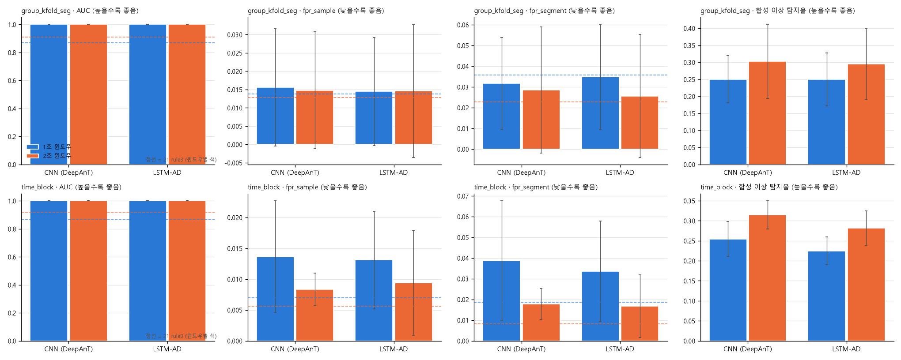 | 예측 계열 지표 개요 (24번) |
| 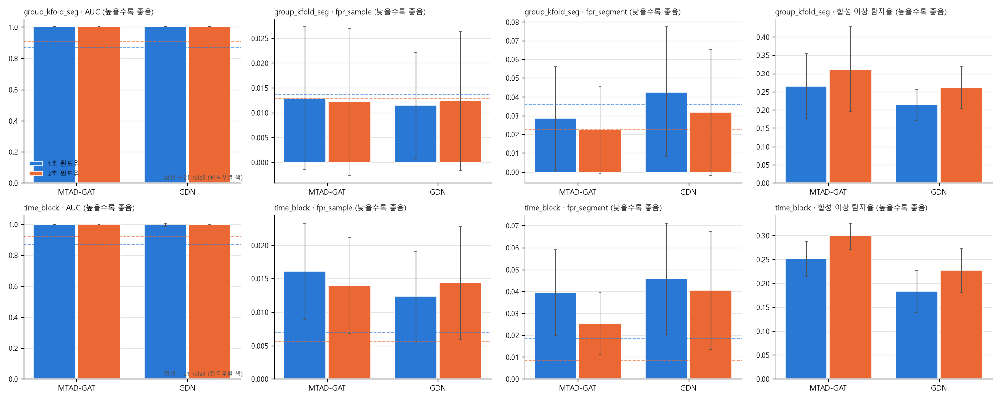 | 그래프 계열 지표 개요 (25번) |
| 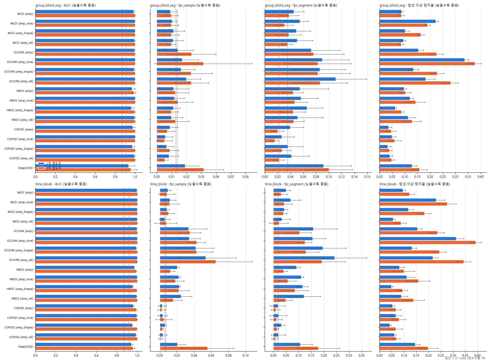 | 분포 계열 지표 개요 (26번) |
| 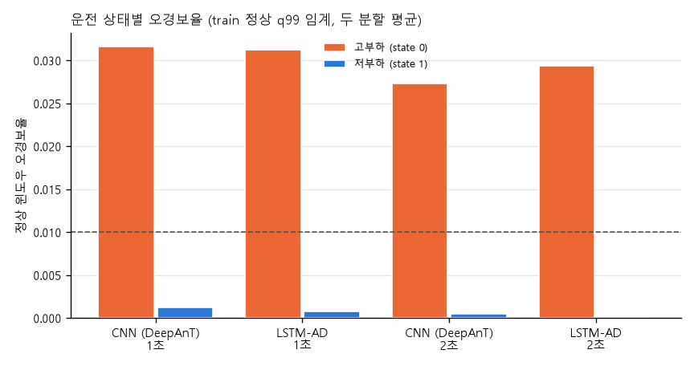 | 운전 상태별 오경보율 (24번, 고부하에 몰림) |
| 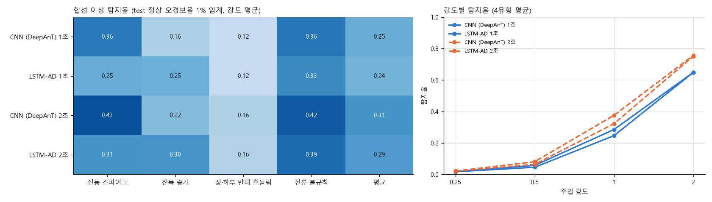 | 합성 이상 유형·강도별 탐지율 (24번) |
| 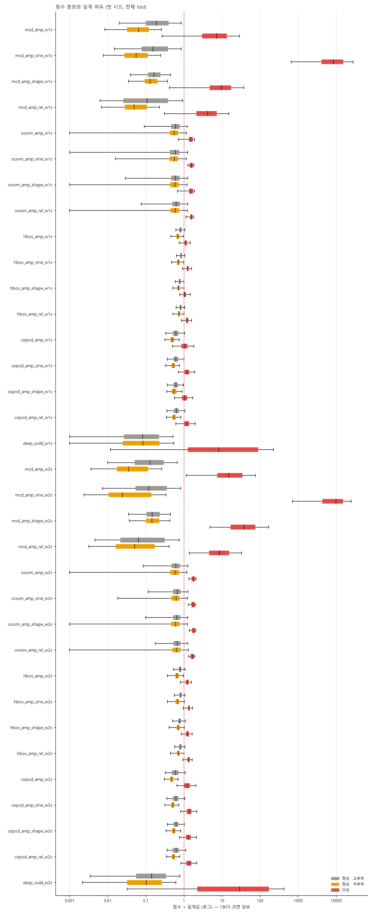 | 점수 분포와 임계 여유 (26번, MCD가 고·저부하를 분리) |

---

## 5. 결합 모델(CNN + MCD) 결과

### 5.1 혼동행렬 — 세그먼트 단위 (정상 452개 / 이상 13개, group_kfold 5 fold 합산, 시드 평균)

|  | 예측 정상 | 예측 이상 | 정밀도 | 재현율 | F1 | 오경보율 |
|---|---|---|---|---|---|---|
| **CNN 단독 (주의)** 실제 정상 | TN 439.3 | FP 12.7 | 0.51 | 1.00 | 0.67 | 2.8% |
| 실제 이상 | FN 0 | TP 13 | | | | |
| **MCD 단독** 실제 정상 | TN 435.0 | FP 17.0 | 0.43 | 1.00 | 0.60 | 3.8% |
| 실제 이상 | FN 0 | TP 13 | | | | |
| **CNN AND MCD (경보)** 실제 정상 | TN 451.0 | FP 1.0 | **0.93** | 1.00 | **0.96** | **0.2%** |
| 실제 이상 | FN 0 | TP 13 | | | | |
| CNN OR MCD 실제 정상 | TN 423.3 | FP 28.7 | 0.31 | 1.00 | 0.48 | 6.3% |
| 실제 이상 | FN 0 | TP 13 | | | | |

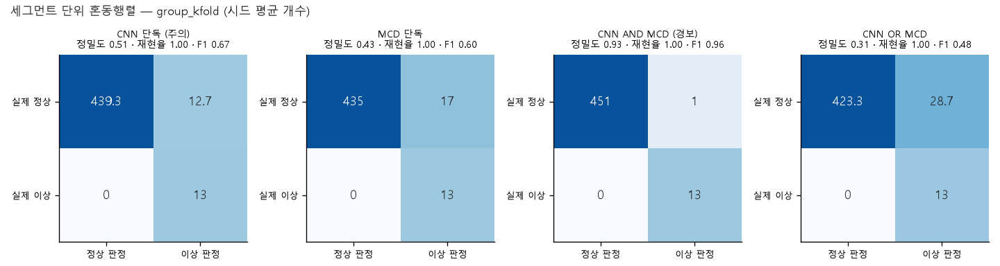

time_block(정상 4블록 합산, 이상은 블록 평균):

| 규칙 | TN | FP | FN | TP | 정밀도 | 재현율 | F1 | 오경보율 |
|---|---|---|---|---|---|---|---|---|
| CNN 단독 | 347.7 | 6.3 | 0 | 13 | 0.67 | 1.00 | 0.80 | 1.8% |
| MCD 단독 | 343.0 | 11.0 | 0 | 13 | 0.54 | 1.00 | 0.70 | 3.1% |
| **CNN AND MCD** | 353.7 | 0.3 | 0 | 13 | 0.98 | 1.00 | 0.99 | 0.1% |
| CNN OR MCD | 337.0 | 17.0 | 0 | 13 | 0.43 | 1.00 | 0.61 | 4.8% |

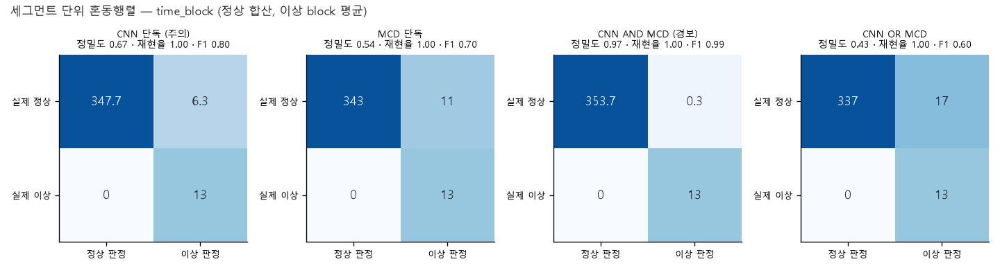

### 5.2 혼동행렬 — 윈도우 단위 (group_kfold, 정상 2,254개 / 이상 63개)

| 규칙 | TN | FP | FN | TP | 정밀도 | 재현율 | 오경보율 |
|---|---|---|---|---|---|---|---|
| CNN 단독 | 2,220.3 | 33.7 | 0 | 63 | 0.65 | 1.00 | 1.5% |
| MCD 단독 | 2,232.0 | 22.0 | 0 | 63 | 0.74 | 1.00 | 1.0% |
| **CNN AND MCD** | 2,253.0 | **1.0** | 0 | 63 | **0.98** | 1.00 | 0.04% |
| CNN OR MCD | 2,199.3 | 54.7 | 0 | 63 | 0.53 | 1.00 | 2.4% |

**읽는 법 [데이터]**
- **미탐은 네 규칙 모두 0**이다(세그먼트 13개, 윈도우 63개 전부 탐지). 규칙 사이의 차이는 전부 FP(오경보)다.
- AND는 FP를 단독의 1/10 이하로 줄이면서 TP를 그대로 유지한다. 반면 OR는 FP가 늘어난다.
- **정밀도·F1은 클래스 비율(이상 13 : 정상 452)에 크게 좌우된다.** 이 비율은 데이터 구성의 결과이지 현장 비율이 아니다. 같은 FP 개수라도 이상이 더 많으면 정밀도가 오른다. 그래서 주 지표로는 오경보율·시간당 오경보를 쓰고 정밀도·F1은 참고로 둔다.

### 5.3 ROC·PR 곡선과 점수 분포

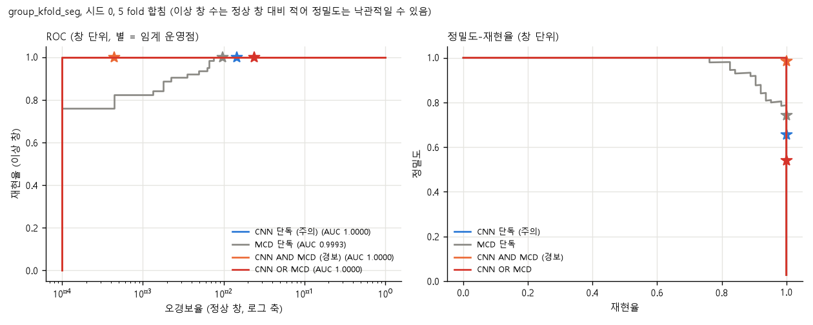

- ROC는 네 규칙의 AUC가 모두 1에 가까워(CNN 단독 1.0000, MCD 0.9993, AND 1.0000, OR 1.0000) **곡선으로는 구분이 안 된다.** x축을 로그로 두면 임계(별)에서의 운영점이 갈린다: 재현율 1.0에서 AND의 오경보율이 가장 낮다.
- PR 곡선에서도 같은 재현율 1.0에서 AND의 정밀도가 가장 높다(0.98).

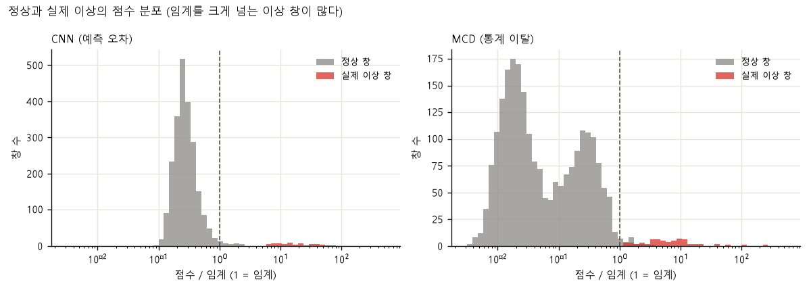

- 실제 이상 창은 CNN 점수가 임계의 5.8~71.8배(중앙값 14.7), MCD는 1.2~258.7배(중앙값 6.1)이다. MCD 쪽 여유가 작은 창이 있다(MCD z < 3인 이상 창이 63개 중 13개).
- 정상은 임계 아래에 몰리고 꼬리만 임계를 넘는다. AND는 두 꼬리가 동시에 넘는 드문 경우만 남긴다.

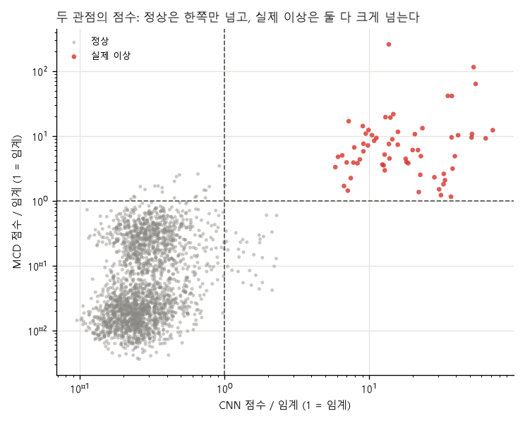

정상(회색)은 한쪽 축만 임계를 넘고, 실제 이상(빨강)은 둘 다 크게 넘어 오른쪽 위 사분면에 있다. AND = 오른쪽 위, OR = 오른쪽 + 위쪽 전체다.

### 5.4 임계 안정성

(fold·시드별 train 정상 q99, `thresholds_by_fold.csv`)

| 분할 | CNN 임계 (최소 / 중앙 / 최대) | MCD 임계 (최소 / 중앙 / 최대) | 최대/최소 |
|---|---|---|---|
| group_kfold | 3.03 / 3.53 / 3.80 | 615.6 / 1,043.2 / 1,426.6 | CNN 1.25배, **MCD 2.32배** |
| time_block | 3.20 / 3.42 / 3.72 | 359.7 / 424.9 / 595.0 | CNN 1.16배, **MCD 1.65배** |

CNN 임계는 안정적이고 **MCD 임계는 fold마다 크게 흔들린다.** train 정상에 어떤 세그먼트가 들어가느냐에 따라 마할라노비스 거리의 꼬리가 달라지기 때문이다. 결합 경보의 임계 안정성에서 가장 큰 불확실성이다.

### 5.5 약한 이상에서의 trade-off

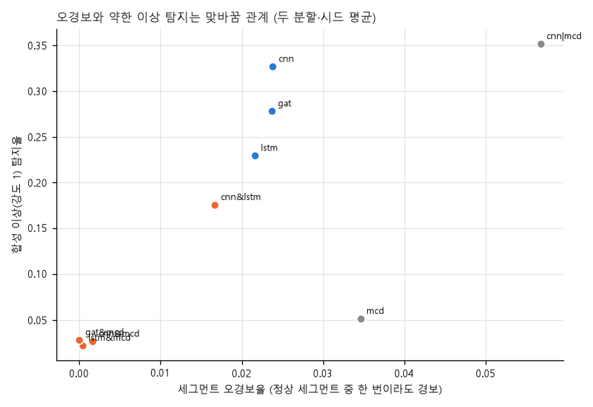
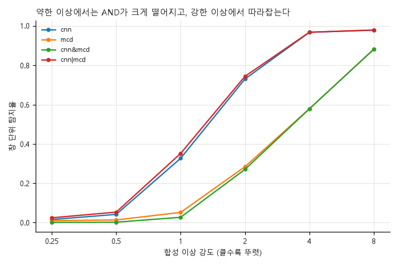

| 합성 강도 | 0.25 | 0.5 | 1 | 2 | 4 | 8 |
|---|---|---|---|---|---|---|
| CNN 단독 (group_kfold) | 0.018 | 0.045 | 0.336 | 0.744 | 0.967 | 0.979 |
| MCD 단독 | 0.011 | 0.014 | 0.049 | 0.251 | 0.570 | 0.853 |
| **CNN AND MCD** | 0.001 | 0.002 | 0.023 | 0.235 | 0.570 | 0.853 |
| AND 유지율 (gkf / tb) | 0.05 / 0.03 | 0.04 / 0.04 | 0.07 / 0.10 | **0.32 / 0.44** | 0.59 / 0.61 | 0.87 / 0.94 |

AND의 탐지율은 약한 쪽(MCD)에 묶인다(강도 4·8에서 AND = MCD). 약한 이상(강도 ≤ 1)은 AND가 거의 못 잡고, CNN 단독도 강도 0.25~0.5에서는 우연 수준이다. **약한 초기 이상은 어떤 규칙도 못 잡는다**는 것이 조기탐지 주장의 한계선이다.

---

## 6. 가설 H1~H5 검증 (`reports/28_model_ensemble_JIW.md`)

| # | 가설 | 성공 기준 | 결과 | 판정 |
|---|---|---|---|---|
| H1 | AND의 오경보 감소가 시드·fold와 무관하게 재현 | 단독 대비 세그먼트 오경보 차이의 95% 구간이 0 미만 | CNN 2.8% → 0.2%, 구간 −4.1 ~ −1.3%p (time_block 1.8% → 0.1%, −3.1 ~ −0.6%p). LSTM·MTAD-GAT도 같음. 같은 계열끼리(CNN AND LSTM)는 2.8% → 2.1% | **통과** |
| H2 | 강도 2에서 단독 대비 70% 이상 탐지 유지 | 70% | 32% / 44%. 강도 8에서 87% / 94% | **미달** |
| H3 | 관점 A 모델은 {CNN, LSTM-AD, MTAD-GAT} × MCD 중 최선 | 오경보·합성 탐지 | 오경보 0.2/0.1%, 0.1/0.0%, 0.0/0.0%, 합성 평균 0.281~0.284 / 0.298~0.309 → 사실상 동일 | 구분 불가, 가장 가벼운 CNN 선택 |
| H4 | 상태별(고·저부하) 임계가 고부하 오경보를 줄인다 | 고부하 FP 2.7% → 1.5% 이하 | 3.2% → 3.1% (group_kfold), 2.2% → 3.0% (time_block). 상태 추정은 고부하 89.3%·저부하 99.9% 정확 | **기각** |
| H5 | 연속 규칙(k of n)이 OR 단계 오경보를 줄인다 | 오경보 감소 대비 탐지 손실 | OR + 2/3: 오경보 6.4% → 2.7%이나 실제 이상 창 탐지 100% → 77%, CNN 단독(2.8%)과 같은 오경보에 합성 탐지는 더 낮음(0.415 vs 0.515) | **부분 기각** |

- H4 해석: 고부하 정상 점수는 **고부하 안에서도 꼬리가 길어** 고부하 전용 q99를 써도 같은 비율로 넘는다. 고부하 오경보는 임계 분리가 아니라 **MCD와의 AND**가 지운다(MCD는 고·저부하를 따로 학습). 고부하 윈도우의 약 10%가 저부하로 오분류되는 상태 추정의 한계도 있다.
- H5 해석: 이상 세그먼트는 윈도우가 몇 개 안 돼서 k개를 채우지 못하는 경우가 생긴다. 그래서 **OR 단계를 버리고 포함 관계의 두 단계**(주의 = CNN 단독, 경보 = CNN AND MCD)로 확정했다.

---

## 7. 오류 분석 (개수로 본 요약)

| 질문 | 답 [데이터] |
|---|---|
| 미탐이 어디서 생기나 | **실제 이상에서는 0건**(4개 규칙 모두, 세그먼트 13개·윈도우 63개). 미탐은 합성 약한 이상에서만 — AND 강도 1 탐지 0.023, CNN 단독 0.336 |
| 오경보는 어디서 생기나 | 예측·그래프 계열은 **고부하** 구간(고부하 2.2~3.5% vs 저부하 0~0.1%) |
| AND 후에 남는 오경보는 | 시드·분할 27개 중 4건(`normal_425` 2회, `normal_283`, `normal_201`). 전부 **고부하 세그먼트의 창 1개짜리**. 카드 값은 CNN 배수 1.0 · MCD 배수 1.7로 임계 바로 위 |
| 왜 MCD와 합치면 오경보가 지워지나 | 오경보 세그먼트의 겹침이 예측 계열 vs MCD 0.00~0.08 (예측 계열끼리는 0.45~0.65) |
| 어느 신호가 이상을 알렸나 | 실제 이상 창 63개의 CNN 오차 1순위 채널: 전류 48% · 상부 진동 43% · 하부 진동 10%, 세그먼트마다 다름. 합성에서는 주입 채널과 94~100% 일치(상하 반대 흔들림 강도 1만 72%) |

팀 파트(FN을 3·19·20 vs 기타로 나누기, FP 27모델 중 19개가 고부하 집중, 상관 구조 변화)는 `reports/31_error_analysis_CHS.md`에 있다.

---

## 8. 조기경보·근거 카드·챗봇의 평가 설정

### 8.1 조기경보 (33번)

| 항목 | 설정 |
|---|---|
| 시나리오 | test 정상 burst 열(time_block 4구간, 구간당 약 15분)에 합성 열화: 열화 시작(T0) 전 3분은 정상, T0 이후 강도를 0 → 4로 **선형 증가**, 이후 4 유지. 열화 기간 2·5·10분 |
| 규모 | 유형 4 × 열화 기간 3 × 구간 4 × 시드 3 = 144 시나리오 + 열화 없는 정상 열 12개 |
| 규칙 | 주의(CNN 단독): burst 안 창 하나라도 CNN z > 1. 추세: log(burst 평균 CNN z)의 EWMA(λ = 0.4)가 train 정상 열 EWMA의 q99 초과. 경보: CNN AND MCD |
| 지표 | 선행 시간 = 열화 완성(T_crit = 강도 4 도달) − 첫 경보 시각, 거짓 사건/시간(연속 경보를 한 사건으로 묶음, 3 burst 연속 꺼져야 새 사건) |
| 결과 | 선행 시간 중앙값 주의 1.39 / 3.60 / 7.39분, 경보 0.98 / 2.81 / 6.71분(열화 2 / 5 / 10분). 거짓 사건 주의 6.2건/시간, 경보 0.3건/시간(정상 약 3.07시간 분량, 사건 19건·1건) |
| 한계 | 열화 곡선·유형은 우리가 정함, λ는 정상 구간의 거짓 사건 수로 고름, "N분 후" 추정 오차(1.5~2.4분)가 남은 시간(0.7~1.5분)과 같거나 커서 철회 |

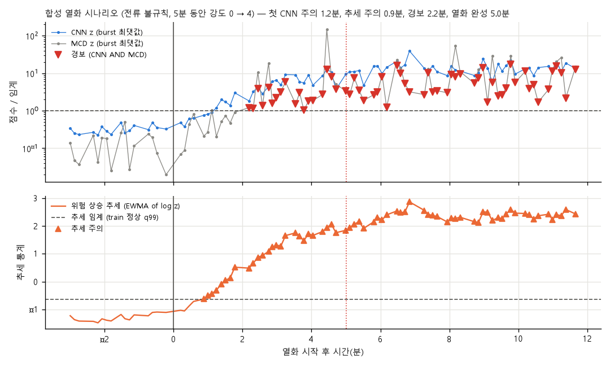
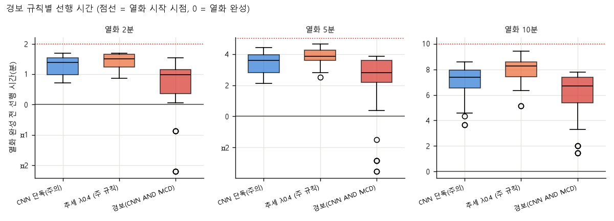

### 8.2 근거 카드 (32번)

- CNN 시점 오차 `(e/sd)²`를 창 안에서 채널별로 합해 1로 맞춘 **오차 비중**의 1순위 채널 + MCD 입력을 표준화한 편차 상위 3개 + 운전 상태 추정 + 점검 권고(가정)를 템플릿 문장으로 만든다.
- 검증: 합성 이상 4유형 × 강도 1·2·4·8, CNN 경보가 난 창에서 1순위 채널이 주입 채널과 같은 비율(CNN 오차 비중 94~100%, MCD 편차 피처는 약한 이상에서 약함: 상하 반대 흔들림 강도 1·2에서 30%·60%).

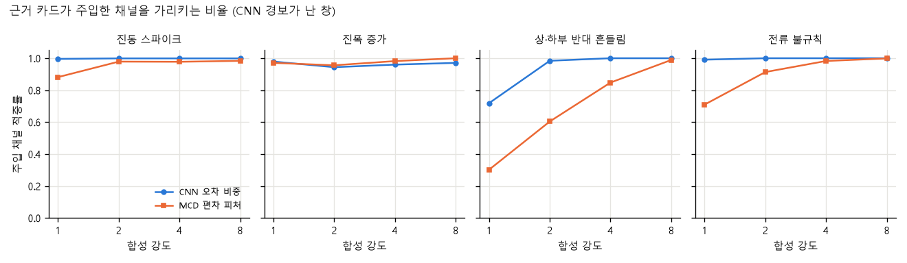

### 8.3 챗봇 (34번)

| 항목 | 설정 |
|---|---|
| 모델 | `Qwen/Qwen2.5-1.5B-Instruct`(Apache-2.0, 1.54B 파라미터), CPU, 탐욕 디코딩 |
| 근거 | 결과 CSV에서 읽은 문장 17개(F1~F17) + 선택한 경보 카드 |
| 방식 | 모델이 **근거 번호만 고르고** 답은 근거 문장 그대로 출력. 원인·시점 질문은 규칙이 거절 |
| 평가 | 표현을 바꾼 질문 17개(범위 안 14)에서 근거 적중: 키워드 규칙 14% → LLM 64%, 범위 밖 100% 거절 (프롬프트를 같은 세트로 2회 수정해 낙관적) |
| 문장 생성 실험 | 9개 중 6개 오류, 코드 검사 0건 감지 → 방식 변경 |

---

## 9. 재현 방법

| 순서 | 실행 | 산출 |
|---|---|---|
| 1 | `python src/extract.py` | 원본 해제 |
| 2 | 팀 노트북 01~04, 11 | 표준 전처리, 윈도우 피처 `11_window_features.parquet` |
| 3 | 노트북 24·25·26 | 모델 가중치(`models/`), `results/24~26_*/cv_scores.csv` |
| 4 | 노트북 28 | 점수 캐시 `data/processed/28_ensemble_scores_*.parquet`, 결합 평가 `results/28_*` |
| 5 | 노트북 35 | 혼동행렬·ROC·임계 안정성·9종 비교표 `results/35_*`, `figures/35_*` |
| 6 | 노트북 32·33 | 근거 카드, 조기경보, 대시보드 |
| 7 | 노트북 34 | 챗봇(모델 `download_model()`로 한 번 내려받음) |

- 환경: Python 3.12, conda 환경 `kamp`, `requirements.txt`에 버전 고정(torch 2.14 CPU, pyod 3.6.6, transformers 5.18.0 등).
- 시드 0~2, 분할은 parquet의 `fold`·`block` 열 고정, 부트스트랩 시드 고정.
- **가중치(약 138MB)·챗봇 모델(약 3GB)·점수 캐시는 git 밖**이라 다른 PC에서는 3번부터 다시 학습해야 한다.

---

## 10. 한계

1. **이상 이벤트 1건.** 재현율 1.00·미탐 0은 이 한 사건이 뚜렷해서일 수 있다(실제 이상은 합성 강도 4~8 이상). 오경보율 0.1~0.2%는 세그먼트 한두 개 차이다.
2. **정밀도·F1은 클래스 비율에 좌우된다**(이상 13 : 정상 452). 현장 비율이 아니다.
3. 합성 이상·열화는 직접 설계한 것이라 해당 유형에 유리할 수 있고 실제 고장 예측 성능이 아니다.
4. MCD 임계가 fold마다 2.3배까지 흔들리고 MCD 가중치는 시드 0만 있다.
5. 날짜가 다른 정상/이상 파일(날짜 = 라벨)이라 설비 상태 차이와 측정 조건 차이를 구분할 수 없다. 형식 누수는 표준 전처리로 차단했다(형식 피처 AUC 1.000 → 0.57~0.60).
6. 시간당 오경보는 세그먼트 환산(352.5/시간)이며 현장 부하와 다를 수 있다 [가정].
7. 예측 계열 3종이 구분되지 않아 CNN을 고른 근거는 "가장 가볍다"는 것뿐이다(결합 결과 동일).
8. 학습 설정(Adam 1e-3, 30 에폭, 배치 256)은 모든 모델에 같게 두었고 모델별 튜닝은 하지 않았다. 튜닝하면 순위가 바뀔 수 있다 [추정].
