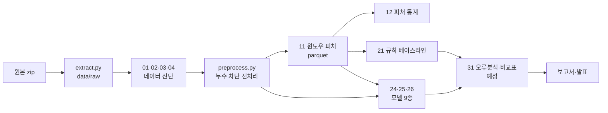

# 프로젝트 전체 정리 — 처음 보는 사람도 이해할 수 있게

> 주제 ③ **진동·전류 시계열 기반 프레스 유압펌프 이상 조기탐지 및 오경보 분석**
> 기준: `main` 브랜치, PR #1 ~ #18 병합 시점 (2026-09-30)
> 이 문서는 "무엇을, 왜, 어떻게 했고, 그래서 무엇을 알게 됐는지"를 순서대로 풀어 쓴 안내서다. 숫자의 출처는 각 절 끝의 파일에 있다.

---

## 0. 세 줄 요약

1. **데이터에 함정이 있었다.** 정상 파일과 이상 파일은 "저장 형식"이 달라서, 신호를 안 봐도 파일 형식만으로 정답을 맞힐 수 있었다(누수). 팀은 이 함정을 찾아내고 막는 전처리를 만들었다.
2. **함정을 막은 뒤에도 이상은 잘 잡힌다.** 규칙 기반 베이스라인은 AUC 0.87, 딥러닝·통계 모델은 AUC 0.99~1.00이다. 특히 규칙이 놓친 "조용한 이상" 세그먼트 3개(3·19·20)를 모델들은 모두 잡았다.
3. **오경보는 "고부하 운전" 구간에 몰린다.** 기계가 세게 일하는 구간이 이상과 비슷해 보이기 때문이다. 다음 단계(31 오류분석)는 이 오경보를 줄이는 것이다.

---

## 1. 대회와 과제

### 1-1. 무엇을 만들어야 하나

프레스 기계의 유압펌프에 이상이 생기기 **전에**, 센서 신호만 보고 "뭔가 이상하다"고 알려 주는 AI를 만든다.
그런데 조건이 두 개 더 붙어 있다.

- **많이 잡는 것만으로는 부족하다.** 정상인데 이상이라고 울리는 **오경보**도 줄여야 한다. 오경보가 잦으면 현장에서 경보를 무시하게 된다.
- **왜 틀렸는지 분석해야 한다.** 놓친 이상(미탐)과 오경보가 **어떤 조건에서** 생기는지 설명해야 한다.

### 1-2. 심사 기준 (100점)

| 문항 | 배점 | 쉽게 말하면 | 지금까지 채운 곳 |
|---|---|---|---|
| 1. 데이터 이해·진단 | 15 | 데이터의 문제점(누수·라벨 오류 등)을 찾았나 | 01·02·03·04 진단 |
| 2. AI 모델 개발 | **40** | 베이스라인 포함 모델 2개 이상 비교 | 21 규칙 + 24·25·26 모델 9종 |
| 3. 영향요인·오류분석 | 15 | 미탐·오경보가 어디서 생기나 | 21·24·25·26에서 1차 분석, **31에서 마무리 예정** |
| 4. 현장 활용방안 | 10 | 공장에서 어떻게 쓰나 (경보 규칙 등) | 각 리포트의 "활용 아이디어", 보고서에서 정리 예정 |
| 5. 창의성·차별성 | 10 | 도메인 지식을 쓴 새로운 시각 | 누수 규명, 전류 에일리어싱, 합성 이상 평가 |
| 6. 코드·재현성 | 10 | 누가 돌려도 같은 결과가 나오나 | 노트북 실행 결과 포함, 버전 고정, 가중치 재사용 |

- 기간: 2026-09-21 ~ **2026-10-08(목) 23:59**
- 제출물: 결과보고서 PDF, 소스코드 zip, 발표자료, 설문 캡처 (`docs/README.md`)

---

## 2. 설비와 데이터를 한눈에

### 2-1. 파인블랭킹 프레스와 유압펌프

- **파인블랭킹**은 금속판을 한 번에 매끈하게 잘라내는 정밀 프레스 가공이다. 위에서 누르고(가압링), 아래에서 받치고(카운터), 가운데를 밀어내는(펀치) 세 힘을 동시에 건다.
- 이 세 힘은 모두 **기름의 압력(유압)** 으로 만든다. 전기모터가 펌프를 돌리고, 펌프가 기름을 밀어 압력을 만든다.
- 펌프가 불안정해지면 → 압력이 흔들리고 → 세 힘의 균형이 깨지고 → 잘린 면이 불량이 된다.

```
전원 ─[전류 센서 AI2]─ 모터 ─(축)─ 유압펌프 ─ 기름 ─ 밸브 ─ 실린더 3개(펀치·가압링·카운터)
                       ↑
            [진동 센서 AI0 상부 / AI1 하부]
```

> 움직이는 그림: `docs/reference/press_animation_JIW.html` (브라우저로 열기)
> 자세한 설명: `docs/reference/02_equipment_sensors_JIW.pdf`

**중요한 한계.** 진동 센서는 펌프가 아니라 **모터 몸체**에 붙어 있다. 그래서 이상의 원인이 펌프인지 모터인지 데이터로 구분할 수 없다. 팀은 보고서에서 탐지 대상을 **"유압펌프 모터-펌프 구동부 이상"** 이라고 쓰기로 했다(PR #14).

### 2-2. 센서 3개

| 이름 | 무엇 | 비유 |
|---|---|---|
| `AI0_Vibration` | 모터 상부 진동 | 기계의 "떨림" |
| `AI1_Vibration` | 모터 하부 진동 | 〃 |
| `AI2_Current` | 모터 전류 | 기계의 "숨소리" — 힘들게 일할수록 커진다 |

### 2-3. 데이터 구성

| | 정상 파일 | 이상 파일 |
|---|---|---|
| 날짜 | 2022-07-12 | 2022-07-17 |
| 길이 | 77분, 20,000행 | 2분 46초, 600행 |
| 세그먼트 | 599개 | 21개 |
| 이상 사건 수 | – | **딱 1건** |

- 1초에 10번(10 Hz) 측정한다.
- **세그먼트**: 데이터가 쭉 이어지지 않고 최대 5초씩 끊겨서 기록된다. 끊긴 덩어리 하나를 세그먼트라고 부른다. 분석과 모델은 항상 세그먼트 안에서만 한다(공백을 넘으면 서로 다른 시점이 섞인다).
- **이상 사건이 1건뿐**이라는 점이 이 과제의 가장 큰 제약이다. "이 한 사건은 잘 잡는다"까지만 말할 수 있다.

### 2-4. 전류 에일리어싱 (알아 두면 헷갈리지 않는 것)

모터 전류는 1초에 60번 방향이 바뀌는 교류(60 Hz)다. 그런데 1초에 10번만 찍으니, 실제 파형 대신 **0.6 Hz로 느리게 출렁이는 가짜 파형**이 기록된다(에일리어싱). 그래서

- 전류 값이 −270 ~ +270 사이를 오가는 건 정상이다.
- 주파수 분석(FFT)으로 베어링 결함 같은 걸 찾는 건 **불가능**하다.
- 대신 "정상 전류는 깨끗한 0.6 Hz 사인파"라서, **사인파에서 얼마나 벗어났는지**가 좋은 이상 지표가 된다(정상 R² 0.9965).

---

## 3. 꼭 알아야 할 용어

| 용어 | 뜻 |
|---|---|
| **윈도우** | 세그먼트를 1초·2초·3초 단위로 잘라 낸 조각. 모델은 윈도우마다 "이상 점수"를 낸다. 0.5초씩 밀면서 자른다. |
| **라벨 `label`** | 정답. **0 = 정상, 1 = 이상**. 이상 파일에서 나온 윈도우는 전부 1이다. |
| **운전 상태 `state`** | 정상 데이터를 두 무리로 나눈 것. **0 = 고부하(세게 일함), 1 = 저부하**. ⚠ 라벨의 0/1과 전혀 다른 뜻이다. ⚠ 21 노트북 **내부** 윈도우 상태는 1 = 고부하로 반대다(PR #18 참고). |
| **이상 점수 / 임계값** | 모델이 낸 점수가 임계값보다 크면 "경보". 임계값은 **학습용 정상 점수의 상위 1% 지점(q99)** 으로만 정한다. 이상 데이터로 임계를 고르면 반칙이기 때문이다. |
| **FP (오경보)** | 정상인데 경보가 울림 |
| **FN (미탐)** | 이상인데 경보가 안 울림 |
| **AUC** | 점수가 이상을 정상보다 높게 매기는 정도. 1.0이면 완벽, 0.5면 동전 던지기. |
| **fpr_sample** | 정상 **윈도우** 중 오경보 비율. 1%면 윈도우 100개 중 1개가 잘못 울림. |
| **fpr_segment** | 정상 **세그먼트** 중 한 번이라도 오경보가 난 비율. 현장 체감에 더 가깝다. |
| **탐지 지연** | 이상 세그먼트가 시작되고 첫 경보까지 걸린 시간. 1초 윈도우면 최소 0.9초. burst 공백(약 8초)을 더한 **체감 지연**도 함께 본다. |
| **판정 불가** | 세그먼트가 윈도우보다 짧아 윈도우를 못 만드는 경우. 1초 윈도우 기준 이상 세그먼트 21개 중 4개. 평가에서 빠진다. |
| **group_kfold_seg (gkf)** | 세그먼트를 5묶음으로 나눠, 4묶음으로 학습하고 1묶음으로 평가하기를 5번. 같은 세그먼트가 학습·평가에 동시에 안 들어간다. |
| **time_block (tb)** | 정상을 시간순 5블록으로 나누고, **앞 블록으로 학습 → 다음 블록으로 평가**(k = 1~4). 실제 운영처럼 "과거로 배워 미래를 본다". |
| **시드** | 딥러닝 학습의 무작위 시작점. 시드 3개로 돌려 결과가 우연인지 확인한다. |
| **합성 이상** | 정상 데이터에 일부러 약한 이상(스파이크·진폭 증가 등)을 넣어 "약한 초기 이상을 얼마나 잡나"를 보는 평가. 실제 이상이 1건이라 필요했다. |

---

## 4. 레포 구조와 작업 흐름

### 4-1. 폴더

```
KAMP-Manufacturing-AI/
├─ README.md, CLAUDE.md     팀 규칙 (커밋·브랜치·PR·폴더·심사 기준)
├─ requirements.txt         Python 3.12 패키지 버전 고정
├─ data/                    원본 zip, raw/, processed/ (전부 git 제외)
├─ src/                     재사용 코드 — 노트북이 불러다 씀
├─ notebooks/               실행 순서와 결과 (실행 결과 포함해서 커밋)
├─ figures/<노트북명>/      노트북이 만든 그림
├─ results/<노트북명>/      지표·오류 사례 CSV
├─ reports/                 노트북별 요약 md
├─ models/                  학습된 가중치 (git 제외)
└─ docs/                    착수 가이드, 참고 자료, 이 문서
```

### 4-2. 노트북 번호 규칙

| 번호 | 단계 | 있는 것 |
|---|---|---|
| 0x | 데이터 진단 | 01, 02, 03, 04 |
| 1x | 전처리·피처 | 11, 12 |
| 2x | 모델 | 21, 24, 25, 26 (22·23은 팀원 몫으로 비어 있음) |
| 3x | 분석 | 31 예정 |

이름은 `<번호>_<내용>_<이니셜>.ipynb`. 이니셜: **CHS**(레포 주인), **JIW**(나).

### 4-3. 전체 흐름



---

## 5. 지금까지 한 일 (PR 순서)

| PR | 누가 | 한 일 | 한 줄 의미 |
|---|---|---|---|
| #1 | CHS | 01·02 데이터 품질·심층 진단 | 데이터 구조 파악, **파일 형식 누수 발견** |
| #2·#3 | CHS | 다른 주제(사출성형·X-ray) 진단 | 주제 선정용 비교 (지금은 보관만) |
| #4·#5 | CHS | 폴더 구조·팀 규칙 | 3인 협업 틀 |
| #6 | CHS | `preprocess.py`·`split.py` 골격 | 누수 차단 전처리·분할 규칙을 코드로 |
| #7·#8 | CHS | 03 재검증, 리포트 정정 | 누수 차단이 **실제로 된다**는 증명 |
| #9 | CHS | 11 윈도우 피처, `evaluate.py`, 착수 가이드 | 모든 모델이 같은 입력·분할·지표를 쓰도록 **계약** 확정 |
| #10 | JIW | torch·pyod 추가, 이니셜 등록 | 모델 비교 환경 |
| #11 | JIW | 도메인·설비 PDF, 모델 후보 사전 비교 | 설비 이해 자료, 어떤 모델을 쓸지 근거 |
| #12 | CHS | 상·하부 진동 비율 피처 | 피처 1개 추가 (33열) |
| #13 | CHS | 21 규칙 베이스라인 4종 | **비교 기준선** AUC 0.79~0.87 |
| #14 | CHS | 탐지 대상 표현·FN 근거 정정 | "모터-펌프 구동부 이상"으로 표현 |
| #15 | JIW | 24 Forecasting·25 Graph 모델 | 딥러닝 4종 AUC ≈ 1.0 |
| #16 | JIW | 26 Distribution 모델·피처 ablation | 통계 모델 5종, 피처 조합 비교 |
| #17 | CHS | 12 피처 통계 분석 | 중복 피처, 부트스트랩 신뢰구간 규칙 |
| #18 | CHS | 04 데이터 프로파일, `stats.py` | 타임스탬프·드리프트·정상 의심 세그먼트 |

---

## 6. 단계별 상세

### 6-1. 데이터 진단 (01·02·03·04) — "데이터를 믿어도 되나?"

#### ① 01·02: 데이터가 어떻게 생겼나 (PR #1)

- 세그먼트 구조, 전류 에일리어싱(0.6 Hz), 운전 상태 2개(고부하 43% / 저부하 57%)를 확인했다.
- **가장 큰 발견: 파일 형식 누수.** 정상 파일과 이상 파일은 저장 방식이 달랐다.

| 누수 경로 | 수치 | 쉽게 말하면 |
|---|---|---|
| 세그먼트 평균(DC)만으로 구분 | AUC 0.94 / 0.92 / 0.89 | 신호의 "기준선 높이"만 봐도 파일을 맞힘 |
| 전류값이 1.19209의 배수인 비율 | 정상 0.19% vs 이상 **99.67%** | 이상 파일만 특정 눈금으로 저장됨 |
| 진동 소수 자릿수 | 정상 6자리 vs 이상 8자리 | 숫자 표기 방식이 다름 |

> 비유: 시험지의 정답이 "빨간 펜으로 쓴 것"이라면, 문제를 안 읽고도 펜 색깔로 맞힐 수 있다. 모델이 이런 걸 배우면 점수는 100점이어도 현장에서는 쓸모가 없다.

- 출처: `reports/01_data_quality.md`, `reports/02_diagnosis_deep.md`

#### ② 03: 누수를 정말 막을 수 있나 (PR #7)

- **표준 전처리** `preprocess.preprocess()`를 만들었다: ① 숫자 표기를 두 파일 똑같이 맞추고(진동 6자리, 전류는 같은 눈금 + 소수 1자리) ② 세그먼트마다 평균을 뺀다.
- 전처리 전에는 형식 정보만으로 AUC **1.000** → 전처리 후 진동 **0.566** / 전류 **0.597**(거의 동전 던지기). **누수 차단 확인.**
- DC 오프셋은 에일리어싱의 부작용이 아니라 실제 오프셋이었다(상관 −0.036).
- 진동 센서 두 개의 감도(게인)가 같은지는 **확인 불가** → 크기와 무관한 "형상" 피처를 함께 쓰기로 했다.
- 출처: `reports/03_diagnosis_recheck_CHS.md`

#### ③ 04: 데이터를 더 꼼꼼히 (PR #18)

| 확인 항목 | 결과 | 의미 |
|---|---|---|
| 타임스탬프 | 두 파일 모두 순서 정상, 실효 10.0000 Hz, 중복 1건 | 시간 정보는 믿을 수 있다 |
| 정상 의심 세그먼트 | 26개(4.3%), 그중 25개가 고부하 | "정상"인데 이상해 보이는 구간 → **오경보 후보** |
| 정상 데이터 드리프트 | 블록 1~3은 안정, **블록 4는 15개 피처 중 12개가 달라짐**(저부하 비율 85.7%) | time_block 마지막 평가에서 성능이 바뀌면 **정상 분포가 변한 탓**을 먼저 의심 |
| 이상 사건의 시간 추이 | 전처리 후에는 뚜렷한 추세 없음 | 02의 "점점 나빠진다"는 서술은 **철회**(그 추세는 DC 탓이었음) |

- 출처: `notebooks/04_data_profile_CHS.ipynb`, `results/04_data_profile_CHS/`

---

### 6-2. 피처 (11·12) — "모델에 무엇을 넣나?"

#### ① 11: 윈도우 피처와 모델링 계약 (PR #9, #12)

윈도우마다 숫자 33개(피처)를 계산해 `data/processed/11_window_features.parquet`에 저장했다.

| 피처군 | 개수 | 무엇 | 비고 |
|---|---|---|---|
| 진폭 | 18 | 채널별 rms·peak·p2p·첨도·crest·왜도 | **기본 입력** |
| 형상 | 9 | 윈도우 안에서 크기를 없앤 뒤의 모양 | 게인 문제 대비 |
| 사인 잔차 | 3 | 전류가 0.6 Hz 사인에서 벗어난 정도 | ⚠ 세그먼트 단위 값, 날짜 교란 주의 |
| 채널 관계 | 3 | 상·하부 진동 상관, 전류 자기상관, 상·하부 RMS 비율 | #12에서 비율 추가 |

**모델링 계약** (`docs/modeling_kickoff.md`): 모든 모델은 ① 같은 전처리 ② 같은 분할(gkf 5 + tb 4) ③ 같은 임계 규칙(train 정상 q99) ④ 같은 지표(`evaluate.py`)를 쓴다. 하나라도 다르면 비교표가 성립하지 않기 때문이다. 결과는 `results/<노트북>/metrics.csv`에 공통 열로 저장한다.

#### ② 12: 피처끼리 겹치지 않나, 믿을 만한가 (PR #17)

| 분석 | 결과 | 의미 |
|---|---|---|
| 중복 | 형상 첨도·왜도 6열 = 진폭 첨도·왜도와 **완전히 같다** | 실제로 쓸모 있는 건 27열, 추리면 23열 |
| PCA | 첫 성분(37.5%)은 "부하" 축 | 정상 변동의 가장 큰 원인은 운전 부하 |
| 정상 vs 이상 비교 | 효과가 가장 큰 건 사인 잔차·전류 자기상관, 전류 rms는 **이상 쪽이 더 작다** | "이상 = 더 크다"가 아님 → 조용한 이상 |
| 고부하 vs 저부하 | 16개 피처가 크게 다름 | 운전 상태별 정규화가 필요 |
| 신뢰구간 | rule1 AUC 0.778 [0.641, 0.889], rule3 0.868 [0.737, 0.961], 차이 +0.090 [0.042, 0.143] | 이상이 17개뿐이라 구간이 넓다. **비교는 "차이의 신뢰구간"으로 판정**한다 |

---

### 6-3. 모델 — "얼마나 잘 잡나?"

#### ① 21: 규칙 베이스라인 (CHS, PR #13) — 비교의 기준선

"진동이 크면 이상" 같은 단순 규칙 4개.

| 규칙 | 방법 | 1초 AUC (gkf) | fpr_segment |
|---|---|---|---|
| rule1 | AI0 진동 RMS가 크면 이상 | 0.786 | 0.040 |
| rule2 | 운전 상태별로 따로 임계 | 0.800 | 0.047 |
| **rule3** | 크기 × 상·하부 방향(시소 흔들림) | **0.870** | **0.036** |
| rule3b | 크기 × 상·하부 비율 | 0.806 | 0.040 |

- 네 규칙 모두 이상 세그먼트 17개 중 **14개**만 잡았다. 놓친 **3·19·20**은 "조용한 이상"이다.
- 19·20의 전류가 이상해 보였던 건 **DC(기준선) 때문**이었고, 평균을 빼면 오히려 정상보다 **조용하다**(AC RMS 59.6·35.2 vs 정상 중앙값 100.5).

#### ② 모델을 고른 방법 (JIW, PR #11)

- KDD'25 서베이 논문의 분류(Forecasting · Graph · Distribution)와 TSB-AD 벤치마크 순위를 근거로 후보 9종을 골랐다.
- 처음엔 누수를 모른 채 원시값으로 실험했는데, **누수 차단 후 다시 해 보니 "CNN이 전류 이상에 가장 강하다"는 결론이 누수 때문이었다**(전류 탐지율 0.55 → 0.32). 03 진단의 "전처리 필수" 결론을 모델 쪽에서 재확인한 사례다.
- 출처: `docs/reference/model_screening_JIW.md`

#### ③ 24·25·26: 모델 9종 (JIW, PR #15·#16)

세 계열은 이상을 판단하는 방식이 다르다.

| 계열 | 노트북 | 모델 | 판단 방식 (비유) |
|---|---|---|---|
| Forecasting | 24 | CNN(DeepAnT), LSTM-AD | "다음 0.1초 신호를 예측해 보고, 예측이 크게 틀리면 이상" — 평소 박자를 외운 사람이 박자가 어긋나면 알아챈다 |
| Graph | 25 | MTAD-GAT, GDN | 센서 3개를 서로 연결된 그래프로 보고 예측 — 센서끼리의 관계까지 본다 |
| Distribution | 26 | MCD, OCSVM, HBOS, COPOD, DeepSVDD | "정상 무리에서 얼마나 멀리 떨어졌나" — 반 평균에서 너무 벗어난 학생 찾기 |

평가 조건: 1초·2초 윈도우 × 분할 9개(gkf 5 + tb 4) × 시드 3개. 가중치 558개(24·25 각 108, 26 342)는 `models/`에 저장돼 있어 다시 돌리면 학습 없이 불러온다.

---

## 7. 결과 종합 (한 표로)

2초 윈도우, fold·시드 평균. "/" 앞은 gkf, 뒤는 tb.

| 모델 | AUC | fpr_sample | fpr_segment | 이상 세그먼트 탐지 (1초 tb) | 합성 이상 탐지율 |
|---|---|---|---|---|---|
| 21 rule1 (크기) | 0.858 / 0.858 | 0.012 / 0.018 | 0.025 / 0.031 | 14 / 17 | – |
| **21 rule3 (최강 규칙)** | 0.910 / 0.920 | 0.013 / 0.006 | 0.023 / 0.008 | 14 / 17 | – |
| **24 CNN (DeepAnT)** | 1.000 / 1.000 | 0.015 / 0.008 | 0.028 / 0.018 | **17 / 17** | **0.309** |
| 24 LSTM-AD | 1.000 / 1.000 | 0.015 / 0.009 | 0.026 / 0.017 | 17 / 17 | 0.289 |
| **25 MTAD-GAT** | 1.000 / 1.000 | 0.012 / 0.014 | 0.022 / 0.025 | 17 / 17 | 0.305 |
| 25 GDN | 1.000 / 0.999 | 0.012 / 0.014 | 0.032 / 0.041 | 16.75 / 17 | 0.244 |
| **26 MCD [진폭]** | 1.000 / 1.000 | 0.010 / 0.008 | 0.038 / 0.031 | 17 / 17 | 0.102 |
| 26 MCD [진폭+사인] | 1.000 / 1.000 | 0.010 / 0.011 | 0.031 / 0.042 | 17 / 17 | 0.228 |
| 26 OCSVM [진폭] | 1.000 / 1.000 | 0.024 / 0.035 | 0.076 / 0.103 | 17 / 17 | 0.230 |
| 26 COPOD [진폭] | 0.996 / 0.990 | 0.007 / 0.002 | 0.020 / 0.009 | 15.75 / 17 | 0.055 |
| 26 DeepSVDD | 0.958 / 0.958 | 0.032 / 0.056 | 0.100 / 0.178 | 16.67 / 17 | 0.176 |

굵은 글씨 = 계열별 대표. 전체 수치: `results/2*_*/metrics.csv`, `cv_scores.csv`


---

## 8. 핵심 발견 7가지 (쉽게)

### 발견 1. 누수는 진짜였고, 막을 수 있었다
형식 정보만으로 AUC 1.000 → 전처리 후 0.57~0.60. 모델 쪽에서도 누수를 막기 전후 결론이 바뀌는 걸 확인했다(전류 탐지율 0.55 → 0.32). **보고서 1번(15점)의 핵심 소재.**

### 발견 2. 누수를 막아도 이상은 잘 잡힌다
딥러닝·통계 모델 AUC 0.99~1.00, 규칙 0.87~0.92. 03의 지도학습 상한(진폭 피처 0.997)과도 맞는다. 즉 형식이 아니라 **진짜 진폭·파형 변화**로 구분된다.
단, 이상 사건이 1건이라 "이 사건에 대해서"라는 단서가 붙는다.

### 발견 3. 규칙이 놓친 "조용한 이상"을 모델은 잡는다 — 이유는 두 가지
- **예측 모델(24·25)**: 진동은 정상인데 **전류 파형이 사인에서 벗어나** 예측 오차가 정상 상위 1%의 4~10배(CNN 62.6 / 26.6 / 24.6 vs 6.68).
- **MCD(26)**: 규칙은 "크면 이상"만 보지만, MCD는 정상에서 **양쪽 방향**으로 먼 걸 본다. "너무 조용한 전류"도 이상으로 잡는다.
- ⚠ 둘 다 전류 신호에 기대고, 이상 사건이 다른 날 하루뿐이라 **"그날 계측 방식이 달랐을 가능성"(날짜 교란)** 을 배제할 수 없다. 보고서에 한계로 적는다.

### 발견 4. 오경보는 "고부하"에 몰린다
예측 모델: 고부하 2~4% vs 저부하 0~0.1%. 04의 정상 의심 세그먼트 26개 중 25개도 고부하.
기계가 세게 일할 때 진동·전류가 커서 이상과 비슷해 보인다. 착수 가이드는 원래 "저부하에서 오경보"를 예상했는데 **반대**였다.
→ **해결 후보: 운전 상태별로 임계를 따로 두기**(21 rule2 방식). MCD는 두 상태가 비교적 고르다(1.3% vs 0.5%).

### 발견 5. CNN과 MTAD-GAT는 동률, 강점이 다르다
시드 3개 평균 합성 이상 0.309 vs 0.305(차이 < 표준편차). CNN은 스파이크·전류, MTAD-GAT는 진폭 증가에 강하다 → **두 모델 점수를 합치는 앙상블** 후보.
그래프 모델이 "센서 관계"를 본다고 해서 관계형 이상(상·하부 반대 흔들림)을 더 잘 잡지는 **않았다**(0.15 vs CNN 0.16). 센서가 3개뿐이라 관계 학습의 이득이 작다.

### 발견 6. 아주 약한 초기 이상은 아직 못 잡는다
합성 이상 강도 0.25에서는 **모든 모델이 약 2%**(우연 수준)다. 딥러닝 4종(2초) 기준으로 강도 1에서 28~38%, 강도 2에서 62~77%를 잡는다. "조기탐지"의 현실적인 한계선이다.

### 발견 7. 사인 잔차 피처는 강력하지만 조심해야 한다
MCD에 사인 잔차 3개를 더하면 합성 이상 탐지가 0.10 → 0.23으로 두 배 넘게 오른다. 하지만 세그먼트 전체에서 한 번 계산한 값이라 날짜 교란 가능성이 크다. 그래서 착수 가이드대로 **기본(진폭) 결과와 따로 보고**한다.

---

## 9. 헷갈리기 쉬운 것 (주의)

| 주의할 점 | 설명 |
|---|---|
| `state` 번호 | parquet·segments.csv에서는 **0 = 고부하, 1 = 저부하**. 21 노트북 내부 윈도우 상태는 **1 = 고부하**로 반대다. |
| `label`과 `state` | label은 정답(정상/이상), state는 정상 데이터의 운전 상태. 이름만 둘 다 0/1이다. |
| AUC 1.000 | 이상 사건이 1건이고 뚜렷해서 생긴 **천장 효과**. 모델 우열은 합성 이상·오경보로 가린다. |
| 합성 이상 | EDA를 보고 우리가 설계한 4종이다. 이 유형에 민감한 모델이 유리할 수 있다. |
| 형상 피처 | 형상 첨도·왜도 6열은 진폭 첨도·왜도와 같은 값(12 E1). 26의 `amp_shape` 조합 중 실제로 새로운 건 형상 crest 3열뿐이다. |
| 사인 잔차·관계 피처 | `cur_fit_*`, `vib_corr01`, `cur_ac1`은 세그먼트 전체 값을 윈도우에 복사한 것이라 실시간 성능으로는 과대평가될 수 있다. |
| time_block 블록 4 | 정상 분포 자체가 바뀐 구간(04). 여기서 성능이 흔들리면 모델보다 데이터 변화를 먼저 본다. |
| 판정 불가 세그먼트 | 1초 윈도우에서 이상 21개 중 4개는 평가에서 빠진다. 성능 보고 때 이 비율을 같이 쓴다. |

---

## 10. 남은 일

| 할 일 | 담당 | 기한 (착수 가이드 §9) | 참고 |
|---|---|---|---|
| 22 모델 (IsolationForest 또는 OC-SVM) | 팀원 (미정) | ~10-06 | 26의 OCSVM과 겹치면 하나만 대표로 |
| 23 모델 (AutoEncoder 또는 GMM/Mahalanobis) | 팀원 (미정) | ~10-06 | 26의 MCD가 Mahalanobis 계열 |
| **31 오류분석 + 비교표** | 미정 | 10-06 ~ 10-07 | 아래 체크리스트 |
| 보고서·발표자료 | 전원 | 10-07 ~ 10-08 23:59 | 이 문서 §8이 뼈대 |

**31 오류분석 체크리스트** (각 노트북의 `error_cases.csv`가 입력)
- [ ] FN을 두 종류로 나눠 보기: 세그먼트 3(전 채널 조용) vs 19·20(전류 DC만 이상) — `CLAUDE.md` 지시
- [ ] 고부하 오경보: 04의 정상 의심 세그먼트 26개와 겹치는지
- [ ] 운전 상태별 임계를 예측 오차 모델에 적용하면 고부하 FP가 얼마나 주나
- [ ] CNN + MTAD-GAT(+ MCD) 점수 앙상블
- [ ] 비교는 부트스트랩 **쌍 차이** 신뢰구간으로 판정(12 E7)
- [ ] `results/model_comparison.csv` 생성 (각 `metrics.csv`를 모아서, 직접 편집 금지)
- [ ] 현장 경보 규칙: 상한 초과 + **하한 미달**(조용한 이상) + k-of-n 연속 경보(`evaluate.kofn_alarm`)

---

## 11. 직접 돌려 보려면

```bash
conda activate kamp            # Python 3.12, requirements.txt 설치된 환경
cd C:\Users\SSAFY\KAMP-Manufacturing-AI
set PYTHONUTF8=1               # cmd 기준 (PowerShell은 $env:PYTHONUTF8=1)
python src/extract.py          # data/raw 생성
cd notebooks
jupyter nbconvert --to notebook --execute --inplace 02_diagnosis_deep.ipynb
jupyter nbconvert --to notebook --execute --inplace 11_window_features_CHS.ipynb
jupyter nbconvert --to notebook --execute --inplace 24_model_forecasting_JIW.ipynb
```

- 02 → 11 순서가 중요하다(11이 02의 `segments.csv`를 쓴다).
- 24·25·26은 `models/<노트북명>/`에 가중치가 있으면 불러와 평가만 한다(`RETRAIN = False`). 처음부터 학습하면 24 약 8분, 25 약 25분, 26 약 20분.

---

## 12. 무엇을 보고 싶으면 어디로

| 알고 싶은 것 | 파일 |
|---|---|
| 팀 규칙 전체 | `CLAUDE.md`, `README.md` |
| 모델링 규칙(입력·분할·지표) | `docs/modeling_kickoff.md` |
| 설비·센서 설명 (그림) | `docs/reference/02_equipment_sensors_JIW.pdf`, `press_animation_JIW.html` |
| 누수 발견과 차단 | `reports/02_diagnosis_deep.md` §2, `reports/03_diagnosis_recheck_CHS.md` |
| 규칙 베이스라인 | `notebooks/21_model_rule_baseline_CHS.ipynb`, `results/21_model_rule_baseline_CHS/` |
| 딥러닝 모델 결과 | `reports/24_model_forecasting_JIW.md`, `reports/25_model_graph_JIW.md` |
| 통계 모델·피처 조합 | `reports/26_model_distribution_JIW.md` |
| 미탐·오경보 세그먼트 목록 | `results/<노트북>/error_cases.csv` |
| 모델 코드 | `src/models_jiw.py`, 평가 반복은 `src/benchmark_jiw.py` |
| 통계 검정 함수 | `src/stats.py` |
