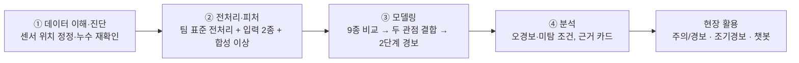

# 담당 파트 정리 — 한눈에 보는 단계별 요약

> **적용 범위 안내(2026-10-07).** 이 문서는 24~28·32~34번 CNN+MCD 계열 담당 작업을 요약한다. 후속 공통 비교와 causal 검증으로 최종 판정 모델은 **주의 = Ridge-VAR `[first_difference]`, 경보 = Ridge-VAR AND MCD `[diff_amp]`**로 변경됐다. 아래 CNN 경보 카드·합성 열화·챗봇 결과는 비교/활용 프로토타입이며 최종 Ridge 성능 수치가 아니다.

> 범위: 내가 맡은 작업(도메인·설비 설명, 모델 비교 24~26, 결합 경보 28, 근거 카드 32, 조기경보 33, 챗봇 34, 설계서·안내서). 팀원 파트(데이터 진단 01~04, 피처 11~13, 규칙 21, 복원 계열 27, 오류분석 31, 운영점 32)는 **링크로만** 연결한다.
> 구성: 작업 단계 4개(데이터 이해·진단 → 전처리·피처 → 모델링 → 분석) → 심사 6개 문항 점검표 → 한계·남은 일 → 파일 색인.
> 근거 표기: **[데이터]** 결과 CSV·노트북으로 확인 / **[추정]** 미검증 / **[가정]** 운영 전제. 수치는 모두 `results/`의 CSV에서 가져왔다.
> **상세판**: 평가 절차·모델 선택 이유·구조와 학습 파라미터·혼동행렬·그래프·가설 검증은 [`docs/modeling_detail_JIW.md`](modeling_detail_JIW.md)에 있다. 이 문서의 각 절 끝에 해당 절 번호를 적었다.

---

## 0. 한 장 요약

**주제 ③ 진동·전류 시계열 기반 프레스 유압펌프 이상 조기탐지 및 오경보 분석**

| | 내용 |
|---|---|
| 데이터 | 정상 20,000행(77분) / 이상 600행(**이벤트 1건**), 센서 3개(상부 진동·하부 진동·전류), 10 Hz, 최대 5초 burst |
| 접근 | 이상이 1건뿐이라 **정상 데이터만으로 학습**하고 정상에서 벗어난 정도를 점수로 쓴다. 임계값은 정상 점수의 상위 1%(q99)로만 정한다 |
| 결과 | **서로 다른 두 모델(시계열 예측 + 통계)이 모두 임계를 넘을 때만 경보**: 정상 세그먼트 오경보 2.8% → 0.2%, 실제 이상은 전부 탐지 |
| 한계 | 약한 초기 이상은 못 잡는다. 이상 1건이라 모든 수치는 "이 이벤트의 기술"이다. 조기경보는 합성 시나리오로만 평가했다 |



### 핵심 숫자 6개

| # | 숫자 | 의미 | 출처 |
|---|---|---|---|
| 1 | 규칙 베이스라인 AUC 0.78~0.87 → 상위 9개 모델 0.9998 이상 | 모델이 규칙보다 낫다. 단 AUC는 천장이라 오경보와 약한 이상 탐지력으로 가렸다 | `results/model_comparison.csv` |
| 2 | 오경보 겹침(자카드) 시계열 모델끼리 0.45~0.65, **MCD와는 0.00~0.08** | 두 계열은 서로 다른 곳에서 틀린다 → 합치면 오경보가 지워진다 | 28번 |
| 3 | 세그먼트 오경보 CNN 단독 2.8% / 1.8% → **CNN AND MCD 0.2% / 0.1%** | 단독 대비 1/10 이하, 95% 구간 −4.1 ~ −1.3%p / −3.1 ~ −0.6%p | 28번 |
| 4 | 시간당 오경보 약 10 / 6건 → **약 0.8 / 0.3건** | 주의 단계와 경보 단계의 현장 부담 차이 | 28번 |
| 5 | 합성 강도 2 탐지율 유지 32% / 44% | AND는 뚜렷한 이상 전용, 약한 이상은 못 잡는다(한계) | 28번 |
| 6 | 열화 완성 전 선행 시간 중앙값 주의 1.4 / 3.6 / 7.4분, 경보 1.0 / 2.8 / 6.7분 | 합성 열화 기준(열화 2 / 5 / 10분). 실제 고장 예측 성능이 아니다 | 33번 |

(수치 쌍은 `group_kfold / time_block` 순서. 평가 방법은 상세판 §1, 혼동행렬은 §5)

---

## 1. 데이터 이해·진단

**한 줄 결론:** 센서가 모터에 있다고 단정한 설명을 바로잡고, 원시 신호로 비교하면 결론이 뒤집힌다는 것을 모델 쪽에서 재확인했다. 데이터 진단의 본체(누수·에일리어싱·라벨 신뢰도)는 팀 노트북 01~04가 다룬다.

| 내가 한 일 | 결과 | 근거 파일 |
|---|---|---|
| 도메인·설비 설명 자료 제작 | 파인블랭킹·유압 계통·센서 배치·이상 전파 경로를 그림과 움직이는 애니메이션으로 설명 | `docs/reference/01_domain_eda_JIW.pdf`, `02_equipment_sensors_JIW.pdf`, `press_animation_JIW.html` |
| **센서 부착 위치 정정** | 처음에 "진동 센서는 모터 몸체"라고 설명했다가 공식 가이드북(7·9·10쪽)으로 확인해 정정: 센서는 유압펌프 상/하단·전력선(외부 설치), 채널 매핑(AI0 상부·AI1 하부)은 확인된 사실, **부착 부위가 모터인지 펌프인지는 확정 불가** → 탐지 대상 표현 "모터-펌프 구동부 이상" 유지 | `docs/reference/README.md`, PR #20 |
| **누수 재확인(모델 쪽)** | 처음에 원시값으로 비교한 결과는 무효였다. 팀 전처리로 다시 돌리니 "CNN이 전류 이상에 가장 강하다"는 결론이 누수 때문이었음(전류 탐지율 0.55 → 0.32) | `docs/project_guide_JIW.md` §누수 |
| 가이드북 방식 확인 | 가이드북은 원신호 3채널을 절대값 → MinMax로 바꿔 20 시점 시퀀스로 LSTM 오토인코더에 넣는다(31~38쪽). 재현해 팀 계약으로도 평가해 비교(§3) | `reports/29_model_guidebook_lstm_ae_JIW.md`, `src/guidebook_*.py` |
| **공백 보간 검증 → 하지 않는다** | 정상 burst를 가려 복원해 봄: 진동은 어떤 방법도 불가(R² ≤ 0), 전류는 burst 안 2초까지만 사인 피팅으로 복원(R² 0.98), **실제 공백(중앙값 4.1초)을 건너서는 R² −0.96으로 0 채움보다 나쁨**. burst마다 전류 위상이 새로 정해짐(위상 오차 중앙값 1.60 rad ≈ 무작위, 주파수는 0.5999 ± 0.0017 Hz로 안정) → 대신 burst별 점수의 시간 흐름을 쓴다 | `reports/14_gap_interpolation_check_JIW.md` |
| 프로젝트 전체 안내서 | 처음 보는 사람이 이해하도록 전체 흐름을 풀어 씀 | `docs/project_guide_JIW.md` (PR #19) |

- 위상이 burst마다 새로 정해지는 원인(수집 구조)은 추정이며 하드웨어를 확인하지 못했다. 운영진에 수집 방식을 문의하면 확정할 수 있다.
- 팀 파트: 누수 차단(형식 피처 AUC 1.000 → 진동 0.566 / 전류 0.597), 에일리어싱, 라벨 신뢰도(진동 확실 18 / 전류 확실 7), 정상 의심 세그먼트 26개 → `reports/01~04`, `13`.

---

## 2. 전처리·피처

**한 줄 결론:** 팀 표준 전처리를 그대로 쓰고, 그 위에 **모델 입력 2종, 피처군 ablation, 합성 이상, 운전 상태 추정**을 만들었다.

| 내가 한 일 | 결과 | 근거 |
|---|---|---|
| **입력 2종 설계** | 신호 모델(CNN·LSTM·MTAD-GAT·GDN·DeepSVDD)은 전처리된 3채널 신호 5샘플을 보고, 통계 모델(MCD·OCSVM·HBOS·COPOD)은 윈도우 진폭 18열을 본다. **시계열 모델은 요약 피처를 쓸 수 없다**는 점이 두 관점 결합의 전제가 됐다 | 24~26 노트북 |
| **피처군 ablation 4종** | 진폭 18열(`amp`) / +전류 사인 잔차 3열 / +형상 9열 / +채널 관계 3열. 2초 합성 탐지: **MCD amp 0.102 → amp+사인 0.228**, OCSVM 0.230 → 0.384. 단 사인 잔차는 세그먼트 단위 값이라 날짜 교란 가능성이 있어 기본(amp)과 **분리해 보고** | `results/26_model_distribution_JIW/cv_scores.csv` |
| **합성 이상 주입** | 정상 윈도우에 4유형(스파이크·진폭 증가·상하 반대 흔들림·전류 불규칙) × 강도(0.25~8)를 넣고 피처를 다시 계산해 탐지율을 잼 | `src/benchmark_jiw.py`, 28번 |
| **운전 상태 추정** | 창 전류 RMS > 125.2면 고부하. 정상 창에서 고부하 89.3% / 저부하 99.9% 정확. 사후 라벨은 평가에만 씀 | 28번 §6 |
| **burst 단위 점수 요약** | 창별 점수를 burst(세그먼트)별로 요약하고 EWMA 추세를 얹음 | `src/early_warning_jiw.py` |

- 팀 파트: 표준 전처리(형식 통일 + 세그먼트 평균 제거), 윈도우 피처 33열, 중복·VIF·PCA → `reports/12`, `13`.

---

## 3. 모델링

**한 줄 결론:** 계열별 대표 9종을 같은 계약으로 비교했더니 실제 이상으로는 구분이 안 돼서(AUC 천장), 오경보와 약한 이상 탐지력으로 가렸다. 서로 다른 계열을 AND로 묶는 것이 가장 효과가 컸다.

### 3-1. 9종 비교 (2초 윈도우, 두 분할 평균, 상세판 §2~4: 모델 선택 이유·구조·학습 설정·전체 표)

| 계열 | 모델 | AUC | 세그먼트 오경보 | 약한 이상 탐지 | 소요/fold |
|---|---|---|---|---|---|
| 예측 | **CNN** (DeepAnT 변형) | 1.000 | 2.4% | **0.308** | 4초 |
| 예측 | LSTM-AD | 1.000 | 2.2% | 0.289 | 8초 |
| 그래프 | MTAD-GAT | 1.000 | 2.4% | 0.306 | 13초 |
| 그래프 | GDN | 0.999 | 3.6% | 0.246 | 4초 |
| 분포 | MCD [amp] | 1.000 | 3.5% | 0.102 | 21초 |
| 분포 | OC-SVM | 1.000 | 8.8% | 0.230 | 0.1초 |
| 분포 | HBOS / COPOD / DeepSVDD | 0.989 / 0.994 / 0.958 | 4.2% / 1.5% / 13.5% | 0.101 / 0.055 / 0.176 | |

- 규칙 베이스라인(팀 21)은 AUC 0.78~0.87이고 3·19·20번 세그먼트를 놓친다. 상위 9개 모델은 0.9998 이상이다.
- **상위 예측 계열 3종(CNN·LSTM-AD·MTAD-GAT)은 구분이 안 된다**(오경보 2.2~2.8%, 약한 이상 0.29~0.31). 대표로 가장 가벼운 CNN을 썼다.
- 이상 유형별 1위가 모두 다르다(스파이크 CNN, 진폭 MTAD-GAT, 상하 반대 흔들림 DeepSVDD) → 한 모델로는 부족하다는 결합의 근거.
- 가이드북 방식 재현: 원본 방식 오경보 111건 / 미탐 45건(가이드북 보고치 78 / 26), 팀 계약 적용 시 2초 AUC 0.922 / 0.821(우리 예측 계열·MCD는 1.000). 원인은 누수 제거와 학습 축소를 분리하지 못함. 노트북 29번, 리포트 `reports/29_*`.

### 3-2. 28번 당시 결합 모델: 두 관점 + 2단계 경보 (비교 프로토타입, 상세판 §2.3·§5)

```
신호 ─▶ CNN(다음 값 예측 오차) ─┐
                                ├─▶ 각자 임계(q99)로 나눈 배수 z
18피처 ─▶ MCD(통계 이탈 거리) ──┘      주의 = CNN z > 1      경보 = CNN z > 1 AND MCD z > 1
```

| 규칙 | 세그먼트 오경보 | 시간당 오경보 | 실제 이상 | 합성 강도 2 |
|---|---|---|---|---|
| CNN 단독 (주의) | 2.8% / 1.8% | 약 10 / 6건 | 전부 탐지 | 0.744 / 0.714 |
| MCD 단독 | 3.8% / 3.1% | 약 13 / 11건 | 전부 탐지 | 0.251 / 0.325 |
| **CNN AND MCD (경보)** | **0.2% / 0.1%** | **약 0.8 / 0.3건** | 전부 탐지 | 0.235 / 0.315 |
| CNN OR MCD | 6.4% / 4.8% | 약 23 / 17건 | 전부 탐지 | 0.760 / 0.725 |

**세그먼트 혼동행렬 (group_kfold, 정상 452 / 이상 13, 시드 평균)**

| 규칙 | TP | FP | FN | TN | 정밀도 | 재현율 | F1 |
|---|---|---|---|---|---|---|---|
| CNN 단독 (주의) | 13 | 12.7 | 0 | 439.3 | 0.51 | 1.00 | 0.67 |
| MCD 단독 | 13 | 17.0 | 0 | 435.0 | 0.43 | 1.00 | 0.60 |
| **CNN AND MCD (경보)** | 13 | **1.0** | 0 | 451.0 | **0.93** | 1.00 | **0.96** |
| CNN OR MCD | 13 | 28.7 | 0 | 423.3 | 0.31 | 1.00 | 0.48 |


미탐은 네 규칙 모두 0이고 차이는 전부 오경보(FP)다. 정밀도·F1은 이상:정상 비율(13 : 452)에 좌우되므로 참고로만 본다(상세판 §5.1).

- 시간당 오경보 = 세그먼트 오경보율 × 시간당 약 352.5 세그먼트(2초 윈도우가 있는 정상 세그먼트 452개 / 관측 76.93분). 처음에 burst 간격으로 452/시간을 쓴 것을 정정했다.
- **가설 5개 중 2개만 통과**: AND의 오경보 감소 통과, 강도 2 유지 70% 미달(32% / 44%), 상태별 임계 **기각**(고부하 3.2% → 3.1%), k of n 부분 기각(오경보↓ 탐지↓), 파트너 모델은 CNN·LSTM-AD·MTAD-GAT 동일.
- 같은 계열끼리의 AND(CNN AND LSTM)는 오경보 2.8% → 2.1%로 효과가 작다. **서로 다른 계열을 합칠 때만** 크게 준다.

### 3-3. 조기경보와 챗봇

| 구성 | 결과 | 한계 |
|---|---|---|
| **조기경보 (33)** | 합성 열화 144개 시나리오에서 열화 완성 전 선행 시간 중앙값 주의 1.4 / 3.6 / 7.4분, 경보 1.0 / 2.8 / 6.7분. 추세 규칙(EWMA)은 평균 0.1~0.8분 더 일찍. **"N분 후" 추정은 오차(1.5~2.4분)가 남은 시간(0.7~1.5분)과 같거나 커서 철회** | 합성 열화(곡선·유형을 우리가 정함). 실제 열화 속도를 모름 |
| **챗봇 (34)** | 소형 오픈소스 LLM(Qwen2.5-1.5B, 로컬 CPU). 문장을 쓰게 하면 9개 중 6개 오류(코드 검사 0건 감지)라서 **근거 번호만 고르게** 변경. 표현을 바꾼 질문의 근거 적중 14% → 64% | 적중률은 낙관적(프롬프트를 같은 세트로 2회 수정), 범위 안 5/14 실패, 모델 1종만 시험 |

---

## 4. 분석 (오류·영향요인)

**한 줄 결론:** 오경보는 고부하 운전에 몰리고 상태 구분으로는 못 막는다. 미탐은 실제 이상에서는 없고 약한 합성 이상에서만 생긴다. 어느 신호 때문에 울렸는지는 근거 카드로 보인다.

| 분석 | 발견 [데이터] | 근거 |
|---|---|---|
| **오경보 집중 조건** | 예측 계열 오경보는 고부하 2.7~3.0% vs 저부하 0%. MCD는 고·저부하를 따로 학습해 분리됨 | 24~26, 28 |
| **상태별 임계는 해법이 아님** | 고부하 전용 q99로 바꿔도 3.2% → 3.1%. 고부하 정상 점수가 고부하 안에서도 꼬리가 길다. 해법은 MCD와의 AND | 28 §6 |
| **AND 후 남는 오경보** | 시드·분할 27개 중 4건, 전부 **고부하 세그먼트의 창 1개짜리** | 28, `error_cases.csv` |
| **미탐** | 실제 이상 세그먼트 미탐 0건(4개 규칙 모두). 미탐은 합성 약한 이상에서만: AND 강도 1 탐지 0.02, CNN 단독 0.34. 실제 이상은 강도 4~8 이상으로 보정됨 | 28 §5 |
| **모델별 강점이 다름** | 스파이크 CNN 0.434, 진폭 MTAD-GAT 0.326, 상하 반대 흔들림 DeepSVDD 0.254, 전류 불규칙 CNN 0.420 | `docs/model_guide_JIW.md` §6 |
| **연속 규칙의 대가** | k of n(2/3)은 오경보 6.4% → 2.7%이나 실제 이상 창 탐지 100% → 77% | 28 §7 |
| **경보 근거 카드** | CNN 오차 비중 1위 채널이 주입 채널과 94~100% 일치(상하 반대 흔들림 강도 1만 72%). 실제 이상 창 63개의 1순위 채널은 전류 48% · 상부 진동 43% · 하부 진동 10%로 **세그먼트마다 다름** → 카드는 "어느 신호가 벗어났나"까지만 말함 | 32번 |
| AND 오경보 카드 | CNN 배수 1.0 · MCD 배수 1.7(임계 바로 위), 실제 이상 창은 CNN 배수 5.8~71.8 | 32번 |

- 팀 파트(중복 없이 연결): FN 이원화(3·19·20은 진동 전용 입력의 한계, 전류를 넣으면 탐지), FP 27모델 중 19개 고부하 집중, 상관 구조 변화, 운영점 설계 → `reports/31`, `32_operating_point`.

---

## 5. 심사 6개 문항 점검표

| 문항 | 배점 | 내 파트의 기여 | 증거 | 자체 평가 | 남은 일 |
|---|---|---|---|---|---|
| 1. 데이터 이해·진단 | 15 | 센서 위치 정정, 모델 쪽 누수 재확인, 공백 보간 판단 | 안내서, reference, 설계서 §2 | **보조** (본체는 팀 01~04) | 수집 방식(위상 무작위) 운영진 확인 |
| 2. AI 예측모델 개발 | **40** | 9종 비교, 결합 경보, 가이드북 재현, 합성 이상 평가, 가설 검증 | 24~26, 28, `model_comparison.csv` | **핵심, 충분.** 베이스라인 포함 2개 이상 비교 | 가이드북 재현은 완료(29번), 학습 길이 효과 분리(G1.5)는 미수행 |
| 3. 영향요인·오류분석 | 15 | 고부하 오경보, 상태별 임계 기각, 강도별 한계, 근거 카드 | 28 §5~7, 32 | **충분.** 팀 31과 상호 보완 | — |
| 4. 현장 활용방안 | 10 | 주의/경보 운영, 시간당 오경보, 조기경보 선행 시간, 근거 카드·챗봇 | 28, 32, 33, 34 | **충분하나 가정 많음.** 현장 검증 없음 | 팀 운영점(32_operating_point)과 임계 방식 정합 |
| 5. 창의성·차별성 | 10 | 두 관점 AND-고정, 합성 강도 평가, 합성 열화 시나리오, 가설 기각 기록, 근거 선택형 챗봇 | 28, 33, 34 | **충분** | — |
| 6. 코드·재현성 | 10 | `src/` 모듈화, 노트북 실행 결과 포함, 버전 고정, 캐시 | `src/*_jiw.py`, `requirements.txt` | **부분.** 가중치(138MB)·챗봇 모델(3GB)은 git 밖이라 이 PC 밖에서는 학습부터 다시 해야 함 | 가중치 전달 방법 문서화 |

---

## 6. 한계와 남은 일

| 항목 | 내용 |
|---|---|
| 이상 이벤트 1건 | "실제 이상 100% 탐지"는 이 한 사건이 뚜렷해서일 수 있다. 오경보율 0.1~0.2%는 세그먼트 한두 개 차이 |
| 합성 평가 | 합성 이상·열화는 우리가 설계한 것이라 이 유형에 유리할 수 있고, 실제 고장 예측 성능이 아니다 |
| 약한 초기 이상 | 강도 1 이하는 어떤 규칙도 못 잡는다. 조기탐지 주장의 한계선 |
| 시간당 오경보 | 세그먼트 환산값이다. 현장 부하와 다를 수 있다 [가정] |
| 점검 권고 | 가이드북·일반 상식 기반 [가정], 현장 정비 기록으로 검증 필요 |
| 챗봇 | 소형 모델 1종, 질문 세트·판독을 직접 만듦, 사용성 미평가 |
| 미수행 | 가이드북 학습 길이 효과 분리(G1.5)·G1 다중 시드, 더 큰 LLM 시험 |
| 번호 겹침 | 32번은 팀 `32_operating_point`와 내 `32_alarm_explain`이 공존(파일명으로 구분) |

---

## 7. 파일 색인

| 구분 | 파일 |
|---|---|
| 읽는 순서 추천 | 이 문서 → `reports/28_model_ensemble_JIW.md` → `33` → `32_alarm_explain` → `34` |
| 입문 | `docs/project_guide_JIW.md`(전체), `docs/model_guide_JIW.md`(모델 9종) |
| 설계 | `docs/design_JIW.md`(2단계 경보), `docs/final_design_JIW.md`(최종 설계 + 실험 반영), `docs/chatbot_design_JIW.md` |
| 모델 비교 | `reports/24~26_*_JIW.md`, `results/24~26_*/` |
| **평가·모델 상세** | `docs/modeling_detail_JIW.md`(평가 절차·모델 선택·구조·파라미터·혼동행렬), `notebooks/35_eval_detail_JIW.ipynb`, `results/35_eval_detail_JIW/` |
| 결합·경보 | `reports/28_model_ensemble_JIW.md`, `src/ensemble_jiw.py` |
| 설명·조기경보·챗봇 | `reports/32_alarm_explain_JIW.md`, `33_early_warning_JIW.md`, `34_alarm_chatbot_JIW.md`, 대시보드 `figures/33_early_warning_JIW/dashboard.html` |
| 팀 통합 | `docs/final_report.md`(심사 6문항 순서의 통합 초안) |
| 팀 파트 | `reports/01~04`, `12`, `13`, `27`, `31`, `32_operating_point_CHS.md` |
