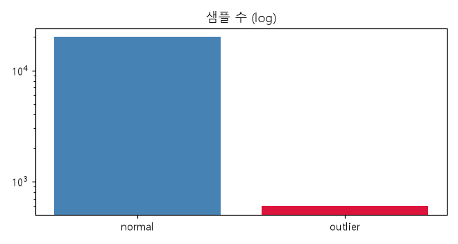
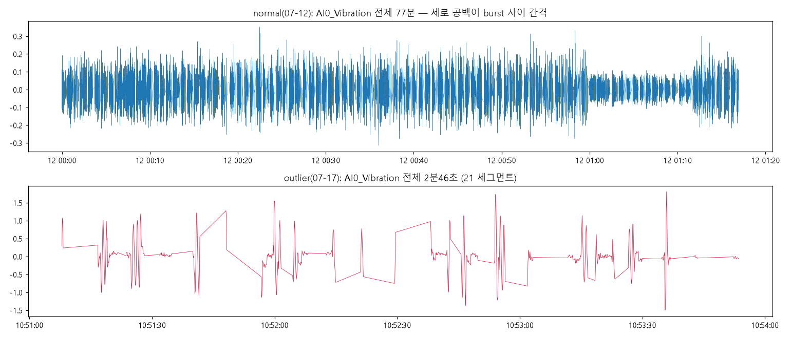
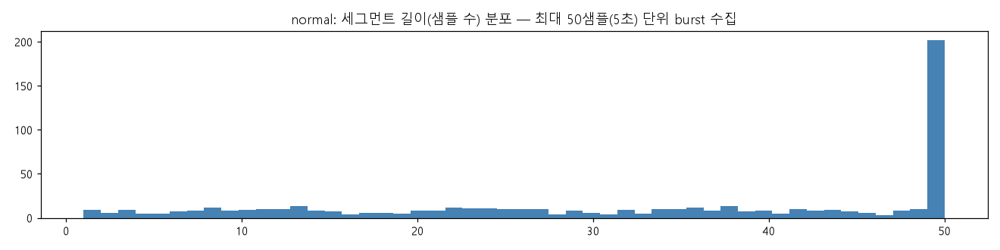
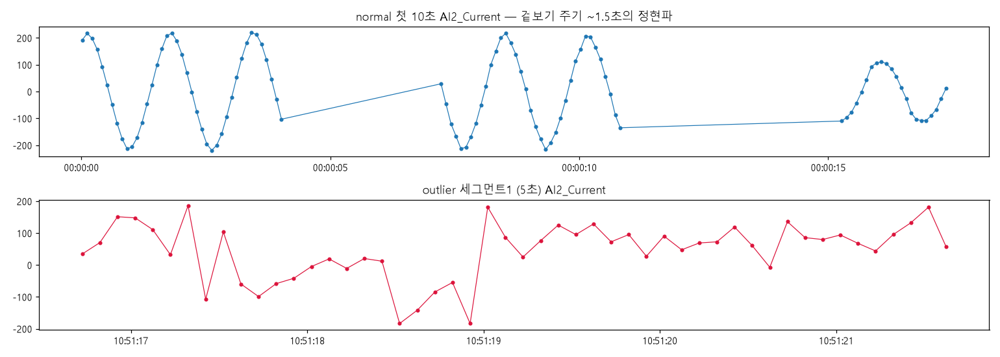
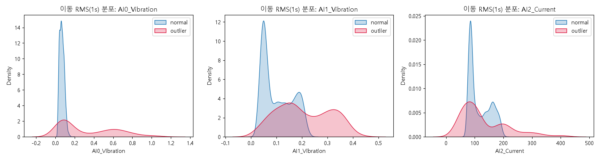

# 주제 ③ 프레스 유압펌프 진동·전류 시계열 — 데이터 품질 진단 리포트

- 작성일: 2026-09-25
- 근거 노트북: `notebooks/01_data_quality.ipynb` (전체 실행 결과 포함)
- 목적: 주제 선정용. 데이터 특성과 필요한 전처리를 파악한다. 모델링은 하지 않았다.
- 표기: 근거가 간접적인 판단은 **(추정)** 으로 표시.

---

## 1. 데이터 한 줄 요약

유압펌프 모터의 **진동 2채널 + 전류 1채널, 10 Hz 샘플링** 시계열. 정상 20,000샘플(2022-07-12, 77분)과 이상 600샘플(2022-07-17, **2분 46초**)이 파일로 나뉘어 있고, 파일이 곧 라벨이다.

## 2. 데이터 구성

| 파일 | 행 | 라벨 | 기간 | 세그먼트(burst) 수 |
|---|---|---|---|---|
| press_data_normal.csv | 20,000 | 전부 0 | 2022-07-12 00:00 ~ 01:17 (77분) | 599 |
| outlier_data.csv | 600 | 전부 1 | 2022-07-17 10:51 ~ 10:54 (2분 46초) | 21 |

- 컬럼: 원본 인덱스, `TimeStamp`(ms), `AI0_Vibration`(상부 진동), `AI1_Vibration`(하부 진동), `AI2_Current`(모터 전류), `Equipment_state`. 채널 배정은 문제 설명 기반 (추정). 물리 단위 불명(가이드북 없음).
- 설비 ID 없음(단일 설비 1대, 추정). 학습/테스트 분할 없음. NaN 0, 중복 0.
- **생산단위**: 1행 = 1샘플(0.1초). 라벨은 샘플 단위로 붙어 있지만 파일 단위로 동일 → 실질적으로 **시간대 단위 라벨**.

## 3. 품질 이슈 Top 5

### ① 이상 이벤트가 1건(1일, 2분 46초, 21 burst)뿐

- 샘플 기준 이상 비율 2.9%, 세그먼트 기준 3.4%, **이벤트 기준 1건**.
- 어떤 F1 점수도 "이 사건 1개를 맞췄다"는 의미라서 일반화 성능을 주장할 수 없다. 오버샘플링은 같은 사건을 복제할 뿐이라 의미가 없다.
- 정상도 하루치 77분이라 "다른 날의 정상을 이상으로 잡는 오경보율"을 데이터로 검증할 수 없다.

### ② 날짜·시간이 곧 라벨 (누수)

- 정상은 07-12, 이상은 07-17. TimeStamp나 원본 인덱스를 피처에 넣으면 100% 분류된다. 절대 시간 피처 금지.
- 데이터는 연속 스트림이 아니라 **최대 50샘플(5초) burst 단위**로 수집되고 burst 사이 2~17초 공백이 있다. 같은 burst의 샘플을 train/test에 나누면 인접 샘플이 답을 알려주므로 **분할은 세그먼트 단위**여야 한다.

### ③ 전류는 10 Hz로 에일리어싱된 AC 파형

- 전류가 ±270 사이를 오가는 정현파. 실제 모터 전류는 60 Hz AC인데 샘플링이 10 Hz(나이키스트 5 Hz)라 **겉보기 주기 약 1.5초의 에일리어싱 파형**이다 (추정).
- 따라서 **FFT·스펙트럼 분석은 무의미**하고, RMS·피크·crest factor 같은 진폭 통계만 신뢰할 수 있다. 예지보전의 표준 기법(베어링 결함 주파수 등)을 쓸 수 없다.
- 순간값은 위상에 따라 −270~+270 어디든 올 수 있어 **샘플 단위 분류는 부적절**. 윈도우(1~5초) 요약 피처가 필수.

### ④ 이상 파일 안에 "조용한" 세그먼트, 정상 파일 안에 "저부하" 구간

- 이상 데이터의 진동은 정상 대비 AI0 표준편차 **6배**(0.07→0.45), AI1 2배, 이동 RMS 중앙값 3배. 전류 |값|>300은 정상 0%, 이상 8%. 대부분 구간은 진폭만으로 분리된다.
- 그러나 **이상 세그먼트 3, 19, 20(72샘플, 12%)은 진동 표준편차가 정상보다 작다**. 라벨이 "이상 시간대"에 통째로 붙은 것이라 세그먼트 단위로는 정상 구간이 섞여 있다. 이 구간은 모델의 **FN(미탐지)으로 집계되지만 실제로는 라벨 노이즈**다.
- 정상의 8번째 10분위 구간(약 60~68분)은 전류 최대 118(다른 구간 260~273), 진동 sd 절반 → 저부하/대기 상태 (추정). 정상에도 운전 상태가 여러 개이며, 단순 임계값은 이 구간에서 **FP(오경보)** 를 낼 수 있다.

### ⑤ 물리 단위 불명
- 진동(g? mm/s?)과 전류(A? ADC raw?) 단위를 알 수 없어 ISO 10816 같은 절대 임계값을 적용할 수 없고, 현장 활용안의 임계값을 실제 단위로 제시하지 못한다.

## 4. 필요 처리 정리

| 항목 | 필요도 | 근거 | 권장 방법 |
|---|---|---|---|
| 결측치 처리 | 하 | NaN 0 | burst 사이 공백을 "결측 구간"으로 인식, 윈도우가 세그먼트 경계를 넘지 않게 처리(`dq.rolling_rms`) |
| 중복 처리 | 하 | 완전 중복 없음(TimeStamp 중복 1건) | 없음 |
| 이상치·라벨 정제 | **중** | 이상 안의 조용한 세그먼트 12%, 정상 안의 저부하 구간 | 이상 세그먼트별 진동 RMS로 **soft label** 또는 조용한 세그먼트 제외·별도 보고. 정상 저부하 구간은 운전 상태 플래그 |
| 불균형 처리 | **상** | 2.9%, 이벤트 1건 | 오버샘플링 무의미. **정상만으로 학습하는 이상탐지**(One-class SVM·IsolationForest·재구성 오차)를 주 모델로, 지도 분류는 비교용 베이스라인 |
| 도메인 지식 결합 | **상** | 단위 불명, 전류 에일리어싱 | 윈도우 피처: 진동 RMS·피크·첨도·왜도·crest factor, 전류 RMS·피크, 상·하부 진동 비, 세그먼트 내 추세. FFT 금지. 조기탐지는 "세그먼트 시작 후 n샘플"로 탐지 지연을 측정 |
| 검증 전략 | **상** | 날짜=라벨, burst 자기상관 | **세그먼트 단위 GroupKFold** + 정상은 시간 순 블록(앞 70%/뒤 30%)으로 오경보율 검증. 이상 21세그먼트는 leave-segment-out. 지표: 세그먼트 단위 탐지율, 정상 세그먼트 오경보율, 탐지 지연(샘플 수) |

## 5. 주제 ③ 관점 총평

- **강점**: 데이터가 작고 깨끗해 파이프라인이 가장 빠르다. 문제 자체가 "오경보 vs 미탐지" 트레이드오프라 심사 3번(FN/FP 조건)·4번(사전경보)·5번(불확실성·임계값 보정)의 서술 구조가 자연스럽다. 정상 내부 저부하 구간과 이상 내부 조용한 구간이 각각 FP·FN 분석의 구체적 재료가 된다.
- **리스크**: (1) 이상 이벤트 1건·1일 → 일반화 주장 불가. (2) 정상도 하루치라 오경보율 검증 근거가 약함. (3) 10 Hz 샘플링으로 주파수 정보 소실 → 예지보전 표준 기법 사용 불가. (4) 물리 단위 불명.
- **난이도 한 줄 평**: 구현은 가장 쉽지만 **데이터 양이 너무 적어 "모델 성능"이 아니라 "탐지 지연·오경보 트레이드오프를 어떻게 설계하고 검증하는가"로 승부해야 하는 주제**. 심사 2번(40점)의 모델 비교는 가능하나 비교 결과의 통계적 의미가 약하다.

## 6. 산출물
- `notebooks/01_data_quality.ipynb` — 실행 결과 포함
- `src/data_quality.py` — `load_all`, `segment_table`, `rolling_rms`, `zero_crossing_period`, `outlier_table`
- `figures/01_data_quality/*.png` — 본문 그림 5장
