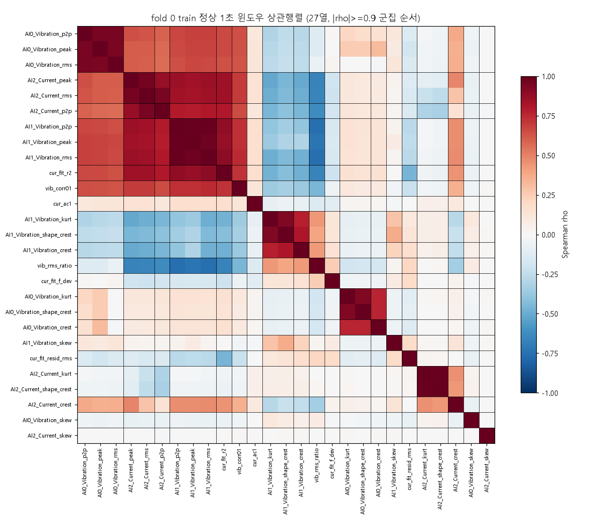
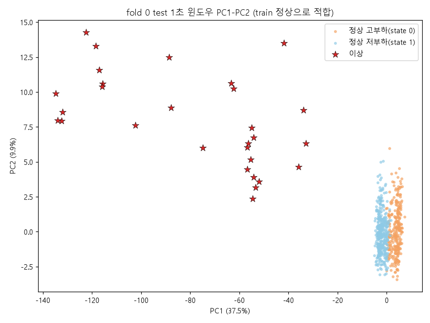
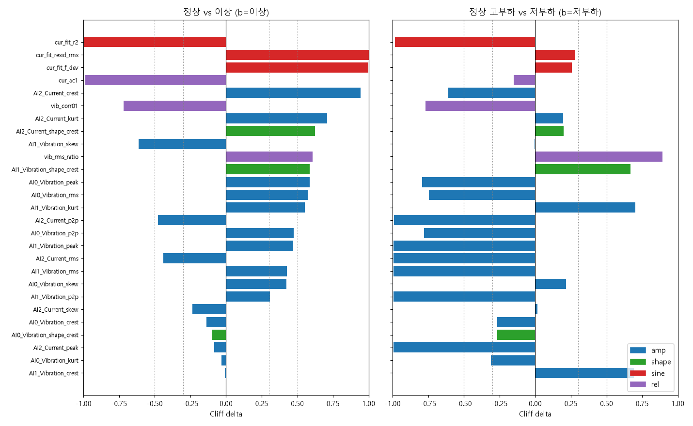
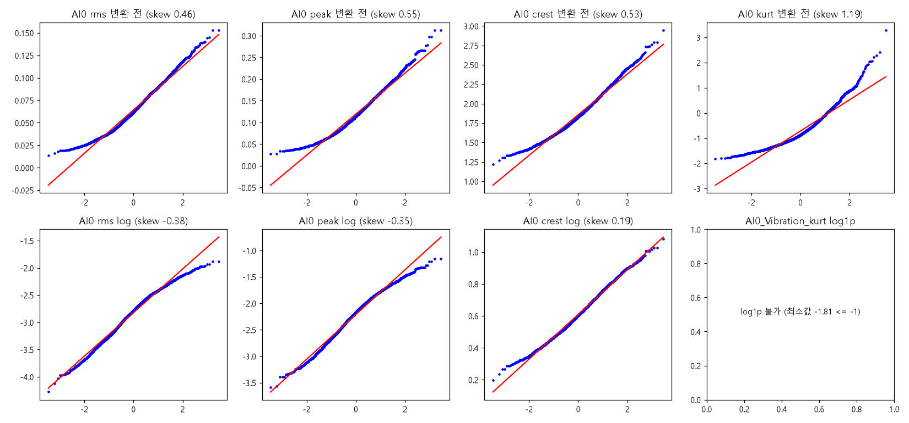

# 주제 ③ 프레스 유압펌프 — 윈도우 피처 통계 구조 리포트 (12_feature_statistics_CHS)

- 노트북: `notebooks/12_feature_statistics_CHS.ipynb` (실행 결과 포함)
- 목적: 표 피처 모델(22·23) 착수 전에 윈도우 피처 33열의 통계 구조(중복·상관·VIF, PCA, 그룹 비교, 분포·변환, 성능 신뢰구간)를 확인해 **입력 피처 계약 v2**(권장 열·제외 열·변환·상태 정규화)와 모델 비교표의 신뢰구간 규칙을 정한다.
- 탐지 대상: 유압펌프 모터-펌프 구동부 이상 (진동 센서의 부착 부위가 모터 몸체인지 펌프 몸체인지 확정할 수 없어 펌프/모터 원인을 구분할 수 없다)
- 입력: `data/processed/11_window_features.parquet` (1초 윈도우 기본, PCA 스모크만 1·2·3초). 코드 `src/stats.py`
- 심사 기준 대응: 2번(E1 입력 계약·E2 PCA 재구성 후보·E7 신뢰구간 규칙), 3번(E5 정상–이상·상태 간 효과 크기), 1번(E1 중복·공선성, E6 분포), 5번(E5 사인·관계 피처가 이상을 가른다는 근거), 6번(`src/stats.py`, fold별 train 정상 적합)
- 원칙: 표준화·PCA·임계·상태 경계는 **train fold 정상 윈도우**로만 적합. 검정 p값은 윈도우가 아니라 **세그먼트 대표값**(중앙값)에서만 계산. 이상은 이벤트 1건(1초 윈도우 기준 평가 가능 세그먼트 17개)이므로 정상 vs 이상 결과는 모집단 추론이 아니라 **이 이벤트의 기술**이다. 추론은 [추정], 전제는 [가정]으로 표기한다.

| 실험 | 가설 / 게이트 | 판정 | 핵심 수치 |
|---|---|---|---|
| E1 중복·상관·VIF | 형상 kurt·skew가 진폭 kurt·skew와 완전 중복, 33열 공분산 특이 | **채택** (중복 제거·축소 집합) | 완전 중복 6쌍(max\|diff\| ≤ 5.33e-15) → 27열, \|ρ\|≥0.9 군집 19개, VIF>10 14열, 조건수 33열 9.7e15 → 27열 99.2 → 축소 23열 30.8 |
| E2 PCA·재구성 오차 | 정상 변동이 소수 축으로 설명 / 이상은 PC 공간 바깥 | 소수 축 **기각**, PC1=부하 축 **채택**, 재구성 오차 **채택(상한 신호)** | 90% 10 / 95% 13성분(5 fold 동일), PC1 37.5%, pca_recon 1초 kfold AUC 1.0000·fpr_segment 0.0550·17/17, time_block 1.0000·0.0615 |
| E5 그룹 비교 | 진폭군 큰 효과 / 상태 간 진폭 차이 큼 | (a) 정상 vs 이상 **참고(보류)**, (b) 상태 간 **채택** | 세그먼트 530/17, 226/304, BH 유의 21/27·25/27, (a) \|δ\|<0.3 6열, (b) \|δ\|>0.5 16열 |
| E6 분포·변환 | 진폭 열 오른쪽 꼬리가 길고 log가 필요 | **보류** (log는 선택) | 진폭 9열 왜도 0.36~0.91 → log 후 0.07~0.53, q99 변동(sd/sd) 1.1~2.3배 감소, heavy tail은 `cur_fit_f_dev` 26.5·`cur_ac1` −4.1·`vib_rms_ratio` 1.7 |
| E7 부트스트랩 CI | rule1 vs rule3 AUC 차이는 재표집하면 무의미 | **부분 기각** → CI 규칙 **채택** | rule1 0.7780 [0.641, 0.889], rule3 0.8676 [0.737, 0.961], 쌍 차이 +0.0896 [0.042, 0.143], p 0.001 |

---

## 1. E1. 중복·상관·VIF — 33열은 27열로, 권장 입력은 23열

**문제.** 11에서 만든 33열에는 스케일 불변인 형상(z-score) 첨도·왜도가 진폭군 `kurt`·`skew`와 같은 값일 가능성이 있고, rms·peak·p2p는 거의 같은 정보다. 그대로 넣으면 Mahalanobis·GMM의 공분산이 특이해진다.

**방법.** (a) 33열 528쌍의 max\|a−b\| < 1e-9 완전 중복 검사, (b) fold 0 train 정상 1초 윈도우(2,605개·421 세그먼트) Spearman 상관·\|ρ\|≥0.9 군집, 상태별 상관 차이, (c) VIF·조건수, (d) \|ρ\|≥0.95 군집에서 대표 1열만 남긴 축소 집합.

**발견.** [데이터]
- 완전 중복 6쌍: AI0·AI1·AI2의 `*_shape_kurt`·`*_shape_skew`가 `*_kurt`·`*_skew`와 max\|diff\| 2.4e-15~5.33e-15(다음으로 가까운 쌍 0.425) → 33열 → **27열**.
- \|ρ\|≥0.9 군집 19개(다중 열 6개): {AI0 rms·peak·p2p}, {AI1 rms·peak·p2p}, {AI2 rms·peak}, shape_crest–kurt 3쌍. `cur_ac1`–사인 잔차, `vib_corr01`–`vib_rms_ratio`는 묶이지 않음(사인·관계 6열은 모두 단독 군집) → 해당 가설 기각.
- 조건수: 33열 **9.7e15**(VIF inf 12개) → 27열 **99.2**(VIF>10 14열, 최대 `AI2_Current_rms` 488.4·`AI2_Current_peak` 479.2) → 축소 23열 **30.8**(VIF>10 8열, 최대 `AI0_Vibration_peak` 66.9·`AI0_Vibration_rms` 61.4).
- 축소 23열 = 진폭 15 + 형상 2(`AI0/AI1_Vibration_shape_crest`) + 사인 3 + 관계 3. 제거 10열 = 중복 6 + 군집 4(`AI1_Vibration_rms`·`peak`→p2p, `AI2_Current_peak`→rms, `AI2_Current_shape_crest`→kurt). AI0 rms·peak·p2p는 0.95 군집이 아니라 남는다.
- 상태별 상관: `AI2_Current_peak`–`cur_fit_resid_rms`가 고부하 −0.363 / 저부하 +0.363(차이 0.726)으로 **부호가 뒤집힌다**. 상위 10쌍 차이 0.577~0.726.

**시사점.** 33열 그대로는 공분산 역행렬이 정의되지 않으므로 22·23 입력은 27열 이하여야 한다. 27열·23열은 조건수 99/31로 PCA 공간을 강제하지 않아도 Mahalanobis 적합이 가능하지만, AI0 진폭군 VIF가 남아 수축(shrinkage) 공분산 또는 축소 집합이 안전하다. 상관 구조가 운전 상태별로 다르므로 단일 공분산은 두 상태를 섞는다.

**활용 아이디어.** `results/12_feature_statistics_CHS/reduced_feature_set.csv`(23열, 열별 제거 사유 포함)를 입력 계약 후보로 두고, 27열은 ablation 비교용으로 쓴다. 상태별 공분산·GMM 성분 2개 변형은 23에서 검증(보류).

## 2. E2. PCA·재구성 오차 — 정상은 13차원, 이상은 그 바깥

**문제.** 정상 27열 변동이 소수 축(부하 + 진동 형상)으로 요약되는지, 이상이 정상 주성분 공간 바깥에 있는지 확인해 "PCA 재구성 오차"를 모델 후보로 쓸 수 있는지 본다.

**방법.** 27열 표준화 PCA를 fold별 train 정상 윈도우로 적합(group_kfold_seg 5 fold, time_block 1~4). 점수 = 표준화 공간 행별 재구성 RMSE(성분 수 = 누적 95% 도달 수), 임계 = train 정상 q99로 21과 동일한 평가 루프. 보조 ablation으로 입력을 피처군별로 나눴다.

**발견.** [데이터]
- 성분 수 90% **10** / 95% **13**(27열 중, 5 fold 동일). fold 0 PC1 37.5%, PC1~3 누적 56.3% → 소수 축 가설 기각.
- PC1 적재 상위 `AI1_Vibration_rms` 0.305, `AI2_Current_peak` 0.300, `cur_fit_r2` 0.299(이어서 AI1 p2p·peak, AI2 rms) → **부하 축**. PC2 = AI0 진동 첨도·crest 축(0.53), PC3 = 전류 crest·kurt 축(0.41).
- `pca_recon` 1초: kfold 평균 AUC **1.0000**(fold별 모두 1.0), fpr_sample 0.0103, fpr_segment **0.0550**, 지연 중앙값 0.9초, 미탐 0(합 17/17). time_block AUC 1.0000·fpr_segment 0.0615·17/17. 2·3초 kfold fpr_segment 0.0569 / 0.0165(time_block 0.0962 / 0.0954).
- 21 규칙 대비: AUC는 rule3 0.8696·rule1 0.7864보다 높지만 fpr_segment는 rule3 0.0358·rule1 0.0395보다 **높다**.
- ablation(1초 kfold, `pca_recon_ablation.csv`): 진폭·형상 21열(진폭 18 + 중복 제거 후 남은 형상 3)만 AUC **0.994**(fold별 0.982~0.999, fpr_segment 0.0589, 9성분), 사인·관계 6열만 AUC **1.000**(fpr_segment 0.0608, 5성분). 노트북·CSV의 행 이름 "진폭·형상 20열"은 표기 오류이며 실제 입력은 21열이다(27 − 사인·관계 6, 다음 재실행 때 라벨 정정).

**시사점.** 세그먼트 브로드캐스트 값인 사인·관계 6열만으로 완전 분리된다. 이상 이벤트가 하루 1건이고 날짜=라벨이므로, AUC 1.0은 일반화 성능이 아니라 "이 이벤트가 정상 분포 바깥에 있다"는 기술이다 [가정]. 21 규칙이 놓친 세그먼트까지 전부 잡은 것은 전류 사인·crest·kurt 축 기여로 보인다 [추정].

**활용 아이디어.** 23 후보에 `pca_recon`(27열, 13성분)을 한 행으로 넣는다. PC1이 부하 축이므로 E5의 상태 조건부 정규화를 병행 변형으로 둔다. 오경보가 규칙보다 높으므로 현장 경보(4번)에서는 AUC가 아니라 fpr_segment 기준으로 임계를 다시 잡아야 한다.

## 3. E5. 그룹 비교 — 이상을 가르는 것은 진폭이 아니라 사인·관계, 상태 차이는 진폭

**문제.** 진폭군이 이상을 크게 가르는지, 고/저부하 사이 정상 분포 위치가 달라 단일 임계가 상태별로 다른 오경보율을 내는지 확인한다.

**방법.** 1초 윈도우를 세그먼트 중앙값으로 줄인 뒤 (a) 정상 **530** vs 이상 **17**, (b) 정상만 고부하(state 0) **226** vs 저부하(state 1) **304** 세그먼트를 Welch t·Mann–Whitney U·Cohen d·Cliff δ, BH 보정으로 비교(윈도우 수 3,264/96이 아님). (a)의 라벨 기반 열 선택은 지도 정보 사용이므로 ablation 전용이다.

**발견.** [데이터]
- (a) BH 유의 **21/27열**. 최대 효과는 사인·관계군: `cur_fit_resid_rms` δ 1.000(중앙값 5.66 → 56.07), `cur_fit_r2` −1.000(0.9965 → 0.4507), `cur_fit_f_dev` 0.998, `cur_ac1` −0.987, `AI2_Current_crest` 0.944.
- 진폭군은 중간 수준: AI0 rms δ 0.573·peak 0.585·p2p 0.473, 전류 rms δ **−0.439**·p2p −0.476(이상의 전류 AC가 정상보다 **작다**) → "진폭군 큰 효과" 기각. 정상 q99 대비 이상 중앙값 AI0 rms 1.49배·peak 1.65배·p2p 1.16배로 임계 여유가 작다.
- 관계군 부호 반전: `vib_corr01` 0.281 → −0.348(δ −0.718), `cur_ac1` 0.900 → 0.427, `vib_rms_ratio` 0.710 → 1.370.
- (a) \|δ\|<0.3 **6열**: `AI0_Vibration_kurt`·`crest`·`shape_crest`, `AI1_Vibration_crest`, `AI2_Current_peak`, `AI2_Current_skew`(축소 23열에 남는 것 5열). 단 AI0 kurt·crest는 PC2 축이라 다변량 기여 가능성이 있어 제외하지 않는다.
- (b) BH 유의 **25/27열**, \|δ\|>0.5 **16열**: AI1 rms·peak·p2p \|δ\| ≈ 0.995, 전류 rms·peak·p2p ≈ 0.99, `cur_fit_r2` −0.982, `vib_rms_ratio` 0.893, AI0 rms·peak·p2p 0.74~0.79 등. 축소 23열과의 교집합 **13열**.

**시사점.** 진폭 RMS 단일 규칙의 한계(21 미탐 3·19·20)는 "이상을 가르는 축이 진폭이 아니라 사인 잔차·전류 crest·진동 상관 방향"이라는 데서 설명된다(3번). 반대로 진폭은 운전 상태를 강하게 가르므로 단일 임계·단일 가우시안은 상태별 오경보율을 다르게 만든다(4번).

**활용 아이디어.** 22·23에 "상태 조건부 정규화(상태별 표준화 또는 상태별 임계)" 변형 행을 추가하고, 정규화 대상은 (b) \|δ\|>0.5이면서 축소 집합에 남는 13열로 한다. 상태 정의는 21과 같은 전류 AC RMS 2-means 경계를 쓰되, parquet `state`는 0 = 고부하(전류 AC RMS 중앙값 156.3)·1 = 저부하(86.4)로 **21 셀 내부 규약(1 = 고부하)과 반대**이므로 혼용하지 않는다. 사인·관계 피처가 이상을 가른다는 점은 5번(도메인 기반 피처)의 근거다.

## 4. E6. 분포·변환 — log는 선택, heavy tail은 사인·관계 3열

**문제.** Gaussian 계열(GMM·Mahalanobis)과 q99 임계가 오른쪽 꼬리에 흔들리는지, log 변환이 필요한지 확인한다(IsolationForest는 단조 변환에 불변).

**방법.** fold 0 train 정상 2,605 윈도우 27열의 왜도·초과첨도·Shapiro를 none/log1p/log(양수 16열)로 비교. 진폭 rms·peak·crest 9열은 fold 간 q99 표준편차 / 변환 값 표준편차(`thr_sd_over_sd`)를 변환 전후로 비교.

**발견.** [데이터]
- 진폭 9열 변환 전 왜도 **0.36~0.91**(최대 `AI1_Vibration_crest` 0.911) → 이미 \|g\|<1, "꼬리가 길다" 기각. log 후 0.07~0.53(절대값 기준).
- \|왜도\|≥1인 5열은 모두 진폭이 아니다: `cur_fit_f_dev` 26.47(초과첨도 872.9), `cur_ac1` −4.14(33.3), `AI1_Vibration_kurt` 1.85, `vib_rms_ratio` 1.66, `AI0_Vibration_kurt` 1.19.
- q99 변동: cv_thr는 변환 전에도 0.0011~0.0355로 작고, `thr_sd_over_sd`는 9열 모두 **1.1~2.3배** 감소(AI0 rms 0.0860 → 0.0408, AI0 peak 0.1841 → 0.0832, AI2 rms 0.0065 → 0.0040).
- Shapiro p<0.05: none 27/27열, log 16/16열(표본 크기·윈도우 종속성 때문에 참고용). kurt·skew·`vib_corr01`·`cur_ac1`은 음수가 있어 log 불가, log1p는 rms 스케일(≈0.1)에서 거의 항등.

**시사점.** 계획서의 "log 표준"은 채택하지 않는다. 이득은 임계 안정성 1.1~2.3배로 작고, 더 큰 위험은 사인·관계 heavy tail 3열이다.

**활용 아이디어.** 23 입력의 양수 진폭 열(rms·peak·p2p)에만 log를 선택 적용하고, `cur_fit_f_dev`·`cur_ac1`·`vib_rms_ratio`는 순위 변환·클리핑 또는 log(f_dev)·log(1−ac1) 변환을 시험한다 [추정]. 22(IsolationForest)는 무관.

## 5. E7. 부트스트랩 신뢰구간 — 우열은 쌍 차이 구간으로 판정

**문제.** 이상 세그먼트 17개로 계산한 21 rule1(0.786) vs rule3(0.870) AUC 차이를 점추정만으로 비교표에 두면 과대 해석될 수 있다.

**방법.** 21과 같은 정의로 `rule1_rms_ai0`·`rule3_rms_state_dir`을 재현하고, kfold OOF 점수를 fold별 q99 임계로 정규화해 모은 뒤 정상·이상 세그먼트를 각각 복원 추출(n_boot 1,000, 전부 유효).

**발견.** [데이터]

| 모델 | OOF 합산 AUC [95% CI] | 21 fold 평균 AUC | fpr_segment [95% CI] | 21 fpr_segment |
|---|---|---|---|---|
| rule1_rms_ai0 | 0.7780 [0.6410, 0.8892] | 0.7864 | 0.0396 [0.0245, 0.0566] | 0.0395 |
| rule3_rms_state_dir | 0.8676 [0.7371, 0.9605] | 0.8696 | 0.0358 [0.0208, 0.0528] | 0.0358 |

- 개별 AUC 구간은 **겹친다**(rule1 상한 0.889 > rule3 하한 0.737). 그러나 같은 재표집 안의 쌍 차이 rule3 − rule1 = **+0.0896 [0.0420, 0.1434]**, 양측 p 0.001(하한 1/1000), 0 미포함(21 fold 평균 차이 0.0832).

**시사점.** 같은 세그먼트를 공유하는 두 모델의 AUC는 강하게 양의 상관이라, 개별 구간 겹침으로 "차이 없음"이라 하면 틀린다. 방향 결합(rule3)의 개선은 이 이벤트 안에서는 재표집에도 유지된다.

**활용 아이디어 (비교표 CI 규칙).** (1) 모든 모델 행에 `auc_ci_low/high`·`fpr_segment_ci_low/high`(세그먼트 부트스트랩 1,000회, seed 42). (2) 우열은 쌍 차이 95% 구간의 0 포함 여부로 판정. (3) p는 "p<0.001"로 표기. (4) 이상 세그먼트 17개·이벤트 1건 한계를 표 주석에 항상 병기.

---

## 6. 모델링·오류분석에 넘기는 것

- **입력 계약 v2 후보**: 기본 입력은 `reduced_feature_set.csv`의 23열, 27열은 ablation. 33열 그대로는 사용 금지(조건수 9.7e15). 26(JIW)은 진폭 18열 + 피처군 추가 방식으로 이미 비교했으므로, 23열 계약은 새 노트북부터 적용하고 기존 24~26 결과를 소급해 바꾸지 않는다.
- **상태 조건부 정규화 변형**: E5(b) 13열 대상, 22·23 비교표에 별도 행. `state` 규약 반전(parquet 0 = 고부하) 주의.
- **PCA 재구성 행**: 23에 `pca_recon`(13성분) 추가. 1초 kfold AUC 1.0000은 24·25(JIW) 1초 모델들의 AUC 0.995 이상·time_block 17/17 탐지와 같은 "이벤트 1건 분리" 수준이며, 우열은 E7 쌍 차이 규칙과 fpr_segment로 서술한다.
- **사인·관계 브로드캐스트 의존 → 날짜 교란 주의**: 사인·관계 6열만으로 AUC 1.000. 이 피처군은 세그먼트 단위 값이고 전류 계측 경로가 날짜별로 달랐을 가능성(03 A-1)이 남아 있으므로, 모델 성능은 진폭·형상만의 결과(0.994)와 나란히 보고한다.
- **heavy tail 3열 처리**: `cur_fit_f_dev`·`cur_ac1`·`vib_rms_ratio`는 Gaussian 계열 입력 전에 순위 변환·클리핑 시험.
- **비교표 규칙**: E7 (1)~(4)를 `results/model_comparison.csv` 작성 시 적용.

## 7. 한계

- **이상 이벤트 1건**: 모든 정상 vs 이상 수치(E2 AUC, E5 (a), E7)는 이 이벤트의 기술이며 다른 고장 유형으로 일반화하지 않는다.
- **날짜 = 라벨**: 정상·이상이 서로 다른 날이라 사인·관계 피처의 완전 분리는 설비 상태가 아니라 계측 조건 차이일 수 있다.
- **세그먼트 브로드캐스트 피처**: `vib_corr01` 등은 세그먼트 전체 값을 윈도우에 복사하므로 윈도우 단위 성능과 실시간 성능을 과대평가한다.
- **평가 가능 이상 세그먼트 17개(1초)**: 원래 21개 중 1초 윈도우를 만들 수 있는 세그먼트만 평가되며, 부트스트랩 구간 폭이 0.22~0.25로 넓다.
- 상관·VIF·분포는 fold 0 train 정상 기준이고, 정규성 검정은 윈도우 종속성 때문에 참고용이다.

## 8. 남은 확인 항목 (31 오류분석으로 이관)

- 정상 vs 이상 상관 구조 변화(\|ρ_정상 − ρ_이상\|): 현재 `corr_by_state_diff.csv`는 고부하 vs 저부하(상위 10쌍)만 있다.
- PCA 공간에서 FN 세그먼트 3·19·20의 위치, 세그먼트별 SPE(재구성 오차)·Hotelling T² 분해로 어떤 축이 탐지에 기여했는지 확인.
- 분포 비교에 KS 통계량 보강(현재 왜도·첨도·Shapiro·Q-Q만).
- 상태별 공분산·GMM 2성분 변형의 실제 효과(E1 보류분)와 heavy tail 3열 변환 효과(E6 보류분).
