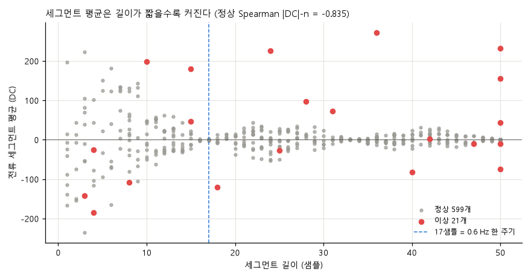
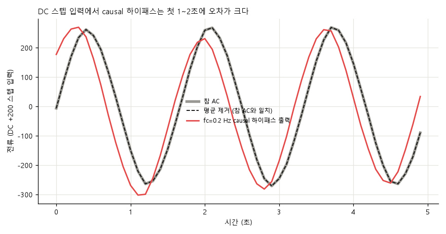
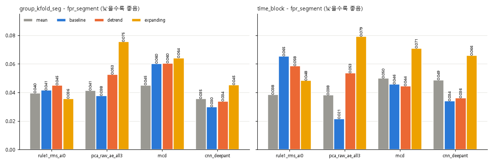
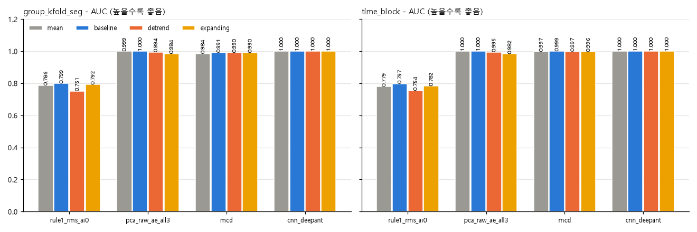
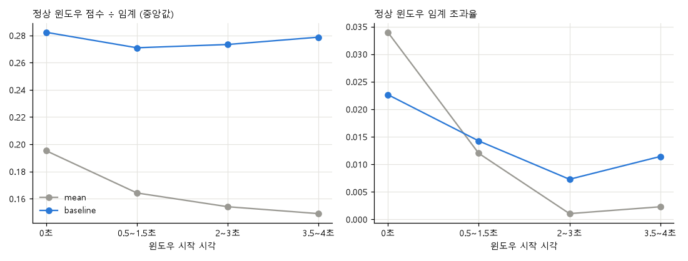
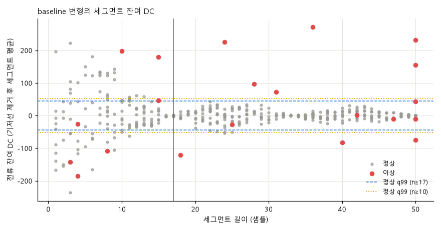

# 주제 ③ 프레스 유압펌프 — 전처리 DC 오프셋 점검 리포트 (13_preprocess_dc_check_CHS)

- 노트북: `notebooks/13_preprocess_dc_check_CHS.ipynb` (실행 결과 포함, 총 실행 약 1.5분)
- 목적: 표준 전처리의 세그먼트 평균 제거가 타당한지 점검하고, 대안 3종(`baseline` 기저선 상수, `detrend` 선형 추세, `expanding` 누적 평균)을 같은 평가 계약으로 비교한다. 가설: 정상 전류의 DC는 거의 상수, 이상 세그먼트의 DC는 드리프트를 포함, 짧은 세그먼트의 "평균"은 DC가 아니라 사인 위상값.
- 탐지 대상: 유압펌프 모터-펌프 구동부 이상 (진동 센서 부착 부위가 모터인지 펌프인지 확정할 수 없어 원인을 구분할 수 없다)
- 입력: `data/raw`(없으면 zip 자동 추출), `data/processed/11_window_features.parquet`의 윈도우 키·`fold`·`block`·`state`. 코드 `src/preprocess.py`(DC 제거 방식 확장)
- 출력: `figures/13_preprocess_dc_check_CHS/`, `results/13_preprocess_dc_check_CHS/`(표 13개). `metrics.csv`는 만들지 않는다(31 비교표에 합산하지 않음).
- 담당: CHS
- 심사 기준 대응: 1·5번(DC 진단, 하이패스 기각), 2·3번(변형 ablation 오경보), 3·4번(위치 효과, DC 보조 지표), 6번(전 과정 재현)
- 원칙: 이상은 이벤트 1건(1초 윈도우 평가 가능 세그먼트 17개)이므로 모든 정상 vs 이상 수치는 이 이벤트의 기술이다. 평가 계약은 24~27과 동일(1초 윈도우, group_kfold_seg(gkf) 5 + time_block(tb) 4, 임계 = train 정상 q99). 운전 상태 번호 0 = 고부하, 1 = 저부하.

## 0. 요약

| 항목 | 판정 | 핵심 수치 | 심사 |
|---|---|---|---|
| A-1 DC 상수성 | 정상은 상수, 이상은 드리프트 | `lin_r2` q50 정상 0.023 vs 이상 0.136(q95 0.696), `lf_frac` q95 0.000 vs 0.528 | 1 |
| A-2 길이 의존성 | 짧은 세그먼트 평균 = 위상값 | Spearman(\|DC\|, n) −0.835, n=5 RMS 잔존 47%, 정상 21.7%(130/599)가 n<17 | 1·5 |
| A-3 위상 산물 여부 | 이상 DC는 실제 오프셋 | n≥24 정상 \|DC\| 최대 52.94, 이상 13개 중 8개 초과(최대 272.43) | 1·5 |
| A-4 하이패스/밴드패스 | **기각** | fc=0.1 causal 상대 오차 0.253이나 DC 스텝 첫 1초 오차 123.3(AC std 104.2 초과) | 1·5 |
| A-5 기타 품질 | 시간축·이상치 문제 없음 | dt 전부 0.1초, 5σ 초과 0 | 1 |
| B-1 누수 점검 | `baseline`·`expanding`은 DC 누수 잔존 | `baseline` \|평균\| AUC 0.9443 / 0.9198 / 0.8911, `mean`·`detrend` 0.5000 | 1·2 |
| B-2 변형 ablation | `baseline` 일관 우위 없음, `detrend`·`expanding` 악화 | `pca_raw_ae_all3` tb 0.0381 → 0.0215(baseline), 0.0535(detrend), 0.0792(expanding) | 2·3 |
| B-3 위치 효과 | `mean`은 세그먼트 시작에서 오경보 증가 | 시작 윈도우 초과율 3.40% vs 3.5~4초 0.23% | 3·4 |
| C DC 보조 지표 | 보조 지표로만 채택 (판정 보드 #5) | n≥10: 이상 17개 중 11개(19·20 포함), 정상 오경보 6/530(1.13%), AUC 0.9196 | 3·4 |

## 1. DC 오프셋 진단 (A-1 ~ A-3)

**방법.** 세그먼트·채널별 평균(`_dc`)과 AC 표준편차, 선형 추세 설명력 `lin_r2`(n≥4), 후반−전반 평균 차이/AC std(`halfdiff_over_std`), 평균 제거 후 0 < f ≤ 0.2 Hz 전력 비율 `lf_frac`(n≥20)을 `seg_dc.csv`(620행, 정상 599 / 이상 21)로 저장했다. 입력은 `unify_format`(진동 6자리, 전류 1.19209 격자 + 1자리)까지만 적용하고 DC는 그대로 둔 표다.

### A-1 세그먼트 내 DC 상수성 (`dc_constancy.csv`)

**결과.** [데이터] 정상 전류(n≥20, 452개)는 `lin_r2` q50 0.023 · q95 0.113, `lf_frac` q95 0.000, `halfdiff` q05~q95 −0.59 ~ 0.60이다. 이상 전류(13개)는 `lin_r2` q50 0.136 · q95 0.696, `lf_frac` q95 0.528, `halfdiff` 중앙값 0.339로 모두 정상보다 크다. 진동은 정상에서 추세가 약하고(`lin_r2` q50 0.004~0.010), 이상 AI1은 q50 0.107 · q95 0.407로 전류만큼은 아니어도 드리프트가 있다.

**시사점.** 정상 전류의 DC는 세그먼트 안에서 상수로 봐도 되지만, 이상 세그먼트는 느린 드리프트가 분산의 70%(q95 0.696), 저주파 전력의 53%(q95)까지 차지한다. "평균 한 값을 빼면 끝"이라는 가정은 정상에서만 성립한다.

### A-2 세그먼트 평균 vs 길이 (`dc_vs_length.csv`)

**결과.** [데이터] 정상 전류 \|DC\|와 길이의 Spearman은 −0.835(599개)다. 길이 [50]의 \|DC\| q95는 1.19(최대 1.45, 중앙값 0.57)로 사실상 상수인데, 짧아질수록 (34,49] 22.5 → (25,34] 28.2 → (16,25] 45.3 → (8,16] 90.3 → (0,8] 182.4(최대 235.6)로 커진다. 0.6 Hz 사인의 이론 손실(평균 제거 후 RMS ÷ 참 RMS, 36위상 평균/최소)은 n=3 0.276/0.048, n=5 0.470/0.164, n=8 0.718/0.401, n=10 0.843/0.572, n=17 1.000/0.990이다.

**시사점.** 정상 세그먼트의 21.7%(130/599)가 17샘플(0.6 Hz 한 주기) 미만이라 그 "세그먼트 평균"은 DC가 아니라 사인의 위상값이고, 평균 제거는 AC를 깎는다. 길이 17 이상에서 손실이 사라지므로 긴 세그먼트에서 추정한 상수 기저선(`baseline`)이 짧은 세그먼트에도 일관되게 적용되는 후보가 된다.

### A-3 이상 DC는 위상 산물이 아니다 (`dc_outlier_vs_normal_len24.csv`)

**결과.** [데이터] n≥24 정상 413개의 \|전류 DC\|는 q99 34.23, 최대 52.94다. 같은 길이의 이상 13개 중 8개(17: 272.4, 16: 231.9, 18: 225.6, 15: 155.4, 13: 97.3, 7: −81.4, 6: −74.4, 3: 73.5)가 정상 최대를 넘고, 나머지 5개(1·8·11·2·12)는 정상 범위(\|DC\| 1.9~44.0)다. 19·20은 길이 24 미만이라 이 비교에서 빠진다.

**시사점.** 155~272는 위상으로 설명되는 편차가 아니라 실제 오프셋이다. 다만 5/13은 DC 이상이 없어 DC는 이상의 일부 징후일 뿐이다. 정상 평균 제거를 유지하는 근거이자(심사 1번), 에일리어싱·형식 누수와 함께 도메인 기반 규명 사례다(5번).

## 2. 하이패스/밴드패스 기각 (A-4, `highpass_rejection.csv`)

**방법.** 길이 50 정상 세그먼트 200개(AC std 중앙값 104.2)의 전류에 2차 Butterworth 하이패스(fc 0.1·0.2·0.5·1.0 Hz)를 zero-phase·causal로 적용해 평균 제거 결과와의 상대 RMS 오차 중앙값을 냈다. +200 DC 스텝을 더한 신호의 참 AC 대비 절대오차는 구간(0~1초, 1~2초, 4~5초)별로 잰다.

**결과.** [데이터] 상대 오차 중앙값(zero-phase / causal): fc=0.1 0.546 / 0.253, 0.2 0.420 / 0.489, 0.5 0.405 / 1.084, 1.0 0.891 / 1.202. DC 스텝 오차(causal): fc=0.2 98.0 / 58.1 / 51.2, fc=0.1 123.3 / 31.1 / 37.8, fc=0.5 111.7 / 121.7 / 120.9. zero-phase fc=0.2도 68.3 / 9.7 / 52.8이다.

**시사점.** AC를 보존(상대 오차 0.25 근처)하면서 5초 안에 DC 스텝을 지우는 차단 주파수가 없다. 0.5 Hz 이상은 0.6 Hz AC 자체를 왜곡한다. 하이패스·밴드패스는 **기각**하고 상수 제거(`mean`/`baseline`)를 유지한다(심사 1·5번).

## 3. 기타 품질 점검 (A-5, `misc_quality.csv`)

**결과.** [데이터] 세그먼트 안 샘플 간격은 정상·이상 모두 q01/q50/q99 = 0.1초(결측 구간 없음), 중복 타임스탬프는 정상 1개 · 이상 0개, 세그먼트 평균 제거 후 5σ 초과 샘플은 모든 채널에서 0이다. 전류 범위는 정상 −271.8 ~ 273.0, 이상 −399.4 ~ 538.8이고 이상 AI0는 −1.50 ~ 1.80(정상 ±0.35)이다. 길이는 정상 n=50 202개 · n<10 69개 · n<17 130개(중앙값 37), 이상 n=50 5개 · n<10 4개 · n<17 7개(중앙값 28)다.

**시사점.** 시간축·이상치 문제는 없고, DC 처리의 핵심 위험은 짧은 세그먼트 비중이다(n<17: 정상 21.7%, 이상 33.3%).

## 4. 전처리 변형 ablation (B)

| 변형 | 의미 |
|---|---|
| `mean` | 세그먼트 평균 제거(benchmark_v1, 24~27과 동일) |
| `baseline` | 정상 전체 긴 세그먼트(n≥17)에서 추정한 채널별 상수를 뺀다(길이 무관, causal 후보) |
| `detrend` | 세그먼트별 1차 선형 추세를 뺀다(오프라인) |
| `expanding` | 세그먼트 안 누적 평균을 뺀다(causal) |

모델 4종: `rule1_rms_ai0`(AI0 1초 RMS), `pca_raw_ae_all3`(복원 계열), `mcd`(진폭 18열), `cnn_deepant`(30 epoch, seed 0). 검증: `mean`·`rule1`의 gkf AUC 0.7864 · fpr_segment 0.0395가 21 결과와 일치한다(전체 144행 = 4변형 x 4모델 x 9분할). `mean` 변형 재계산 진폭 18열은 parquet과 최대 절대 2.441e-05 차이(float32 반올림 수준).

### B-0 기저선의 fold별 변동 (`baseline_by_fold.csv`)

[데이터] 전류 기저선은 gkf fold 0~4가 0.572 ~ 0.596, tb k=1~4가 0.502 ~ 0.584(k=1은 train 정상 113개), 정상 전체 사용값은 0.576이다. 모두 0.4~0.8 범위이고 격자 1.19209 미만이다. 진동 두 채널은 0이다. fold 변동은 전류 AC std(약 100)의 0.1% 이하(최대 0.094)이므로 정상 전체 1회 적합으로 단순화해도 평가가 달라지지 않는다.

### B-1 형식 누수 점검 (`leak_check_by_variant.csv`)

변형별 DC 제거 후 \|세그먼트 평균\| 단독 AUC(620개 세그먼트):

| 변형 | AI0 | AI1 | AI2(전류) |
|---|---|---|---|
| `mean` | 0.5000 | 0.5000 | 0.5000 |
| `baseline` | 0.9443 | 0.9198 | 0.8911 |
| `detrend` | 0.5000 | 0.5000 | 0.5000 |
| `expanding` | 0.8958 | 0.8590 | 0.5257 |

**주의(핵심 한계).** `baseline`·`expanding`은 이상 파일 세그먼트의 DC를 제거하지 않는다. `baseline`의 AUC가 02 진단의 원본 \|DC\| 값(0.9443 / 0.9198 / 0.8911)과 같다. 따라서 두 변형의 **실제 이상 AUC·탐지 수는 파형이 아니라 DC(계측 체인 변경과 실제 이상의 구분 불가, 판정 보드 #5)의 도움을 받은 상한**으로 읽고, 파형 탐지의 정직한 비교는 `mean` vs `detrend`다. `baseline`의 오경보(fpr_segment)는 정상 데이터만으로 계산되므로 이 누수의 영향을 받지 않는다. 소수 자릿수 `ndec_mean`은 `detrend`에서 AI0 0.7885 · AI2 0.7644, `baseline`에서 AI0 0.7096으로 일부 남는다(`mean` 0.52~0.56). `step_share`·`uniq_ratio`는 모든 변형에서 0.50~0.60이다.

### B-2 변형 x 모델 (`variant_metrics.csv`, `variant_cv.csv`, `fn_by_variant.csv`)

fpr_segment / n_detected(이상 17개 중). 낮은 fpr이 좋다.

| 모델 | split | mean | baseline | detrend | expanding |
|---|---|---|---|---|---|
| rule1_rms_ai0 | gkf | 0.0395 / 14 | 0.0414 / 14 | 0.0450 / 14 | 0.0356 / 14 |
| rule1_rms_ai0 | tb | 0.0384 / 14 | 0.0653 / 14 | 0.0585 / 14 | 0.0482 / 14 |
| pca_raw_ae_all3 | gkf | 0.0413 / 17 | 0.0376 / 17 | 0.0525 / 15 | 0.0754 / 14 |
| pca_raw_ae_all3 | tb | 0.0381 / 17 | 0.0215 / 17 | 0.0535 / 15 | 0.0792 / 14 |
| mcd | gkf | 0.0451 / 17 | 0.0602 / 17 | 0.0605 / 17 | 0.0641 / 16 |
| mcd | tb | 0.0499 / 17 | 0.0457 / 17 | 0.0445 / 17 | 0.0709 / 17 |
| cnn_deepant | gkf | 0.0354 / 17 | 0.0297 / 17 | 0.0338 / 17 | 0.0452 / 17 |
| cnn_deepant | tb | 0.0486 / 17 | 0.0339 / 17 | 0.0360 / 17 | 0.0659 / 17 |

AUC(gkf)는 `cnn_deepant` 전 변형 1.0000, `pca_raw_ae_all3` 0.9995 / 1.0000 / 0.9944 / 0.9837(mean / baseline / detrend / expanding), `mcd` 0.9842 / 0.9908 / 0.9902 / 0.9902, `rule1` 0.7864 / 0.7985 / 0.7510 / 0.7916이다.

**결과.** [데이터] 미탐 세그먼트: `rule1`은 4변형 모두 3·19·20, `cnn_deepant`는 모두 0, `mcd`·`pca_raw_ae_all3`는 `mean`·`baseline`에서 0이다. `detrend`에서 `pca_raw_ae_all3`가 19·20, `expanding`에서 `pca_raw_ae_all3`가 3·19·20, `mcd`(gkf)가 19를 놓친다.

**시사점.**
- `baseline` vs `mean`: 탐지 수는 모든 모델에서 같고, 복원·예측 계열은 오경보가 낮아졌다(`pca_raw_ae_all3` tb 0.0381 → 0.0215, `cnn_deepant` gkf 0.0354 → 0.0297; 단 `pca_raw_ae_all3` gkf 0.0413 → 0.0376은 fold당 세그먼트 0.4개 수준의 노이즈). 반면 `mcd` gkf(0.0451 → 0.0602)와 `rule1` tb(0.0384 → 0.0653)는 높아져 일관된 우위가 아니다. fold당 정상 test 세그먼트가 약 100개라 0.01은 세그먼트 1개 수준이다. 위 B-1 주의대로 탐지 수 동률은 DC 도움을 받은 상한이다.
- `detrend`(`mean`과 정직한 비교): `mcd`·`cnn_deepant`는 17개를 유지하지만 `pca_raw_ae_all3`는 19·20을 잃는다(15/17). 오경보는 8칸 중 5칸에서 늘지만 `mcd` tb·`cnn_deepant` 두 split은 오히려 낮다. `pca_raw_ae_all3`의 19·20 미탐은 두 세그먼트의 이상이 DC·저주파에 있다는 해석과 맞지만 근거는 모델 1종이다(심사 2·3번).
- `expanding`: `rule1` gkf(0.0356)를 빼면 가장 나쁘다. 오경보가 늘고 `pca_raw_ae_all3`(3·19·20)·`mcd` gkf(19)가 탐지를 잃는다. 누적 평균이 앞부분에서 `mean`과 같은 위상 편향을 갖는 구조가 원인으로 추정되나 위치 효과는 `mean`·`baseline`만 측정했다 [추정].

### B-3 세그먼트 안 위치 효과 (`position_effect.csv`)

`pca_raw_ae_all3` gkf test 정상 윈도우를 윈도우 시작 시각별로 묶어 점수 ÷ 임계와 임계 초과율을 비교했다.

| 시작 구간 | n 윈도우 | mean 점수/임계 중앙값 | mean 초과율 | baseline 점수/임계 중앙값 | baseline 초과율 |
|---|---|---|---|---|---|
| 0초 | 530 | 0.195 | 3.40% | 0.282 | 2.26% |
| 0.5~1.5초 | 1334 | 0.164 | 1.20% | 0.271 | 1.42% |
| 2~3초 | 962 | 0.154 | 0.10% | 0.273 | 0.73% |
| 3.5~4초 | 438 | 0.149 | 0.23% | 0.279 | 1.14% |

**시사점.** `mean`은 세그먼트 앞부분 점수를 약 31% 높인다(0.195 vs 0.149). `baseline`은 이 위치 의존성을 없애지만 시작 윈도우 초과율(2.26%)은 여전히 최고다. 즉 `mean`의 시작 초과율 3.40% 중 1.14%p는 세그먼트 평균 제거(위상 혼입)가 만든 몫이고, `baseline`에 남는 2.26%(뒤쪽 대비 약 1.1%p 초과)는 DC 처리와 무관한 기동 과도로 보인다 [추정]. 단 `baseline`은 뒤쪽 윈도우 초과율을 오히려 높이므로(2~3초 0.10 → 0.73%, 3.5~4초 0.23 → 1.14%) 위치 의존성 제거가 오경보 총량 감소는 아니며, 변형마다 임계가 달라 초과율의 변형 간 비교는 근사다. 경보 운영에서 세그먼트 시작 윈도우를 별도로 다뤄야 한다(오경보 조건 분석 3번, 현장 운영 4번).

## 5. DC 보조 지표 (C, 판정 보드 #5)

**방법.** `baseline`의 전류 잔여 DC(기저선 제거 후 세그먼트 평균)를 단독 경보 지표로 본다. 임계 = 정상 잔여 \|DC\| q99(정상 전체 추정, 분할 없음이므로 진단용). 길이 조건 n≥17 vs n≥10을 비교한다(`dc_aux_indicator.csv`).

| 조건 | 정상 / 이상 세그먼트 | 임계 | 이상 초과 | 정상 초과(오경보) | AUC |
|---|---|---|---|---|---|
| n≥17 | 469 / 14 | 44.131 | 9 (3·4·6·7·13·15·16·17·18) | 5 (1.07%) | 0.9229 |
| n≥10 | 530 / 17 | 52.111 | 11 (위 9개 + 19·20) | 6 (1.13%) | 0.9196 |

**시사점.** 잔여 DC는 단변량 규칙 가운데 19·20까지 잡는 지표이고(다변량 모델 `pca_raw_ae_all3`·`mcd`·`cnn_deepant`는 `mean` 변형에서도 19·20을 탐지한다) 길이 조건을 10으로 낮춰도 오경보 비율은 1.07% → 1.13%로 거의 늘지 않는다. 반면 이상 세그먼트 잔여 \|DC\| 최소가 1.33이라 DC 이탈이 작은 이상은 놓친다. **판정 보드 #5 권고**: 이 신호는 02 §2 형식 누수 채널(\|DC\| AUC 0.9443 / 0.9198 / 0.8911)과 같은 양이라 날짜 = 라벨 교란을 배제할 수 없으므로 모델 입력 피처로는 쓰지 않고, 현장 경보의 **보조 지표**(n≥10 세그먼트에 한해 주 점수와 OR 결합)로만 채택한다(심사 3·4번).

## 6. 한계

- 이상 이벤트가 1건이고 모든 임계(정상 q99, DC 보조 지표 q99)는 정상 전체 추정값이라 일반화 성능이 아니다.
- `baseline`·`expanding`의 실제 이상 수치는 이상 파일 DC(계측 체인 변경과 구분 불가)가 포함된 **상한**이다. 파형만의 비교는 `mean` vs `detrend`다.
- `baseline` 기저선은 분할마다 재적합하지 않고 정상 전체 1회 적합이다(B-0에서 fold별 변동 0.502~0.596 확인).
- `cnn_deepant`는 시드 1개(30 epoch), 1초 윈도우만 비교했다. fold당 정상 test 약 100개 세그먼트라 0.01 차이는 노이즈 수준이다.
- `B.run`의 합성 이상 열(`variant_cv.csv`의 `inj_*`)은 주입 후 평균을 다시 빼는 규약이라 변형 간 비교에 쓰지 않았다.
- 진폭 18열 재계산이 parquet과 최대 절대 2.441e-05(`AI2_Current_p2p`), 최대 상대 4.668e-05 차이다(float32 배열 때문, 허용치 1e-6 초과).

## 7. 다음 단계

- 입력 계약 v1에 `baseline`(정상 학습 구간 긴 세그먼트 기저선, causal) 추가를 제안한다. `mean`은 오프라인 benchmark_v1로 유지하고, 현장 적용 경로(4번)는 `baseline` + 시작 윈도우 별도 처리를 검토한다.
- 2단계 경보 설계에 DC 보조 지표(n≥10, OR 결합)와 시작 윈도우 임계 별도 처리를 반영한다.
- `src/features.py` 윈도우 상관 피처 추가는 별도 PR로 분리한다. 이 노트북은 31 비교표(`metrics.csv` 수집)에 반영하지 않는다.

## 8. 산출물

- 노트북: `notebooks/13_preprocess_dc_check_CHS.ipynb`
- 표 (`results/13_preprocess_dc_check_CHS/`): `seg_dc.csv`, `dc_constancy.csv`, `dc_vs_length.csv`, `dc_outlier_vs_normal_len24.csv`, `highpass_rejection.csv`, `misc_quality.csv`, `baseline_by_fold.csv`, `leak_check_by_variant.csv`, `variant_cv.csv`, `variant_metrics.csv`, `fn_by_variant.csv`, `position_effect.csv`, `dc_aux_indicator.csv`
- 그림: `figures/13_preprocess_dc_check_CHS/dc_vs_length.png`, `figures/13_preprocess_dc_check_CHS/highpass_example.png`, `figures/13_preprocess_dc_check_CHS/variant_fpr_segment.png`, `figures/13_preprocess_dc_check_CHS/variant_auc.png`, `figures/13_preprocess_dc_check_CHS/position_effect.png`, `figures/13_preprocess_dc_check_CHS/dc_aux_indicator.png`
