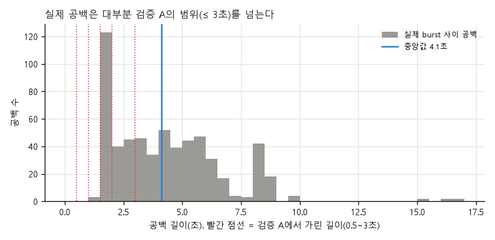
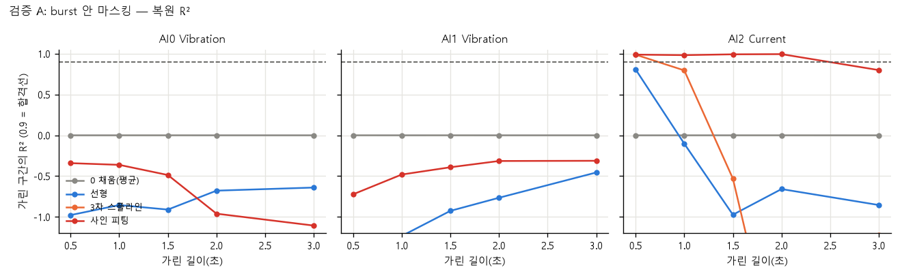
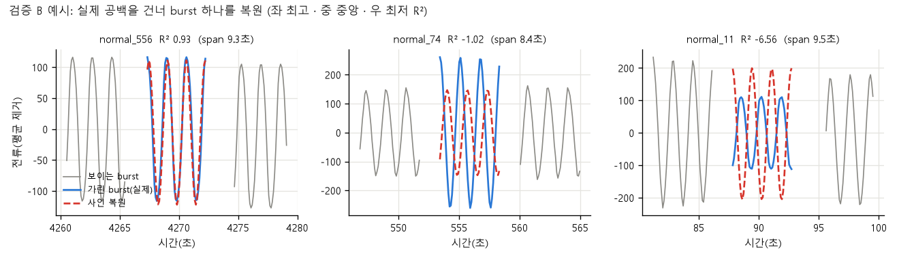
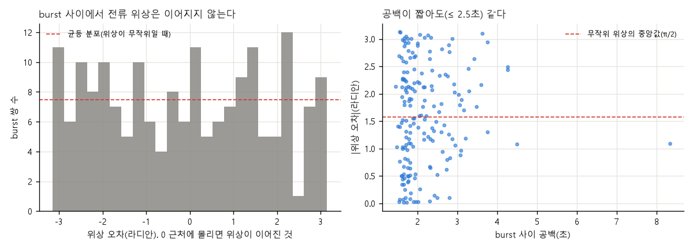

# 주제 ③ 프레스 유압펌프 — burst 사이 공백 보간 정합성 검증 리포트 (14_gap_interpolation_check_JIW)

- 노트북: `notebooks/14_gap_interpolation_check_JIW.ipynb` (실행 결과 포함, 에러 셀 0, 모델 학습 없음)
- 목적: burst 사이 **측정되지 않은 공백을 보간해서 연속 신호로 모델에 넘겨도 되는가**를, 값이 있는 구간을 가려서 검증한다 (설계: `docs/final_design_JIW.md` §2.1~2.2).
- 심사 기준 대응: 1번(결측·공백 처리의 타당성, 관측 구조 규명), 5번(도메인 신호 기반 판단)
- 코드: `src/gap_interp_jiw.py`. 입력은 표준 전처리 결과(세그먼트 평균 제거).
- 근거 수준 표기: **[데이터]** 노트북 출력 / **[추정]** 미검증

| 절 | 핵심 결과 | 출처 |
|---|---|---|
| 실제 공백 | 중앙값 4.1초(약 41샘플), 5~95% 1.6~8.5초, 최대 16.5초. ≤ 3초는 35%, ≤ 2초는 21% | `gaps.csv` |
| A 마스킹 | 진동은 어떤 방법도 불가(R² ≤ 0). 전류는 사인 피팅만 가능(R² 0.98~0.99, 한계 2초) | `mask_eval.csv` |
| B 실제 공백 | 가운데 burst를 가리고 앞뒤로 복원하면 전류 사인 R² −0.98 / −0.61 (0 채움 = 0보다 나쁨) | `holdout_summary.csv` |
| C 위상 | burst 안 전류 주파수 0.5999 ± 0.0017 Hz인데 burst 사이 위상은 무작위(|오차| 중앙값 1.60 rad, Rayleigh p ≈ 0.75) | `phase_continuity.csv` |
| 결론 | **공백을 보간하지 않는다.** 모델 입력은 burst 안 윈도우만 | `verdict.csv` |

---

## 1. 검증 설계

공백 구간의 실제 값은 없으므로 값이 있는 구간을 가려서 복원 가능성을 잰다. 판정은 가린 구간의 **채널별 합산 R²**(분산 설명 비율) ≥ 0.9다. 세그먼트 평균이 제거된 입력이라 burst 사이 DC가 이어지지 않으므로, 사인 모델은 burst마다 오프셋을 따로 두고 파형의 진폭·주파수·위상 연속성만 본다.

| 검증 | 방법 |
|---|---|
| A. burst 안 마스킹 | 정상 burst 가운데 k = 5·10·15·20·30샘플(0.5~3초)을 가리고 0 채움 · 선형 · 3차 스플라인 · 사인 피팅으로 복원 (앞뒤 5샘플 이상 남는 burst: k = 5에서 480개 … k = 30에서 276개) |
| B. 실제 공백 홀드아웃 | 연속한 세 정상 burst 중 가운데를 통째로 가리고 앞뒤 burst(실제 공백 2개)로 복원, span 8~16초, 259개 |
| C. 위상 연속성 | 앞 burst의 전류 사인을 공백 너머로 이어 다음 burst와 위상 비교, 연속 burst 쌍 179개 |

## 2. 실제 공백은 얼마나 긴가 [데이터]

공백(다음 burst 시작 − 이번 burst 끝)은 598개, 평균 4.37초, **중앙값 4.12초**, 사분위 2.31~5.71초, 5~95% 1.63~8.46초, 최대 16.54초다. burst 길이(중앙값 3.7초, 최대 5초)와 비슷하거나 더 길다. 검증 A에서 가린 길이(0.5~3초) 안의 공백은 35%, 2초 이하는 21%뿐이다.

## 3. 검증 A — burst 안 마스킹 [데이터]

| 채널 | 방법 | 0.5초 | 1초 | 1.5초 | 2초 | 3초 |
|---|---|---|---|---|---|---|
| 진동 AI0 | 0 채움 | 0.00 | 0.00 | 0.00 | 0.00 | 0.00 |
| | 선형 / 사인 | −0.98 / −0.34 | −0.85 / −0.36 | −0.91 / −0.49 | −0.68 / −0.96 | −0.64 / −1.11 |
| | 3차 스플라인 | −7.1 | −13.0 | −14.1 | −25.6 | −110.8 |
| 진동 AI1 | 선형 / 사인 | −1.23 / −0.72 | −1.23 / −0.48 | −0.93 / −0.39 | −0.77 / −0.32 | −0.46 / −0.31 |
| 전류 AI2 | 선형 | 0.81 | −0.10 | −0.97 | −0.66 | −0.85 |
| | 3차 스플라인 | 0.99 | 0.80 | −0.53 | −3.05 | −1.22 |
| | **사인 피팅** | **0.99** | **0.98** | **0.99** | **0.99** | 0.80 |

- **진동은 어떤 방법도 안 된다.** R²가 0 채움(= 0)보다 낮고 3차 스플라인은 가릴수록 크게 나빠진다. 진동은 평균 0 주변의 불규칙 신호라 앞뒤 값으로 가운데를 예측할 수 없다. 0 채움이 가장 덜 해롭다.
- **전류는 사인 피팅만 된다.** 합격선(0.9)을 넘는 한계는 2초(20샘플)다. 전류는 0.6 Hz로 접힌 규칙적 사인이다(burst별 사인 R² 중앙값 0.996).

## 4. 검증 B — 실제 공백을 건너 복원 [데이터]

| 채널 | 방법 | span 8~12초 (241개) | 12~16초 (18개) | 전체 |
|---|---|---|---|---|
| 진동 AI0 | 끝점 선형 / 사인 | −0.05 / −0.07 | −0.01 / −0.10 | −0.04 / −0.07 |
| 진동 AI1 | 끝점 선형 / 사인 | −0.04 / −0.02 | −0.02 / −0.03 | −0.04 / −0.02 |
| 전류 AI2 | 끝점 선형 | −0.04 | −0.01 | −0.04 |
| 전류 AI2 | **사인 피팅** | **−0.98** | **−0.61** | **−0.96** |

(0 채움은 R² = 0.) 실제 공백을 건너서는 전류도 복원되지 않고, 사인 복원이 **0 채움보다 나쁘다**(R² −0.96). 복원한 파형이 실제와 어긋난 위상으로 놓이기 때문이다.

## 5. 검증 C — 왜 이어지지 않나: 위상이 burst마다 새로 정해진다 [데이터 + 추정]

| 항목 | 값 |
|---|---|
| burst 안 전류 주파수 (길이 ≥ 40 burst 276개) | 0.5999 Hz, 표준편차 0.0017 Hz |
| burst 안 사인 R² 중앙값 | 0.9963 |
| burst 사이 위상 오차 \|값\| 중앙값 (연속 쌍 179개) | **1.60 rad** (무작위 위상의 기댓값 π/2 = 1.57) |
| 위상 오차의 합성 길이 R / Rayleigh 검정 | 0.040 / p ≈ 0.75 (균등 분포를 기각하지 못함) |
| 공백 ≤ 2.5초인 쌍(139개) \|위상 오차\| 중앙값 | 1.53 rad |
| 앞 burst 사인으로 다음 burst 예측 R² 중앙값 / R² > 0.9 비율 | −1.28 / 5.0% |

- 주파수가 안정적(± 0.0017 Hz)인데 위상만 무작위다. 공백 동안의 위상 **드리프트**라면 공백이 짧을수록 위상이 이어져야 하는데 2.5초 이하에서도 같다. 따라서 **burst마다 위상이 새로 정해진다**고 해석한다.
- 원인으로는 접힌 60 Hz 성분의 위상이 burst를 새로 시작할 때마다 바뀌는 수집 구조(DAQ 재시작과 구동 주파수의 비동기)를 추정한다 [추정, 하드웨어 동작은 확인하지 못함].
- 한계: 이 검증의 burst 쌍은 길이 ≥ 40 조건 때문에 공백이 대부분 짧다(약 1.5~4초). 더 긴 공백의 위상 오차는 표본이 거의 없어 직접 확인하지 못했다.

## 6. 결론과 활용 [데이터 + 추정]

| 채널 | burst 안 짧은 공백(≤ 2초) | 실제 공백(중앙값 4.1초) | 판정 |
|---|---|---|---|
| 진동 AI0·AI1 | 불가 (모든 방법 R² ≤ 0, 0 채움이 최선) | 불가 | 보간하지 않는다 |
| 전류 AI2 | 가능 (사인 피팅 R² 0.98~0.99, 3초 0.80) | 불가 (R² −0.96, burst 사이 위상 무작위) | burst 안에서만, 공백은 보간하지 않는다 |

1. **공백을 보간해 연속 신호로 만들지 않는다.** 실제 공백에서는 진동·전류 모두 복원되지 않고, 잘못 복원한 값은 0 채움보다 나쁘다. 설계서 §2.1의 "원 신호 보간 불채택"이 수치로 확인됐다(심사 1번: 결측 처리의 타당성).
2. 보간이 가능한 유일한 경우(burst **안**의 전류 2초 이하 결측)는 이 데이터에 필요하지 않다(burst 안에 결측이 없다).
3. 모델 입력은 지금처럼 **burst 안의 윈도우**로만 만들고, burst 간 정보는 burst별 점수의 시간 흐름(33번)으로 쓴다.
4. **burst를 이어 붙인 시퀀스는 전류 위상이 끊기는 경계를 포함한다.** 가이드북이 행을 이어 붙여 20시점 시퀀스를 만든 방식(29번 G1)은 burst 경계에서 파형이 불연속인 시퀀스를 학습·평가에 섞는다.
5. 현장 활용: 수집이 burst 단위로 새로 시작되는 구조라면 **연속 모니터링용 신호 처리(위상 기반 분석)가 불가능**하다. 연속 수집으로 바꾸면 위상 정보를 쓸 수 있다 [가정, 데이터 수집 담당과 확인].

## 7. 한계

- 진동은 평균 제거된 입력만 검증했다. 원시 진동의 저주파 성분은 이 데이터(10 Hz, 에일리어싱)로 확인할 수 없다.
- 보간 방법은 4종(0 채움, 선형, 3차 스플라인, 사인)이다. 신경망 기반 보간(예: 시계열 대치 모델)은 시도하지 않았다. 다만 진동이 불규칙 잡음에 가깝고 전류 위상이 무작위라서 정보가 없는 구간을 복원할 근거가 없다 [추정].
- 위상 무작위의 원인은 수집 구조 추정이며 하드웨어를 확인하지 못했다. 대회 운영진에 수집 방식을 문의하면 확정할 수 있다.
- 정상 burst만 검증했다(이상 burst 사이 공백은 표본이 적음).
