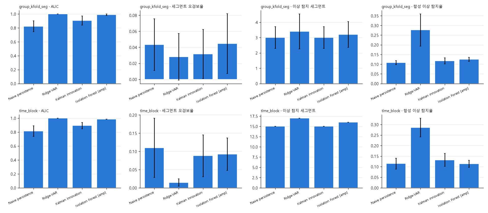
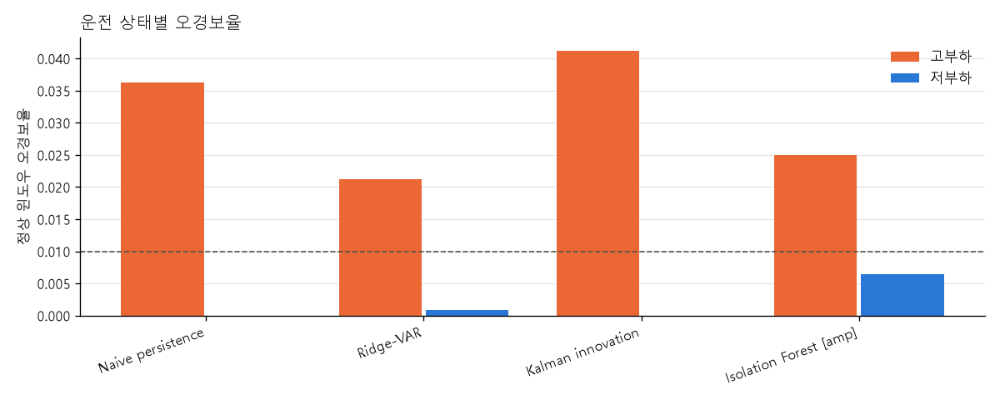
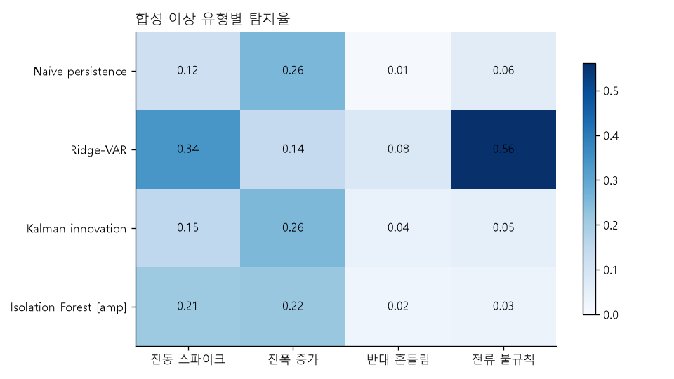

# 주제 ③ 프레스 유압펌프 — 고전 시계열·트리 이상탐지 리포트

- 노트북: `notebooks/22_model_classical_timeseries_JSC.ipynb` (실행 결과 포함, 에러 셀 0)
- 목적: Naive persistence·Ridge-VAR·Kalman innovation·Isolation Forest를 동일한 1초 계약으로 비교하고, 소형 TCN 진행 필요성을 판정한다.
- 입력: 표준 `mean` 전처리 원신호와 `data/processed/11_window_features.parquet`의 1초 윈도우
- 코드: `src/models_jsc.py`, `src/benchmark_jsc.py`
- 출력: `figures/22_model_classical_timeseries_JSC/`, `results/22_model_classical_timeseries_JSC/`
- 탐지 대상: 유압펌프 모터-펌프 구동부 이상
- 심사 기준 대응: 2번(4개 모델·기존 대표 비교), 3번(FN·FP 조건), 4번(causal 후보), 6번(재현성)

> **후속 최종 선택(2026-10-07).** 34번에서 causal `first_difference` 입력 성능을 확인하고, 23번에서 MCD 결합 경보를 검증한 뒤 **Ridge-VAR를 최종 시계열 모델로 확정했다.** 31번 공통 세그먼트 비교에서는 CNN과 탐지·오경보 차이가 통계적으로 구분되지 않았지만, Ridge는 1초 입력으로 이상 세그먼트 4개를 추가 판정하고 탐지 지연을 1.9초에서 0.9초로 줄였다.

## 0. 결론

**1초 고전 시계열 후보 비교 결과 Ridge-VAR를 최종 시계열 대표로 선택하고 소형 TCN은 보류한다.** Ridge-VAR는 1초 time-block에서 평가 가능한 이상 17/17을 모두 탐지했고, `fpr_segment` 0.0145로 같은 1초 계약의 DeepAnT 0.0387보다 62.5% 낮았다. 합성 이상 평균 탐지율도 0.2857로 DeepAnT 0.2538보다 0.0318 높았다. 정상 파형의 시간 구조는 현재 데이터에서는 소형 CNN보다 과거 5샘플의 선형 자기회귀로 충분히 설명된다.

Isolation Forest `[amp18]`는 time-block에서 16/17 탐지, `fpr_segment` 0.0925로 MCD `[amp]`의 17/17·0.0499보다 나쁘다. 따라서 분포 대표는 MCD를 유지한다. Naive와 Kalman은 모두 19·20을 놓치고 time-block 오경보가 각각 0.1096·0.0879라 최종 후보에서 제외한다.

단, 이 절의 표준 `mean` 전처리는 세그먼트 전체 평균을 사용한다. Ridge-VAR의 예측 구조만으로 실시간 성능을 확정하지 않았으며, 후속 34번에서 미래 샘플을 쓰지 않는 `first_difference` 입력과 세그먼트 초기 구간·처리시간을 별도로 검증했다.

## 1. 입력·평가 계약

| 항목 | 값 |
|---|---|
| 샘플링·채널 | 10 Hz, AI0·AI1 진동 + AI2 전류 |
| 윈도우 | 1초 `(10, 3)`, step 0.5초, 세그먼트 경계 통과 금지 |
| 정상/이상 윈도우 | 3,264 / 96 |
| 판정 가능 세그먼트 | 정상 530/599, 이상 17/21 |
| 분할 | `group_kfold_seg` 5 + 정상 시간순 `time_block` 4 |
| 학습 | 정상만 사용 |
| 임계 | fold별 train 정상 score q99 |
| 실제 이상 | AUC·탐지 수·FN·지연 |
| 정상 | `fpr_sample`·`fpr_segment`·운전 상태별 FP |
| 강건성 | spike·amplitude·antiphase·current × 강도 4단계 합성 이상 |

기존 24~27과 공정하게 비교하기 위해 파일 형식 누수를 차단한 `preprocess.preprocess()` 기본 `mean`을 사용했다. 13번의 causal `baseline`은 이상 날짜의 DC가 남아 `|DC|` 단독 AUC 0.89~0.94의 교란을 다시 포함하므로 이 노트북의 주 입력으로 쓰지 않았다.

## 2. 모델

### 2.1 Naive persistence

직전 3채널 관측을 다음 관측의 예측값으로 사용한다.

```text
x_hat[t] = x[t-1]
score[t] = mean(((x[t] - x_hat[t]) / train_residual_sd)^2)
```

학습되는 시간 구조가 없는 최저 기준선이다.

### 2.2 Ridge-VAR

과거 5샘플(0.5초)의 세 채널을 펼친 15차원 입력으로 다음 3채널을 동시에 예측한다.

```text
[x[t-5], ..., x[t-1]] -> Ridge -> x_hat[t]
```

`alpha ∈ {0.01, 0.1, 1, 10, 100}`는 각 외부 fold 학습 정상 세그먼트의 뒤 20%를 validation으로 두고 MSE가 가장 작은 값으로 선택했다. 선택 후 외부 fold의 전체 학습 정상에 재적합했다. 이상 라벨·AUC는 alpha 선택에 사용하지 않았다.

### 2.3 Kalman innovation

정상 데이터에 Ridge-VAR(1) 상태전이를 적합하고, 세그먼트 시작마다 filter state를 초기화했다. 관측과 1-step 예측의 차이 `innovation`을 예측 공분산으로 기준화한 Mahalanobis 거리를 점수로 사용했다.

```text
score[t] = innovation[t]' S[t]^(-1) innovation[t]
```

관측 잡음 공분산은 정상 동역학 잔차 분산의 10%로 고정했으며 이상 결과로 조정하지 않았다.

### 2.4 Isolation Forest `[amp18]`

1초 윈도우 진폭 피처 18열을 300개 isolation tree에 입력했다. sklearn 기본 score의 부호를 뒤집어 클수록 이상이 되게 했고, `contamination`의 자동 임계 대신 공통 train 정상 q99를 사용했다.

## 3. 전체 성능

아래 값은 fold 평균이다. GroupKFold의 `n_detected`는 fold당 이상 수가 달라 평균 3.4가 17/17 전체 탐지를 뜻하므로 표에는 전체 탐지 수로 환산해 적었다.

| 모델 | split | AUC | fpr_sample | fpr_segment | 탐지 | 합성 이상 평균 |
|---|---|---:|---:|---:|---:|---:|
| Naive | gkf / tb | 0.8221 / 0.8140 | 0.0097 / 0.0275 | 0.0434 / 0.1096 | 15/17 / 15/17 | 0.1084 / 0.1143 |
| **Ridge-VAR** | **gkf / tb** | **1.0000 / 1.0000** | **0.0116 / 0.0060** | **0.0280 / 0.0145** | **17/17 / 17/17** | **0.2763 / 0.2857** |
| Kalman | gkf / tb | 0.9040 / 0.8925 | 0.0112 / 0.0298 | 0.0317 / 0.0879 | 15/17 / 15/17 | 0.1171 / 0.1324 |
| Isolation Forest | gkf / tb | 0.9878 / 0.9851 | 0.0108 / 0.0203 | 0.0446 / 0.0925 | 16/17 / 16/17 | 0.1249 / 0.1138 |



최종 저장 출력에서 네 모델의 36개 모델·fold 채점 시간 합은 약 52.5초였다(가중치 캐시·하드웨어에 따라 달라짐). epoch 기반 모델이 아니므로 1 epoch smoke와 장기 학습의 구분은 적용되지 않는다.

## 4. Ridge-VAR 해석

### 4.1 DeepAnT 대비

| 모델 | split | AUC | fpr_segment | 탐지 | 합성 이상 |
|---|---|---:|---:|---:|---:|
| **Ridge-VAR** | gkf | 1.0000 | **0.0280** | 17/17 | **0.2763** |
| DeepAnT | gkf | 0.9999 | 0.0317 | 17/17 | 0.2502 |
| **Ridge-VAR** | time-block | 1.0000 | **0.0145** | 17/17 | **0.2857** |
| DeepAnT | time-block | 0.9999 | 0.0387 | 17/17 | 0.2538 |

Ridge-VAR의 time-block `fpr_segment`는 DeepAnT 대비 62.5% 낮고 합성 이상은 0.0318 높다. AUC 포화 상황에서도 정상 오경보와 약한 합성 이상 두 축에서 모두 밀리지 않았다.

Ridge alpha는 gkf에서 0.01이 4회·100이 1회, time-block에서 0.01이 1회·1이 3회 선택됐다. 시간 구간에 따라 규제 세기가 달라졌지만 모든 외부 fold에서 17/17 탐지를 유지했다. 최종 재학습에서는 정상 최신 calibration block을 따로 두고 alpha를 다시 고정해야 한다.

### 4.2 왜 선형 모델이 강한가

- 정상 전류는 약 0.6 Hz로 관측되는 매우 규칙적인 파형이다.
- 0.5초 과거 문맥에 세 채널을 함께 넣으면 다음 시점의 위상과 센서 관계를 선형 결합으로 예측할 수 있다.
- 현재 세그먼트는 최대 5초·3채널이라 깊은 시간 문맥이나 대규모 비선형 표현의 이득이 제한적이다.
- 이상 전류의 불규칙성에서 Ridge 합성 탐지율이 특히 높다.

합성 유형별 Ridge time-block 탐지율은 spike 0.3442, amplitude 0.1353, antiphase 0.0836, current 0.5795다. current·spike에는 강하지만 진폭 증가·반대 흔들림에는 여전히 약하다. 이 약점은 TCN을 즉시 추가할 근거라기보다 MCD·관계 피처와 다른 관점을 결합할 근거다.

## 5. FN·FP 분석

### 5.1 FN

| 모델 | 미탐 세그먼트 |
|---|---|
| Naive | 19, 20 |
| Ridge-VAR | 없음 |
| Kalman | 19, 20 |
| Isolation Forest | 19 |

19·20은 진동이 정상과 비슷하고 평균 제거 후 전류 AC RMS도 정상보다 낮은 구간이다. Naive·Kalman은 큰 순간 변화나 VAR(1) innovation이 부족해 놓쳤다. Ridge는 5-step 다변량 문맥으로 두 구간의 파형 관계 이탈을 잡았고, 이는 1-step 상태전이보다 긴 문맥이 필요하다는 결과다.

Isolation Forest는 amp18만 사용해 MCD처럼 조용한 이상을 양방향으로 볼 수 있지만, 독립 tree partition은 19를 안정적으로 분리하지 못했다.

### 5.2 정상 FP

Ridge의 정상 윈도우 오경보는 time-block에서 고부하 0.0184, 저부하 0.0000이다. 오류 사례의 고유 FP 세그먼트도 gkf 고부하 13·저부하 2, time-block 고부하 6·저부하 0으로 고부하에 집중된다.



이는 기존 DeepAnT·MTAD-GAT의 고부하 FP와 같은 방향이다. Ridge로 총량은 줄었지만 상태 차이는 남으므로 Stage 4·운영점 단계에서 정상 상태별 calibration 또는 허용 오경보율 기반 임계를 유지해야 한다.

## 6. Isolation Forest vs MCD

| 모델 | split | AUC | fpr_segment | 탐지 | 합성 이상 |
|---|---|---:|---:|---:|---:|
| Isolation Forest | time-block | 0.9851 | 0.0925 | 16/17 | 0.1138 |
| **MCD `[amp]`** | time-block | **0.9968** | **0.0499** | **17/17** | 0.0949 |

Isolation Forest는 합성 이상 평균만 MCD보다 0.0189 높지만 실제 이상 19를 놓치고 세그먼트 오경보가 약 1.85배다. 트리 비선형성의 추가 이득이 MCD의 공분산 구조보다 작으므로 분포 대표는 MCD를 유지한다.



## 7. TCN 진행 판정

사전에 다음 세 조건을 동시에 만족하는 선형 후보가 하나라도 있으면 TCN을 보류하기로 했다.

1. time-block `fpr_segment ≤ DeepAnT + 0.01`
2. 합성 이상 평균 `≥ DeepAnT − 0.03`
3. DeepAnT와 같은 17/17 탐지

Ridge-VAR가 세 조건을 모두 만족했으며 오히려 FP와 합성 이상에서 DeepAnT를 앞섰다.

> **판정: 현재 데이터에서는 소형 TCN 보류. Colab GPU 결제·사용 불필요.**

TCN을 다시 여는 조건은 다음 두 가지다.

- Stage 4의 진짜 causal DC 전처리에서 Ridge 성능이 크게 하락할 때
- 독립 날짜·다른 고장 이벤트가 추가되어 진폭 증가·반대 흔들림 같은 비선형 이상에서 Ridge 미탐이 확인될 때

## 8. 후속 검증 결과

1. 34번에서 세그먼트 전체 평균을 쓰지 않는 `first_difference`, burst별 상태 초기화, 초기 문맥 처리와 샘플별 추론 시간을 검증했다.
2. causal 1초 Ridge는 실제 이상 17/17, 탐지 지연 중앙값 0.9초, 최악 처리시간 0.388 ms를 기록해 10 Hz 입력에 충분했다.
3. 23번에서 **주의 = Ridge**, **경보 = Ridge AND MCD**의 2단계 구조를 검증했다. time-block 경보 오경보율은 0.25%였고 실제 이상 17/17을 유지했다.
4. 따라서 Ridge-VAR를 최종 시계열 대표로 고정한다. DeepAnT는 일부 약한 합성 이상에 강한 비선형 비교군으로 유지한다.

## 9. 한계

- 실제 이상은 한 날짜·한 이벤트다. 17/17은 독립 고장 17건의 일반화 결과가 아니다.
- 표준 `mean` 전처리는 오프라인 결과이며 최종 입력은 34번에서 검증한 causal `first_difference`를 사용한다. 수집 방식이 바뀌면 입력 계약을 다시 검증해야 한다.
- Ridge alpha가 fold에 따라 달라진다. 외부 데이터 없이 하나의 최종 alpha를 고정하면 성능이 달라질 수 있다.
- 합성 이상은 모델 stress test이며 실제 결함의 물리적 재현이 아니다.
- Kalman의 상태 차원·관측 잡음 비율은 작은 고정 설계다. 더 복잡한 상태공간 탐색은 현재 결과상 우선순위가 낮다.

## 10. 산출물

- `results/22_model_classical_timeseries_JSC/metrics.csv`: 공통 모델 비교표 입력
- `cv_scores.csv`: 36개 모델·fold 상세 지표와 합성 이상
- `error_cases.csv`: FP·FN 세그먼트
- `scores.csv`: 윈도우별 점수·임계
- `model_details.csv`: Ridge alpha·Kalman 공분산·IF 설정
- `comparison_with_references.csv`: DeepAnT·MCD 직접 비교
- `tcn_decision.csv`: 사전 규칙 기반 TCN 판정
- `figures/22_model_classical_timeseries_JSC/`: 지표·상태 FP·합성 이상·점수 여유 그림 4개
