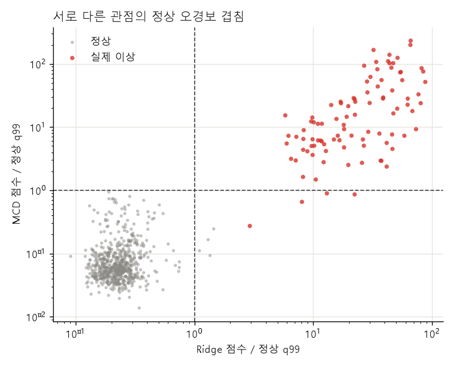
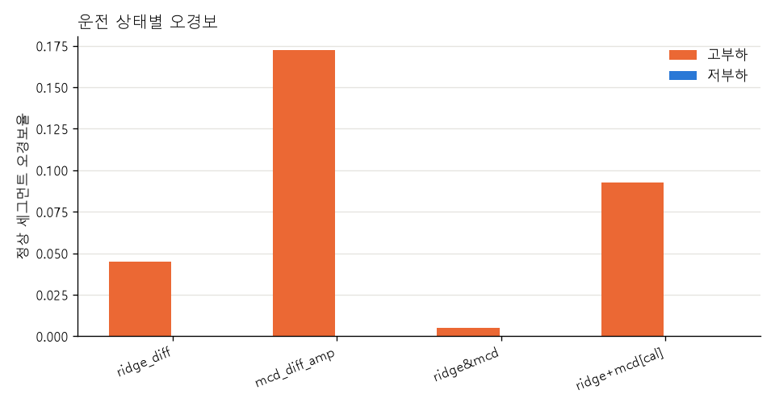
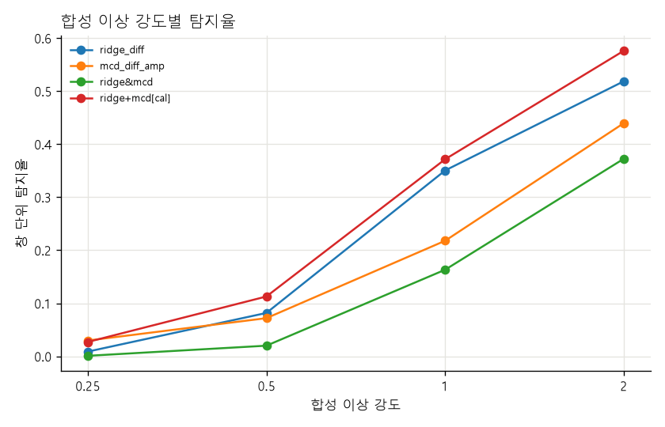
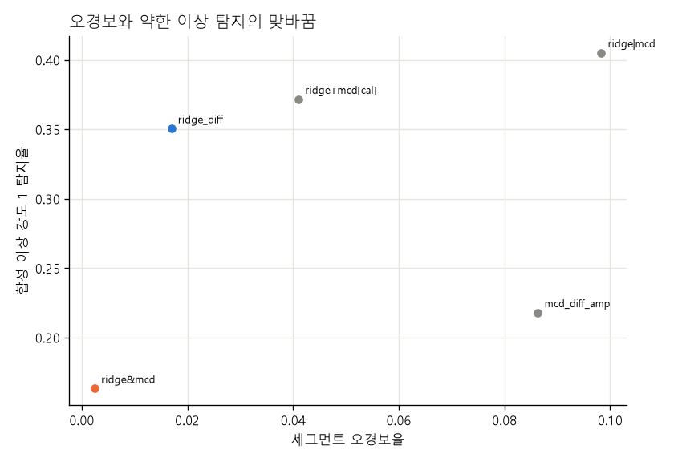

# 주제 ③ 프레스 유압펌프 — Ridge 1차 차분 + MCD 앙상블 검증 리포트

- 노트북: `notebooks/23_model_ensemble_ridge_mcd_JSC.ipynb` (실행 결과 포함, 에러 셀 0)
- 목적: 최종 causal 시계열 후보 Ridge와 통계분포 MCD를 결합해 실제 이상 탐지를 유지하면서 오경보를 낮출 수 있는지 검증한다.
- 입력: 공통 형식 통일 → burst별 1차 차분, 1초 윈도우
- 코드: `src/ensemble_jsc.py`, `src/realtime_jsc.py`, `src/models_jsc.py`
- 출력: `figures/23_model_ensemble_ridge_mcd_JSC/`, `results/23_model_ensemble_ridge_mcd_JSC/`
- 심사 기준 대응: 2번(최종 모델·앙상블 비교), 3번(FP 겹침·상태별 오류), 4번(주의/경보 운영), 5번(예측+통계 관점 결합), 6번(재현성)

## 0. 결론

**최종 운영 구조는 `주의 = Ridge[first_difference]`, `경보 = Ridge AND MCD[diff_amp]`로 채택한다.**

time-block에서 AND는 평가 가능한 실제 이상 17/17과 탐지 지연 중앙값 0.9초를 유지하면서 세그먼트 오경보율을 Ridge 단독 0.0170에서 0.0025로 낮췄다. GroupKFold에서는 0.0206에서 0으로 낮아졌다. 세그먼트 쌍 부트스트랩에서 AND−Ridge 오경보율 차이의 95% 구간은 GroupKFold `−0.0340~−0.0094`, time-block `−0.0264~−0.0048`로 모두 0 아래였다.

AND는 약한 이상을 놓칠 수 있다. 합성 강도 1 탐지율은 Ridge 0.3505에서 AND 0.1633으로 줄어 유지율이 46.6%다. 따라서 AND 하나로 Ridge를 교체하지 않고, Ridge 초과를 민감한 **주의**, 두 모델 동시 초과를 낮은 오경보의 **경보**로 쓴다.

## 1. 왜 MCD 입력도 바꿨나

기존 26·28번의 MCD `[amp]`는 세그먼트 전체 평균을 제거한 신호에서 진폭 피처를 계산한다. 성능 비교에는 정직하지만 완성되지 않은 현재 burst의 미래 평균을 사용하므로 실시간 최종 입력으로 그대로 쓸 수 없다.

이번 MCD `[diff_amp]`는 다음 계약을 사용한다.

1. 센서값 공통 형식 통일
2. burst가 시작되면 이전값 초기화
3. `d[0]=0`, `d[t]=x[t]−x[t−1]`
4. 1초 차분 윈도우에서 채널별 RMS·peak·p2p·kurt·crest·skew 18개 계산
5. 학습 정상 피처의 중앙값 대치·표준화
6. Minimum Covariance Determinant의 강건 Mahalanobis 거리를 이상점수로 사용

따라서 Ridge와 MCD 모두 미래 샘플·burst 사이 보간·다른 burst의 마지막 값을 사용하지 않는다. 두 모델이 같은 causal 신호를 보지만 Ridge는 시간 예측오차, MCD는 1초 통계분포 거리를 본다.

## 2. 결합 방법

각 모델 점수를 자기 fold의 학습 정상 q99로 나눈다.

```text
z_ridge = ridge_score / ridge_train_normal_q99
z_mcd   = mcd_score   / mcd_train_normal_q99
```

| 규칙 | 점수 | 경보 조건 |
|---|---|---|
| Ridge | `z_ridge` | `> 1` |
| MCD | `z_mcd` | `> 1` |
| AND | `min(z_ridge, z_mcd)` | 둘 다 `> 1` |
| OR | `max(z_ridge, z_mcd)` | 하나라도 `> 1` |
| Calibrated mean | `(z_ridge+z_mcd)/2`를 train 정상 q99로 재보정 | `> 1` |

분할은 GroupKFold 5 + 정상 forward time-block 4, MCD 시드는 0·1·2다. Ridge alpha·개별 임계·평균 결합 임계는 모두 fold별 학습 정상만으로 적합했다.

## 3. 실제 이상·오경보 결과

아래 값은 fold·시드 평균이다. GroupKFold 탐지 3.4/3.4는 서로 다른 fold를 합치면 17/17이다.

| 규칙 | split | AUC | 세그먼트 FPR | 실제 이상 | 실제 이상 창 recall | 지연 |
|---|---|---:|---:|---:|---:|---:|
| Ridge | gkf / tb | 1.0000 / 1.0000 | 0.0206 / 0.0170 | 17/17 / 17/17 | 1.0000 / 1.0000 | 0.9초 |
| MCD | gkf / tb | 0.9917 / 0.9968 | 0.0429 / 0.0863 | 17/17 / 17/17 | 0.9496 / 0.9653 | 0.9초 |
| **Ridge AND MCD** | **gkf / tb** | 0.9954 / 0.9991 | **0.0000 / 0.0025** | **17/17 / 17/17** | 0.9496 / 0.9653 | **0.9초** |
| Ridge OR MCD | gkf / tb | 1.0000 / 1.0000 | 0.0635 / 0.0983 | 17/17 / 17/17 | 1.0000 / 1.0000 | 0.9초 |
| Calibrated mean | gkf / tb | 1.0000 / 1.0000 | 0.0338 / 0.0410 | 17/17 / 17/17 | 1.0000 / 1.0000 | 0.9초 |



MCD 단독은 차분 진폭 피처에서 실제 이상을 모두 잡지만 정상 꼬리가 넓어 time-block FPR이 8.63%다. 그러나 그 FP가 Ridge FP와 거의 겹치지 않아 AND에서 0.25%까지 줄어든다. OR와 평균 결합은 실제 이상 탐지에 추가 이득이 없고 FPR만 Ridge보다 높아 기각한다.

## 4. FP 겹침과 통계적 확인

정상 test 세그먼트에서 fold·시드당 평균 FP와 겹침은 다음과 같다.

| split | Ridge FP | MCD FP | 동시 FP | Jaccard |
|---|---:|---:|---:|---:|
| GroupKFold | 2.20 | 4.53 | **0.00** | **0.000** |
| time-block | 1.75 | 8.92 | **0.50** | **0.041** |

| split | 세그먼트 수 | Ridge FPR | AND FPR | 차이 | 95% bootstrap CI |
|---|---:|---:|---:|---:|---:|
| GroupKFold | 530 | 0.0208 | 0.0000 | −0.0208 | **−0.0340 ~ −0.0094** |
| time-block | 417 | 0.0168 | 0.0024 | −0.0144 | **−0.0264 ~ −0.0048** |

time-block에서 AND 후 남은 고유 FP는 `normal_178` 하나다. 첫 time-block에서 세 MCD 시드 모두 발생했고, 고부하 세그먼트의 5개 창 중 1~2개가 동시에 초과했다. 다른 time-block과 GroupKFold에는 AND FP가 없다.

## 5. 운전 상태별 FP

| 규칙 (time-block) | 고부하 윈도우 FPR | 저부하 윈도우 FPR | 고부하 세그먼트 FPR | 저부하 세그먼트 FPR |
|---|---:|---:|---:|---:|
| Ridge | 0.0201 | 0.0000 | 0.0449 | 0.0000 |
| MCD | 0.0361 | 0.0000 | 0.1722 | 0.0000 |
| **Ridge AND MCD** | **0.0014** | **0.0000** | **0.0049** | **0.0000** |
| Calibrated mean | 0.0234 | 0.0000 | 0.0929 | 0.0000 |



두 모델 모두 FP가 고부하에 집중되지만 같은 고부하 세그먼트에서 동시에 틀리는 경우는 드물다. AND가 상태별 임계를 추가하지 않고도 고부하 세그먼트 FPR을 Ridge 대비 약 89% 낮춘다.

## 6. 합성 이상: 경보의 대가

| 규칙 (time-block) | 강도 0.25 | 0.5 | 1 | 2 | 전체 평균 |
|---|---:|---:|---:|---:|---:|
| Ridge | 0.0089 | 0.0818 | **0.3505** | **0.5188** | 0.2400 |
| MCD | 0.0298 | 0.0720 | 0.2180 | 0.4398 | 0.1899 |
| **Ridge AND MCD** | **0.0010** | **0.0201** | **0.1633** | **0.3727** | 0.1393 |
| Ridge OR MCD | 0.0377 | 0.1337 | 0.4052 | 0.5859 | 0.2906 |
| Calibrated mean | 0.0270 | 0.1128 | 0.3717 | 0.5763 | 0.2720 |





AND의 강도 1 탐지율은 Ridge의 46.6%, 전체 합성 평균은 58.0%다. 강도 2에서는 71.8%를 유지한다. AND는 “초기 징후를 가장 먼저 찾는 모델”이 아니라 “두 관점이 동의한 이상을 낮은 오경보로 확정하는 모델”이다.

OR와 평균 결합은 합성 이상을 Ridge보다 조금 높이지만 실제 이상은 Ridge가 이미 전부 잡으며 오경보가 각각 9.83%·4.10%로 증가한다. 현재 데이터에서는 운영 후보가 아니다.

## 7. MCD 시드 안정성·계산량

MCD 시드 0·1·2에서 time-block 결과는 다음 범위였다.

- MCD 세그먼트 FPR: 0.0825~0.0895
- AND 세그먼트 FPR: 세 시드 모두 0.0025
- AND 실제 이상: 세 시드·모든 time-block에서 17/17
- AND 합성 강도 1: 0.1622~0.1645

fold당 MCD 학습시간은 평균 3.59초, test 점수 계산은 피처가 준비된 상태에서 창당 평균 약 45 μs, 최대 약 100 μs였다. 실시간 시스템에서는 1초 윈도우 피처 계산시간과 센서 I/O가 추가된다. 모델 점수 계산 자체는 10 Hz 운영에 충분히 작다.

## 8. 최종 운영 구조

| 단계 | 규칙 | time-block 세그먼트 FPR | 실제 이상 | 조치 제안 |
|---|---|---:|---:|---|
| **주의** | Ridge `[first_difference]` 초과 | 1.70% | 17/17 | 점검 목록 등록, 다음 burst 추세 확인 |
| **경보** | Ridge AND MCD `[diff_amp]` 초과 | **0.25%** | **17/17** | 즉시 설비 상태 확인, 필요 시 정지 판단 |

경보는 항상 주의의 부분집합이다. OR 단계를 추가하지 않으며, calibrated mean도 운영에는 쓰지 않는다. 임계값은 최종 학습 시 최신 정상 calibration block으로 다시 고정한다.

## 9. 한계

- 실제 이상은 한 이벤트다. 17/17은 독립 고장 17건의 일반화 결과가 아니다.
- 실제 이상이 강해서 모든 규칙이 세그먼트 단위로 잡는다. 약한 이상 차이는 합성 실험에 의존한다.
- MCD의 18개 피처가 모두 1차 차분 기반이라 기존 26번 MCD `[amp]`와 수치를 직접 동일 모델처럼 비교하면 안 된다.
- AND는 약한 합성 이상을 줄이므로 Ridge 주의 단계를 제거할 수 없다.
- time-block bootstrap 분모 417개는 평가 fold 1~4에 들어간 판정 가능 정상 세그먼트다. block 0은 학습 시작 구간이라 test에 나오지 않는다.
- 합성 이상은 4가지 설계 유형으로 실제 결함의 물리적 재현이 아니다.

## 10. 산출물

- `results/23_model_ensemble_ridge_mcd_JSC/metrics.csv`: 공통 모델 비교표 형식
- `cv_scores.csv`: 규칙·fold·시드별 실제/합성/상태 지표
- `scores.csv`: test 윈도우별 Ridge·MCD·결합 z 점수
- `segment_alarms.csv`: 정상 세그먼트별 단독·결합 FP 여부
- `fp_overlap.csv`: fold·시드별 FP 교집합과 Jaccard
- `bootstrap.csv`: AND−Ridge paired bootstrap 구간
- `error_cases.csv`: 모든 규칙·시드의 FP/FN 사례
- `model_details.csv`: Ridge alpha·임계, MCD 임계·support
- `timing.csv`: fold·시드별 학습·점수 계산시간
- `operating_decision.csv`, `verdict.csv`: 최종 2단계 운영 판정
