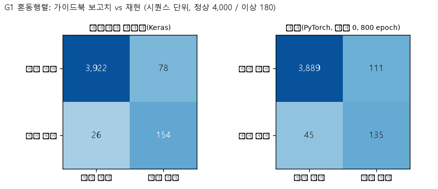
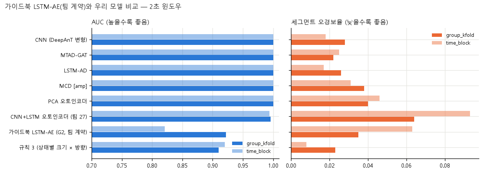

# 주제 ③ 프레스 유압펌프 — 가이드북 LSTM-Autoencoder 재현과 팀 계약 적용 리포트 (29_model_guidebook_lstm_ae_JIW)

- 노트북: `notebooks/29_model_guidebook_lstm_ae_JIW.ipynb` (실행 결과 포함, 에러 셀 0)
- 목적: 공식 가이드북(2.3 분석 체험)의 LSTM-Autoencoder를 **재현(G1)**하고, 같은 모델에 **팀 평가 계약을 적용(G2)**해 (1) 누수를 막으면 성능이 어떻게 변하는지, (2) 우리 모델과 비교해 어떤지 본다.
- 탐지 대상: 유압펌프 모터-펌프 구동부 이상 (센서 부착 부위 미확정)
- 심사 기준 대응: 2번(가이드북 방식 재현과 팀 모델 비교), 1번(가이드북 평가 설계의 누수 점검)
- 코드: `src/guidebook_lstm_ae.py`(모델·G1 데이터·임계), `src/guidebook_g1.py`(G1 실행), `src/guidebook_g2.py`(G2 실행). G2 가중치 `models/29_model_guidebook_lstm_ae_JIW/`(18개, git 제외).
- 근거 수준 표기: **[데이터]** 노트북 출력 / **[추정]** 미검증

| 절 | 핵심 결과 | 출처 |
|---|---|---|
| G1 재현 | 오경보 111건 / 미탐 45건, 재현율 0.750, F1 0.634, AUC 0.957 (가이드북 보고치: 78건 / 26건, 0.856, 0.748) | `results/29_*/g1_runs.csv` |
| G2 팀 계약 | 2초 AUC 0.922 / 0.821, 세그먼트 오경보 3.5% / 6.3%, 실제 이상 세그먼트 2초 time_block 13개 중 9~12개만 탐지 | `cv_scores.csv`, `metrics.csv` |
| 우리 모델과 비교 | CNN·LSTM-AD·MTAD-GAT·MCD는 AUC 1.000, 13/13 탐지 → 가이드북 방식이 낮음 | `compare_models.csv` |
| 원인 | 누수 제거와 학습 길이 축소가 섞여 **분리하지 못함** | 노트북 §4 |

---

## 1. 가이드북 방식(G1)과 팀 계약 적용(G2)

| 항목 | G1 (가이드북 원본) | G2 (팀 계약 적용) |
|---|---|---|
| 입력 | 원시 3채널 `abs()` → MinMax | `preprocess.preprocess()`(형식 통일 + 세그먼트 평균 제거), 채널별 MinMax(train 정상 세그먼트) |
| 시퀀스 | 행을 이어 붙여 과거 20개(2초), 정답 = 10초 뒤, burst 공백을 넘음 | 세그먼트 안에서만 20개, 점수 = 평가 윈도우(1·2초) 안 시점별 재구성 오차의 평균 |
| 분할 | 정상 앞 15,000행 학습 / 뒤 5,000행 + 이상 전체 평가 | `group_kfold_seg` 5 + `time_block` 4 |
| 임계 | 검증 세트(평가 정상 880 + **이상 300**)에서 정밀도 = 재현율인 점수 | train 정상 점수 q99 (이상 미사용) |
| 모델 | LSTM(64) → LSTM(32) → RepeatVector → LSTM(32) → LSTM(64) → Dense(3), 파라미터 63,939개 | 같음 |
| 학습 | Adam 1e-3, MSE, 배치 128, 최대 800 epoch, EarlyStopping(120), ReduceLROnPlateau(0.7, 50) | 같으나 **최대 100 epoch**, EarlyStopping(20), ReduceLROnPlateau(0.7, 10)로 축소(분할 18회라 원 설정으로는 하루 이상) |

모델 구조는 같고, 바뀌는 것은 입력·시퀀스·분할·임계·학습 길이다.

## 2. G1 재현 결과 [데이터]

(평가 시퀀스: 정상 4,000 / 이상 180)

| 방식 | TN | FP | FN | TP | 정확도 | 정밀도 | 재현율 | F1 | 오경보율 | AUC |
|---|---|---|---|---|---|---|---|---|---|---|
| 가이드북 보고치(Keras) | 3,922 | 78 | 26 | 154 | 0.975 | 0.664 | 0.856 | 0.748 | 2.0% | — |
| 재현(PyTorch, 시드 0, 800 epoch 전부) | 3,889 | 111 | 45 | 135 | 0.963 | 0.549 | 0.750 | 0.634 | 2.8% | 0.957 |

- 재현은 가이드북보다 약간 나쁘지만 **비슷한 수준**(오경보 2%대, 재현율 0.75~0.86)이다. 차이의 원인(Keras vs PyTorch 세부, 시드 1개, 정밀도 = 재현율 지점 선택의 민감도)은 분리하지 않았다. 시드를 늘리면 줄어들 수 있다 [추정]. 재학습은 CPU 약 85분(`python src/guidebook_g1.py <시드>`).
- 임계(0.0217)는 검증 세트의 정밀도 = 재현율 0.75 지점이다. 이상 300개로 임계를 정했기 때문에 평가의 이상 시퀀스에서도 재현율이 0.750으로 같게 나온다.

### 가이드북 평가 설계에서 점검할 점 (심사 1번)

| 점검 | 내용 |
|---|---|
| 이상으로 임계 결정 | 검증 세트에 이상 300개가 들어가 정밀도 = 재현율 지점을 고름 |
| 날짜 = 라벨 | 평가 정상은 7/12, 이상은 7/17 |
| 파일 형식 누수 | 입력이 원시값의 `abs()`라 DC 오프셋·수치 형식 차이가 그대로 남음(팀 진단: 형식 피처 AUC 1.000) |
| 시퀀스 | burst 공백을 넘어 이어 붙임, 평가 정상은 학습과 같은 날짜의 뒤 5,000행 |
| 평가 단위 | 시퀀스 단위 혼동행렬. 이상 180개는 서로 겹친 시퀀스(독립 표본은 이벤트 1건) |

따라서 G1의 "정확도 96~97%"를 다른 모델의 성능과 직접 비교하면 안 된다.

## 3. G2 결과 (팀 계약, 시드 0) [데이터]

| 윈도우 | 분할 | AUC | 세그먼트 오경보 | 탐지 / 평가 가능 이상 세그먼트(fold 평균) | 학습 epoch(평균) |
|---|---|---|---|---|---|
| 2초 | group_kfold | 0.922 | 3.5% | 2.4 / 2.6 (합계 12 / 13) | 100 (전 fold 상한) |
| 2초 | time_block | 0.821 | 6.3% | 10.25 / 13 | 73.5 |
| 1초 | group_kfold | 0.863 | 1.3% | 2.2 / 3.4 (합계 11 / 17) | 99.4 |
| 1초 | time_block | 0.741 | 2.4% | 8.75 / 17 | 60.3 |

### 우리 모델과 비교 (2초, `compare_models.csv`)

| 모델 | AUC (gkf / tb) | 세그먼트 오경보 (gkf / tb) | 탐지 (tb, /13) |
|---|---|---|---|
| CNN (DeepAnT 변형) | 1.000 / 1.000 | 2.8% / 1.8% | 13 |
| LSTM-AD | 1.000 / 1.000 | 2.6% / 1.7% | 13 |
| MTAD-GAT | 1.000 / 1.000 | 2.2% / 2.5% | 13 |
| MCD [amp] | 1.000 / 1.000 | 3.8% / 3.1% | 13 |
| PCA 오토인코더 (팀 27) | 1.000 / 1.000 | 4.0% / 4.6% | 13 |
| CNN+LSTM 오토인코더 (팀 27) | 0.996 / 0.994 | 6.4% / 9.3% | 12.75 |
| **가이드북 LSTM-AE (G2)** | **0.922 / 0.821** | **3.5% / 6.3%** | **10.25** |
| 규칙 3 (상태별 크기 × 방향) | 0.910 / 0.920 | 2.3% / 0.8% | 12 |

- 가이드북 방식(G2)은 우리 예측 계열·MCD보다 AUC가 낮고(0.92 / 0.82 vs 1.00), 실제 이상 세그먼트를 일부 놓친다(2초 time_block 13개 중 9·11·9·12개). 규칙 3(AUC 0.91 / 0.92)과는 group_kfold에서 비슷하고 time_block에서는 더 낮다.
- 팀 27의 복원 계열과 같은 방향이다. 입력과 평가를 팀 계약으로 맞추면 복원 계열은 예측 계열·MCD보다 못하다.

## 4. 해석 — 왜 이런 차이가 났나

| 후보 원인 | 근거 | 확인 여부 |
|---|---|---|
| 누수(형식·날짜)가 G1 수치를 부풀렸다 | G1 입력은 원시값 `abs()`, 평가 이상 = 다른 날, 임계를 이상으로 정함. G2에서 제거하자 AUC 0.957 → 0.82~0.92 | 방향만 [추정] (G1은 시퀀스 단위·고정 분할, G2는 윈도우 단위·세그먼트 분할이라 직접 비교는 거침) |
| G2의 학습 축소(800 → 100 epoch) | 2초 group_kfold의 epoch이 전부 상한 100에 닿아 수렴 미확인 | **미분리** |
| 점수 정의 차이 | G1은 시퀀스 마지막 시점 오차, G2는 윈도우 안 시점 오차 평균 | **미분리** |
| 학습량 | time_block 1·2는 학습 정상이 98·183 세그먼트 | 관찰 |

세 요인을 떼려면 "팀 계약 + 800 epoch" 같은 추가 실험이 필요하다. 이 데이터에서 가이드북 방식이 팀 모델보다 나쁜 이유를 하나로 단정할 수 없다. 확인한 것은 두 가지다: **입력·분할·임계를 팀 계약으로 맞추면 가이드북 방식의 성능이 내려간다**, 그리고 **그 조건에서도 우리 예측 계열·MCD는 13/13을 잡는다.**

## 5. 시사점과 활용

- **심사 2번**: 가이드북 방식이라는 외부 기준선을 재현하고 팀 계약으로 다시 평가해 우리 모델과 같은 표에 넣었다. "가이드북 방식을 그대로 쓰면 되는 것 아닌가"에 대한 답이 된다.
- **심사 1번**: 가이드북 평가 설계의 누수 가능성(이상으로 임계 결정, 날짜 = 라벨, 형식 누수)을 항목별로 짚었다.
- 보고서에는 "G1 수치는 누수 가능성이 있어 직접 비교하지 않고, 팀 계약 적용 결과(G2)만 비교표에 넣는다"로 쓴다.

## 6. 한계

- G1은 **시드 1개**다(CPU 85분/시드). 가이드북 수치와의 차이가 시드·프레임워크 중 무엇 때문인지 모른다. G1 가중치는 저장돼 있지 않고 결과만 `g1_runs.csv`에 있다(재학습하면 갱신).
- G2는 **학습을 축소**(100 epoch)했고 시드 1개다. 성능 저하가 학습 부족 때문일 수 있다.
- 점수 정의·분할 단위가 G1과 G2에서 달라 AUC 숫자를 직접 비교하기 어렵다.
- 이상 이벤트가 1건이라 세그먼트 탐지 수의 일반화는 불가능하다.

## 7. 다음 작업

- "팀 계약 + 800 epoch"(G1.5) 실험으로 학습 길이 효과를 분리한다(CPU 하루 이상 예상, 시드 1개).
- G1을 시드 3개로 늘려 가이드북 수치와의 차이를 시드 변동과 비교한다(시드당 약 85분).
