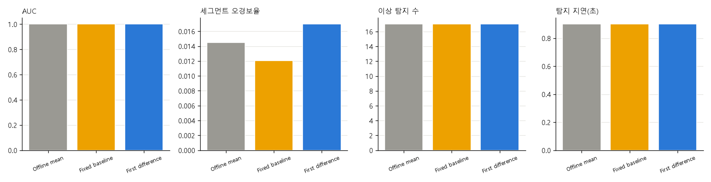
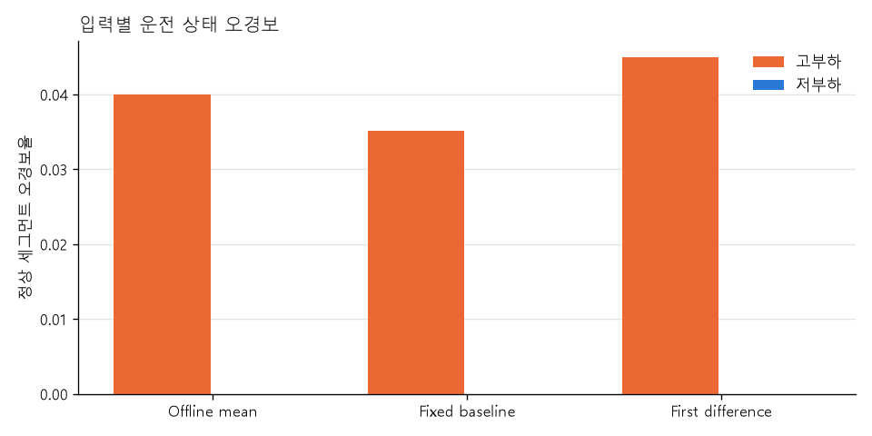
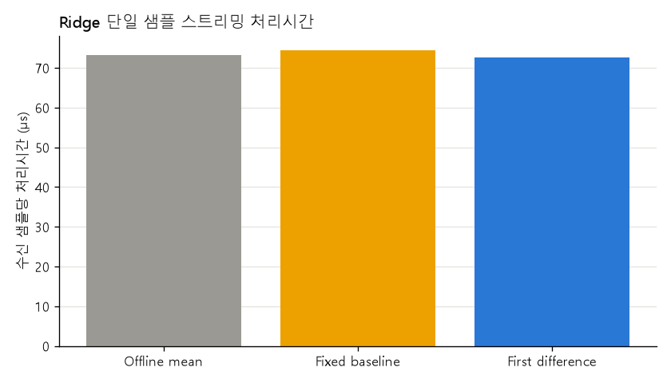

# 주제 ③ 프레스 유압펌프 — Ridge-VAR 실시간 입력 검증 리포트

- 노트북: `notebooks/34_realtime_input_validation_JSC.ipynb` (실행 결과 포함, 에러 셀 0)
- 목적: 22번 Ridge-VAR가 미래 샘플을 쓰지 않는 입력에서도 성능을 유지하는지 검증한다.
- 코드: `src/realtime_jsc.py`, `src/models_jsc.py`
- 출력: `figures/34_realtime_input_validation_JSC/`, `results/34_realtime_input_validation_JSC/`
- 심사 기준 대응: 2번(Ridge 입력 검증), 3번(운전 상태별 FP), 4번(실시간 입력·지연·처리량), 6번(재현성)

> **후속 최종 선택(2026-10-07).** 이 실험에서 causal 입력과 10 Hz 처리 가능성을 확인하고, 23번 Ridge + MCD 결합 및 31번 CNN 공통 비교까지 종합해 **Ridge-VAR를 최종 시계열 모델로 확정했다.** 최종 입력은 `first_difference`, 최종 경보는 Ridge와 MCD `[diff_amp]`의 동시 초과를 사용한다.

## 0. 결론

**최종 Ridge 입력은 `first_difference`(세그먼트 내 1차 차분)로 확정한다.** time-block에서 AUC 1.0000, 평가 가능한 이상 17/17, 세그먼트 오경보율 0.0170을 기록했다. 오프라인 `mean`의 0.0145보다 0.0025p 높을 뿐이며 GroupKFold에서는 오히려 0.0280에서 0.0206으로 낮아졌다.

`fixed_baseline`도 17/17·오경보율 0.0121로 수치상 가장 좋지만, 잔여 세그먼트 평균만으로 실제 이상을 구분하는 AUC가 채널별 0.9197~0.9592다. 이상 날짜의 DC/계측 체인 교란을 그대로 포함하므로 최종 주 입력으로 채택하지 않고 성능 상한과 현장 보조 지표로만 남긴다.

1차 차분은 현재와 직전 샘플만 사용하고 burst 경계에서 이전 값을 버린다. Ridge 상태도 매 burst 초기화되며 첫 5샘플에는 점수를 내지 않는다. 첫 샘플 점수는 0.5초, 공통 1초 윈도우 판정은 0.9초에 가능하다. 단일 샘플 처리시간은 현재 PC에서 최악 0.388 ms로 10 Hz 샘플 간격 100 ms의 0.4% 미만이다.

## 1. 입력·평가 계약

| 항목 | 값 |
|---|---|
| 센서 | AI0·AI1 진동 + AI2 전류, 10 Hz |
| 공통 형식 통일 | 진동 6자리, 전류 공통 격자 및 1자리 반올림 |
| 윈도우 | 1초, step 0.5초, burst 경계 통과 금지 |
| 모델 | Ridge-VAR, 과거 5샘플 × 3채널 → 다음 3채널 |
| 분할 | GroupKFold 5 + 정상 forward time-block 4 |
| 학습·임계 | 정상만 학습, fold별 학습 정상 점수 q99 |
| 상태 초기화 | burst 시작마다 차분 이전값·Ridge 과거 버퍼 초기화 |
| 처리시간 | 형식 통일 후 샘플별 입력 변환 + `sklearn` Ridge 예측, 파일 I/O 제외 |

비교 입력은 다음 세 가지다.

| 입력 | 정의 | causal | 판정 |
|---|---|---:|---|
| `offline_mean` | 완성된 burst 전체 평균 제거 | 아니오 | 22번 재현 기준선 |
| `fixed_baseline` | 현재 fold 학습 정상의 길이 ≥ 17 burst 평균 중앙값을 고정 상수로 제거 | 예 | 잔여 DC 교란 성능 상한 |
| `first_difference` | `d[0] = 0`, `d[t] = x[t] - x[t-1]` | 예 | **현장 입력 채택** |

`first_difference`의 첫 0은 명시적인 burst 시작값이다. 다른 burst의 마지막 샘플과 현재 burst의 첫 샘플을 빼지 않으며, burst 사이 공백을 보간하거나 이어 붙이지 않는다.

## 2. 성능

아래 값은 fold 평균이다. GroupKFold의 탐지 3.4/3.4는 서로 다른 fold의 이상을 합치면 17/17이라는 뜻이다.

| 입력 | split | AUC | 윈도우 FPR | 세그먼트 FPR | 탐지 | 지연 중앙값 |
|---|---|---:|---:|---:|---:|---:|
| Offline mean | GroupKFold / time-block | 1.0000 / 1.0000 | 0.0116 / 0.0060 | 0.0280 / 0.0145 | 17/17 / 17/17 | 0.9 / 0.9초 |
| Fixed baseline | GroupKFold / time-block | 1.0000 / 1.0000 | 0.0113 / 0.0055 | 0.0243 / 0.0121 | 17/17 / 17/17 | 0.9 / 0.9초 |
| **First difference** | **GroupKFold / time-block** | **1.0000 / 1.0000** | **0.0100 / 0.0068** | **0.0206 / 0.0170** | **17/17 / 17/17** | **0.9 / 0.9초** |

사전 합격 조건은 time-block에서 17/17, AUC ≥ 0.99, 세그먼트 FPR ≤ offline mean + 0.01이었다. 1차 차분은 세 조건을 모두 통과했다. 오프라인 mean 행은 22번의 fold별 AUC·FPR·지연·탐지 수와 정확히 일치했다(assert 통과).

## 3. 잔여 DC 교란

세그먼트별 입력 평균의 절댓값 하나로 라벨을 분류한 진단 AUC다. 임계나 Ridge 학습에는 사용하지 않았다.

| 입력 | AI0 | AI1 | AI2 | 해석 |
|---|---:|---:|---:|---|
| Offline mean | 0.5000 | 0.5000 | 0.5000 | 평균 제거 후 수치 잔차 차단 |
| Fixed baseline | **0.9592** | **0.9479** | **0.9197** | 이상 날짜 DC가 강하게 남음 |
| First difference | 0.7224 | 0.7926 | 0.5633 | 상수 DC는 제거됨. 값은 `(마지막-처음)/n`의 경계 파형 차이 |

`fixed_baseline`의 낮은 오경보를 그대로 “실시간 성능 우위”라고 해석하지 않는다. 1차 차분의 평균은 상수 오프셋에 불변이며, 남은 분리력은 burst 양 끝 파형 변화다. 다만 실제 이상이 한 이벤트뿐이므로 이것도 독립 고장 일반화 근거는 아니다.

## 4. 시작 구간·탐지 지연·상태 초기화

- 27개 입력·분할 조합 모두 첫 유효 점수 인덱스가 정확히 5였다.
- 각 burst의 처음 5개 점수는 모두 `NaN`이었다. 이전 burst 상태가 넘어간 경우는 없었다.
- 첫 시점 점수는 6번째 샘플 도착 시점인 0.5초에 계산된다.
- 운영 판정은 1초 윈도우 점수 평균이므로 10번째 샘플 시점인 0.9초에 처음 나온다.
- batch 점수와 실제 샘플별 입력 점수의 최대 절대오차는 `3.41e-13`, 최대 상대오차는 `6.77e-15`였다.
- 평가 가능한 이상은 모든 fold에서 첫 1초 윈도우에 탐지돼 지연 중앙값이 0.9초였다.

공백까지 포함한 체감 지연은 수집 구조의 burst 간격 중앙값 7.958초를 더한 약 8.858초다. 이는 모델 계산시간이 아니라 burst 수집 방식의 하한이다.

## 5. 고부하·저부하 오경보

| 입력 (time-block) | 고부하 윈도우 FPR | 저부하 윈도우 FPR | 고부하 세그먼트 FPR | 저부하 세그먼트 FPR |
|---|---:|---:|---:|---:|
| Offline mean | 0.0184 | 0.0000 | 0.0400 | 0.0000 |
| Fixed baseline | 0.0175 | 0.0000 | 0.0351 | 0.0000 |
| **First difference** | **0.0201** | **0.0000** | **0.0449** | **0.0000** |

1차 차분에서도 정상 FP는 고부하에 집중되고 저부하에서는 없었다. 입력 변환만으로 상태 차이가 사라지지 않으므로 최종 운영점은 32번처럼 정상 기준 목표 오경보율로 관리한다. 23번의 MCD 결합 검증에서는 실제 이상 17/17을 유지하면서 time-block 세그먼트 오경보율이 Ridge 단독 1.70%에서 경보 0.25%로 낮아졌다.

## 6. 처리시간

1차 차분의 수신 샘플당 처리시간은 9개 fold 중앙값 0.095 ms, 최악 0.388 ms였다. 최악 처리량도 약 2,580 sample/s로 센서 입력 10 sample/s보다 약 258배 높다.

측정에는 형식 통일 이후의 1차 차분, 정규화, 과거 5샘플 버퍼, 한 행 Ridge 예측이 포함된다. 센서 통신·CSV I/O·대시보드 전송은 포함하지 않으며 PC 부하에 따라 달라진다. 따라서 절대 지연 보증값이 아니라 현재 Python 구현이 10 Hz 실시간 처리에 계산상 충분하다는 근거로 사용한다.

## 7. 최종 Ridge 입력 계약

최종 운영에 사용하는 Ridge 입력 계약은 다음과 같다.

1. 샘플 도착 즉시 공통 형식 통일을 적용한다.
2. 새 `seg_uid`가 시작되면 직전값과 과거 5샘플 버퍼를 비운다.
3. 첫 샘플의 차분은 0, 이후는 같은 burst의 직전 샘플과 차분한다.
4. 5샘플을 모으기 전에는 점수를 내지 않는다.
5. 1초 윈도우가 완성되는 0.9초부터 경보 판정에 사용한다.
6. 임계값은 충분한 크기의 별도 정상 calibration 구간으로 고정하고, 현재 운전의 고·저부하 구성이 calibration과 유사한지 확인한다.
7. 23번에서 검증한 **주의 = Ridge-VAR `[first_difference]`, 경보 = Ridge-VAR AND MCD `[diff_amp]`**를 최종 2단계 구조로 사용한다.

## 8. 한계

- 실제 이상은 한 날짜·한 이벤트다. 17/17은 독립 고장 17건의 재현율이 아니다.
- 1초 미만 세그먼트는 공통 평가 계약상 판정하지 못한다.
- 첫 차분 0은 경계 표식 역할도 하므로 데이터 수집 장치가 연속 수집으로 바뀌면 입력 계약을 다시 검증해야 한다.
- 최종 alpha와 임계값은 제출 모델 학습 시 충분한 정상 calibration 구간으로 고정하고 운전 상태 구성 변화 여부를 함께 확인해야 한다.
- 처리시간은 현재 PC의 Python 측정이며 전체 서비스 지연이 아니다.

## 9. 산출물

- `results/34_realtime_input_validation_JSC/metrics.csv`: 공통 비교표 형식
- `cv_scores.csv`: 입력·fold별 성능, 상태별 FPR, alpha, 실행시간
- `scores.csv`: test 윈도우별 점수와 임계
- `stream_timing.csv`: 샘플별 처리시간·처리량
- `baseline_by_fold.csv`: fold별 학습 정상 고정 상수
- `input_diagnostics.csv`: 입력 평균 절댓값의 라벨 AUC
- `error_cases.csv`: FP/FN 세그먼트(모든 입력에서 FN 없음)
- `contract_checks.csv`: 상태 초기화·첫 점수 위치·batch/stream 정합성
- `verdict.csv`: causal 후보 합격 조건과 채택 판정
