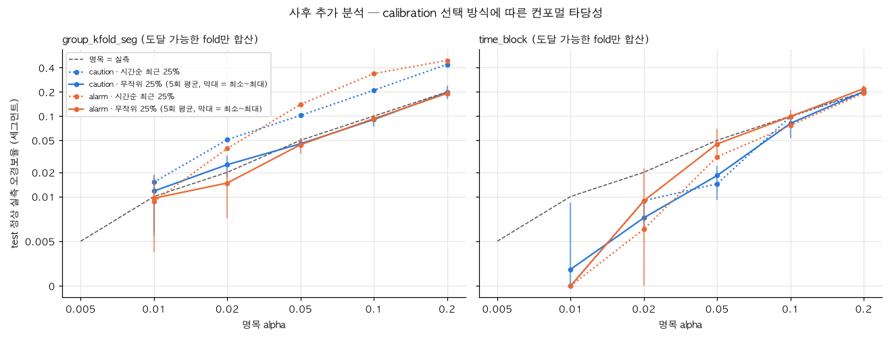

# 주제 ③ 프레스 유압펌프 — 분할 컨포멀 p-value 리포트: 최종 경보 구조의 점수를 정상 기준으로 보정된 p-value로 (36_conformal_pvalue_CHS)

- 노트북: `notebooks/36_conformal_pvalue_CHS.ipynb` (실행 결과 포함, 에러 셀 0, 실행 1분 이내, 2회 실행 CSV 동일)
- 공통 함수: `src/conformal.py` (p-value, alpha별 컨포멀 임계, 최소 p, 시간순·무작위 train/calibration 분할, Clopper–Pearson 구간)
- 목적: 23의 최종 경보 구조(1차 차분 입력 Ridge-VAR + 1차 차분 진폭 피처 MCD)가 내는 이상 점수를 정상 데이터만으로 만든 분할 컨포멀 p-value로 바꾸고, 그 보정이 실제로 성립하는지(명목 alpha 대 실측 정상 오경보율) 점검한다. 이상 데이터는 적합·calibration·선택 어디에도 쓰지 않았다.
- 심사 기준 대응: 2번(이상 확률 출력 — 점수를 보정된 p-value로), 5번(확률보정·불확실성 추정), 4번(허용 오경보율 alpha로 경보 임계 지정, 재보정 필요성)
- 탐지 대상 표현: 유압펌프 모터-펌프 구동부 이상(센서 부착 부위를 확정할 수 없어 원인이 모터인지 펌프인지는 데이터로 구분하지 않는다).
- 근거 수준 표기: **[데이터]** 이 리포트의 CSV·노트북 출력으로 직접 확인 / **[추정]** 데이터에서 논리적으로 따라오나 직접 검증하지 않음 / **[가정]** 현장·운영 전제.
- 상태 번호: 0 = 고부하, 1 = 저부하.
- 새 모델이 아니라 23 점수 위의 보정 계층이므로 `metrics.csv`를 만들지 않았고(모델 비교표 31에 들어가지 않는다) `models/`에도 저장하지 않았다.

**p-value 읽는 법.** `p = (1 + #{calibration 점수 >= 점수}) / (n + 1)`. "정상이라는 가정 아래 이만큼 극단적일 확률의 상한"이다. 보장은 calibration 정상과 test 정상이 교환 가능(exchangeable)할 때 `P(p <= alpha | 정상) <= alpha`이다. **이상일 확률이 아니며 `1 − p`를 이상 확률로 읽지 않는다.**

| 절 | 핵심 결과 | 출처 |
|---|---|---|
| A calibration 크기 | calibration 세그먼트 gkf 105~107개(최소 p 0.0093~0.0094), time_block 28 / 54 / 79 / 106개(최소 p 0.0345 / 0.0182 / 0.0125 / 0.0093). alpha 0.005는 9분할 전부, 0.01은 time_block 1~3, 0.02는 time_block 1에서 도달 불가 | `calibration_sizes.csv` |
| B 이상 p-value | 이상 17세그먼트가 9분할 모두에서 최소 p에 붙는다. gkf p <= 0.01·0.04 모두 17/17. time_block p <= 0.04는 블록 1~4 모두 17/17, p <= 0.01은 블록 4만 17/17(블록 1~3은 도달 불가로 0/17) | `outlier_pvalues.csv`, `segment_pvalues.csv` |
| C 타당성 | gkf는 보장이 깨진다: 세그먼트 실측 오경보율이 alpha 0.02 이상에서 명목의 2.0~3.4배, 10개 조합 중 8개가 95% 구간 하한 > alpha. time_block은 합산 기준 명목 이하지만 블록별로 흩어진다 | `validity.csv`, `validity_curve.png` |
| D 운영 alpha | 주의(0.04): gkf 오경보율 0.0868(시간당 35.9회)·17/17, time_block 0.0145(시간당 6.0회)·17/17. 경보(0.01): gkf 0.0094(시간당 3.9회)·17/17·F1 0.8718, time_block은 블록 4에서만 작동(fp 0/108·17/17) | `operating_alpha.csv` |
| E 떼어 낸 비용 | 학습 정상 25% 감소의 비용은 gkf `ridge&mcd` 오경보 1개(0.0000 → 0.0018)뿐, 탐지 17/17 유지 | `holdout_cost.csv` |
| F 상태별 | gkf 주의 0.04: 고부하 0.1195 대 저부하 0.0625, 경보 0.01: 고부하 0.0221 대 저부하 0.0000 | `validity_by_state.csv` |
| H 사후 추가 | calibration을 무작위 25%로 뽑으면 gkf 보장이 회복된다(alpha 0.05: 0.1019 → 0.0453, 0.10: 0.2094 → 0.0906). calibration 고부하 비율 시간순 0.1716 대 무작위 0.4313(test 정상 0.4264). 주의 0.04의 gkf 오경보율 0.0868 → 0.0408, 이상 17/17 유지 | `posthoc_random_calibration.csv`, `posthoc_calibration_state_share.csv`, `posthoc_validity_random.png` |

원칙: 이상은 다른 날짜의 **이벤트 1건**(1초 기준 판정 가능 17세그먼트, 전체 21)이고 정상은 77분 하루치다. 아래 탐지 수치는 모집단 추정이 아니라 이 이벤트의 기술이다. `CAL_FRAC` 0.25, alpha 격자 (0.005, 0.01, 0.02, 0.05, 0.10, 0.20), 운영 alpha 주의 0.04 · 경보 0.01(32가 사전 고정한 값), 점수 정의는 결과를 보기 전에 고정했고 결과를 본 뒤 바꾸지 않았다.

---

## 1. 설계

**방법.** `benchmark_jsc.iter_splits`의 9분할(GroupKFold 5 + 정상 forward time-block 4, 이상은 블록마다 반복)을 그대로 쓴다. fold의 train 정상 세그먼트를 시간순으로 놓고 가장 최근 25%를 calibration, 나머지를 proper-train으로 둔다(개수 = `max(1, floor(0.25 × n + 0.5))`). 22·23 리포트의 운영 절차 "최신 정상 calibration block으로 임계 재고정"과 같은 방향이다. Ridge-VAR(lookback 5)과 RobustMCD(진폭 18열, seed 0)는 proper-train에만 적합하고, 23과 같이 각 점수를 proper-train q99로 나눈다(`z_ridge`, `z_mcd`). [데이터: 노트북 셀 3·5]

- 비순응 점수: 주의 `s_caution = z_ridge`(예측 모델 단독), 경보 `s_alarm = min(z_ridge, z_mcd)`(AND).
- 주 단위는 세그먼트(burst): 세그먼트 점수 = 윈도우 점수 최댓값, calibration도 세그먼트 최댓값. 윈도우 단위 p-value는 한 burst 안의 겹치는 윈도우가 의존적이라 근사로만 보고한다.
- 점검 assert(모두 통과): proper-train·calibration·test 세그먼트 서로소, train·calibration에 이상 없음, calibration이 proper-train보다 시간상 뒤, p-value 범위 `[1/(n+1), 1]`, 그리고 **스트리밍 등가** — 모든 test 세그먼트·모든 alpha에서 `p_seg <= alpha` ⇔ `윈도우 점수 하나라도 > conformal_threshold(alpha)`(동점 포함). [데이터: 노트북 셀 5]

**시사점.** 스트리밍 등가가 성립하므로 운영에서는 p-value를 매번 계산할 필요 없이 alpha마다 임계 하나만 들고 윈도우가 완성될 때마다 비교하면 된다. 탐지 지연 정의도 기존과 같다(첫 초과 윈도우 `t_start + win_s − 0.1`). [데이터]

---

## 2. A. calibration 크기와 도달 가능한 최소 p

**방법.** fold별 proper-train·calibration 세그먼트·윈도우 수, 최소 p = `1/(n+1)`, alpha별 도달 가능 여부를 표로 만들었다. [데이터: `calibration_sizes.csv`]

**발견.**

| split | fold | train 세그먼트 | proper-train 세그먼트 / 윈도우 | calibration 세그먼트 / 윈도우 | 최소 p(세그먼트) | 최소 p(윈도우) | 도달 불가 alpha(세그먼트) |
|---|---|---|---|---|---|---|---|
| gkf | 0 | 421 | 316 / 1,953 | 105 / 652 | 0.0094 | 0.0015 | 0.005 |
| gkf | 1 | 426 | 319 / 1,954 | 107 / 659 | 0.0093 | 0.0015 | 0.005 |
| gkf | 2 | 428 | 321 / 1,983 | 107 / 664 | 0.0093 | 0.0015 | 0.005 |
| gkf | 3 | 420 | 315 / 1,951 | 105 / 626 | 0.0094 | 0.0016 | 0.005 |
| gkf | 4 | 425 | 319 / 1,978 | 106 / 636 | 0.0093 | 0.0016 | 0.005 |
| time_block | 1 | 113 | 85 / 569 | 28 / 169 | 0.0345 | 0.0059 | 0.005, 0.01, 0.02 |
| time_block | 2 | 215 | 161 / 1,032 | 54 / 314 | 0.0182 | 0.0032 | 0.005, 0.01 |
| time_block | 3 | 314 | 235 / 1,469 | 79 / 496 | 0.0125 | 0.0020 | 0.005, 0.01 |
| time_block | 4 | 422 | 316 / 1,983 | 106 / 620 | 0.0093 | 0.0016 | 0.005 |

- 경보 alpha 0.01은 time_block 첫 블록뿐 아니라 **블록 1~3 전부**에서 도달 불가다. 도달 가능한 분할은 gkf 5개와 time_block 4뿐이다. [데이터]
- 윈도우 단위는 time_block 1의 alpha 0.005 한 조합만 도달 불가다. [데이터]

**시사점.** 세그먼트 단위 p-value의 해상도는 calibration 세그먼트 수가 정한다. alpha 0.01에는 99개 이상, 0.005에는 199개 이상이 필요하다. [데이터]

**활용 아이디어(4번).** 이 데이터의 수집 속도(판정 가능 정상 413.35 세그먼트/시간, `reports/32_operating_point_CHS.md` 1절)로 99세그먼트는 약 14분 분량이다. 설치·재보정 직후 그 시간 동안은 alpha 0.01 경보를 쓸 수 없고 주의 단계(0.04, 24세그먼트 이상 필요)만 쓸 수 있다. [가정]

---

## 3. B. 세그먼트 p-value

**방법.** test 세그먼트마다 (split, fold, seg_uid) 한 행으로 두 점수의 세그먼트 점수·세그먼트 p-value·윈도우 p-value 최솟값을 저장했다(1,032행 = 정상 947 + 이상 85). 이상만 `outlier_pvalues.csv`(85행 = gkf 17 + time_block 17 × 4)로 따로 냈다. [데이터]

**발견.**
- 이상 17세그먼트는 9분할 모두에서 두 점수의 p가 최소값 `1/(n+1)`에 붙는다. gkf `s_alarm` 기준 이상 세그먼트 점수 최솟값은 4.40(seg 19), test 정상 세그먼트 점수 최댓값은 1.33이다. [데이터]
- p <= alpha에 도달한 이상 세그먼트 수(분모 17):

| split | fold | 최소 p | 주의 점수 p <= 0.04 | 주의 점수 p <= 0.01 | 경보 점수 p <= 0.04 | 경보 점수 p <= 0.01 |
|---|---|---|---|---|---|---|
| gkf | 5 fold 합 | 0.0093~0.0094 | 17 | 17 | 17 | 17 |
| time_block | 1 | 0.0345 | 17 | 0 (도달 불가) | 17 | 0 (도달 불가) |
| time_block | 2 | 0.0182 | 17 | 0 (도달 불가) | 17 | 0 (도달 불가) |
| time_block | 3 | 0.0125 | 17 | 0 (도달 불가) | 17 | 0 (도달 불가) |
| time_block | 4 | 0.0093 | 17 | 17 | 17 | 17 |

- 표준 전처리(세그먼트 평균 제거)에서 조용했던 seg 3·19·20도 1차 차분 입력에서는 최소 p다(`s_alarm` 33.3 / 4.40 / 5.74). 23의 17/17 탐지와 같은 결과다. [데이터]

**시사점.** 이 이벤트는 정상과 점수 차가 커서 p-value가 전부 바닥값이다. 따라서 p-value로는 이상 세그먼트 사이의 강약을 구분할 수 없다(원 점수는 4.4~92.4로 다르다). 강도 표시는 원 점수(z)로, 오경보 통제는 p-value로 역할을 나눠야 한다. [추정]

그림: [정상·이상 p-value 분포](../figures/36_conformal_pvalue_CHS/pvalue_distribution.png)

---

## 4. C. 타당성 — 명목 alpha 대 실측 정상 오경보율

**방법.** test 정상에서 `p <= alpha`인 비율을 alpha 격자마다 셌다. gkf는 5 fold 합산과 Clopper–Pearson 95% 구간, time_block은 블록별·블록 평균·합산 개수. 도달 불가 fold는 0으로 세지 않고 제외했다(`attainable = False`, 집계 행의 `n_folds_attainable`에 개수). [데이터: `validity.csv` 288행]

**발견 (세그먼트 단위).**

| split | 점수 | alpha | 쓴 fold 수 | 오경보 / 정상 | 실측 | 95% 구간 | alpha가 구간 안 |
|---|---|---|---|---|---|---|---|
| gkf | s_caution | 0.01 | 5 | 8 / 530 | 0.0151 | 0.0065~0.0295 | 예 |
| gkf | s_caution | 0.02 | 5 | 27 / 530 | 0.0509 | 0.0338~0.0733 | 아니오(초과) |
| gkf | s_caution | 0.05 | 5 | 54 / 530 | 0.1019 | 0.0775~0.1308 | 아니오(초과) |
| gkf | s_caution | 0.10 | 5 | 111 / 530 | 0.2094 | 0.1755~0.2466 | 아니오(초과) |
| gkf | s_caution | 0.20 | 5 | 233 / 530 | 0.4396 | 0.3969~0.4831 | 아니오(초과) |
| gkf | s_alarm | 0.01 | 5 | 5 / 530 | 0.0094 | 0.0031~0.0219 | 예 |
| gkf | s_alarm | 0.02 | 5 | 21 / 530 | 0.0396 | 0.0247~0.0599 | 아니오(초과) |
| gkf | s_alarm | 0.05 | 5 | 74 / 530 | 0.1396 | 0.1112~0.1721 | 아니오(초과) |
| gkf | s_alarm | 0.10 | 5 | 179 / 530 | 0.3377 | 0.2975~0.3798 | 아니오(초과) |
| gkf | s_alarm | 0.20 | 5 | 261 / 530 | 0.4925 | 0.4491~0.5359 | 아니오(초과) |
| time_block | s_caution | 0.01 | 1 | 0 / 108 | 0.0000 | 0.0000~0.0336 | 예 |
| time_block | s_caution | 0.02 | 3 | 3 / 315 | 0.0095 | 0.0020~0.0276 | 예 |
| time_block | s_caution | 0.05 | 4 | 6 / 417 | 0.0144 | 0.0053~0.0311 | 아니오(미달) |
| time_block | s_caution | 0.10 | 4 | 41 / 417 | 0.0983 | 0.0715~0.1310 | 예 |
| time_block | s_caution | 0.20 | 4 | 82 / 417 | 0.1966 | 0.1596~0.2381 | 예 |
| time_block | s_alarm | 0.01 | 1 | 0 / 108 | 0.0000 | 0.0000~0.0336 | 예 |
| time_block | s_alarm | 0.02 | 3 | 2 / 315 | 0.0063 | 0.0008~0.0227 | 예 |
| time_block | s_alarm | 0.05 | 4 | 13 / 417 | 0.0312 | 0.0167~0.0527 | 예 |
| time_block | s_alarm | 0.10 | 4 | 32 / 417 | 0.0767 | 0.0531~0.1066 | 예 |
| time_block | s_alarm | 0.20 | 4 | 80 / 417 | 0.1918 | 0.1552~0.2330 | 예 |

(alpha 0.005는 두 split 모두 도달 가능한 fold가 0개라 행이 비어 있다.)

- **gkf에서는 보장이 깨진다.** alpha 0.02 이상에서 실측이 명목의 2.0~3.4배이고, 도달 가능한 10개 조합 중 8개에서 구간 하한이 alpha를 넘는다. alpha 0.01만 구간 안이다. [데이터]
- time_block은 합산 기준으로 명목 이하지만 블록별 실측은 흩어진다. alpha 0.10에서 `s_caution` 블록 1~4 = 0.2255 / 0.0808 / 0.0648 / 0.0278, `s_alarm` = 0.1275 / 0.0404 / 0.1389 / 0.0000. alpha 0.20에서 블록 4는 0.0370·0.0278로 명목의 1/5 이하다. 합산이 맞아 보이는 데에는 블록 간 상쇄가 섞여 있다. [데이터]
- 윈도우 단위(근사)도 같은 방향이다: gkf alpha 0.05에서 0.1305·0.1415, time_block 0.0439·0.0432. [데이터]
- calibration 세그먼트의 고부하 비율은 gkf 0.152~0.196으로 test 정상(0.363~0.524)보다 낮다. time_block 1~3은 calibration 0.443~0.500 대 test 0.475~0.528로 비슷하고, 블록 4는 calibration 0.528 대 test 0.148로 반대 방향으로 어긋난다. [데이터: 노트북 셀 18]

**시사점.** gkf는 test 세그먼트가 전 구간에 흩어져 있는데 사전 고정한 calibration은 "train의 가장 최근 25%", 즉 수집 마지막 구간이다. 그 구간은 고부하 비율이 낮고 조용해서(time_block 4의 낮은 실측 오경보율과 같은 구간) calibration 점수가 test 정상보다 낮게 분포하고, 그 결과 오경보가 명목의 2배 이상 나온다. 교환 가능성이 깨진 것이며 컨포멀 절차의 계산 오류가 아니다(동점 포함 등가 assert 통과). 설계를 결과에 맞춰 바꾸지 않았다. [추정: 원인 해석 / 데이터: 고부하 비율·블록 4 실측]

시간순 분할에서도 블록 1(초과)과 블록 4(크게 미달)처럼 77분 안에서 정상 분포가 움직인다. 컨포멀 보장은 "calibration과 같은 분포의 정상"에 대해서만 성립하므로, 이 데이터에서 p-value의 명목 alpha는 **calibration 구간과 운전 구성이 비슷한 구간에서만** 문자 그대로 읽을 수 있다. [추정]

**활용 아이디어(4·5번).** (1) calibration 블록은 가장 최근이면서 고부하·저부하 구성이 현재 운전과 비슷해야 한다. 구성이 달라지면 재보정한다. (2) 실측 정상 오경보율과 alpha의 차이 자체를 분포 이동 감시 지표로 쓴다: 정상 구간에서 alpha 0.04 주의가 구간 밖으로 자주 울리면 이상이 아니라 calibration이 낡았다는 신호다. [가정]

그림: [타당성 곡선](../figures/36_conformal_pvalue_CHS/validity_curve.png)

---

## 5. D. 운영 alpha에서의 성능 — 주의 0.04 · 경보 0.01

**방법.** fold마다 calibration 세그먼트 점수에서 alpha의 컨포멀 임계를 구해 test에 any 집계로 적용했다. 집계는 31과 같은 규약(gkf는 5 fold `pool_confusion` 합산, time_block은 블록별 계산 후 블록 평균). 시간당 오경보 = `fpr_segment × 413.35`(`reports/32_operating_point_CHS.md` 1절). 도달 불가 블록은 임계가 무한대라 경보가 울리지 않으며, 이를 그대로 넣은 `block_mean`과 도달 가능한 블록만 평균한 `block_mean_attainable`을 함께 냈다. [데이터: `operating_alpha.csv`]

**발견.**

| 단계 | 점수 · alpha | split | 집계 | fp / 정상 | fpr_segment | 시간당 오경보 | tp / fn (이상 17) | recall | F1 | 지연 중앙값 |
|---|---|---|---|---|---|---|---|---|---|---|
| 주의 | s_caution · 0.04 | gkf | 5 fold 합산 | 46 / 530 | 0.0868 | 35.9 | 17 / 0 | 1.00 | 0.4250 | 0.9초 |
| 주의 | s_caution · 0.04 | time_block | 블록 평균(4블록 모두 도달 가능) | 1.50 / 104.25 | 0.0145 | 6.0 | 17 / 0 | 1.00 | 0.9587 | 0.9초 |
| 경보 | s_alarm · 0.01 | gkf | 5 fold 합산 | 5 / 530 | 0.0094 | 3.9 | 17 / 0 | 1.00 | 0.8718 | 0.9초 |
| 경보 | s_alarm · 0.01 | time_block | 블록 평균(전체 4블록) | 0.00 / 104.25 | 0.0000 | 0.0 | 4.25 / 12.75 | 0.25 | 0.2500 | 0.9초 |
| 경보 | s_alarm · 0.01 | time_block | 도달 가능 블록만(블록 4) | 0 / 108 | 0.0000 | 0.0 | 17 / 0 | 1.00 | 1.0000 | 0.9초 |

- 참고 조합: `s_caution` · 0.01은 gkf fp 8 / 530 = 0.0151·17/17·F1 0.8095, `s_alarm` · 0.04는 gkf fp 48 / 530 = 0.0906·F1 0.4146, time_block 블록 평균 0.0308·F1 0.9199. [데이터]
- 주의의 gkf 오경보율 0.0868은 명목 0.04의 2.2배다(C절의 교환 가능성 붕괴). fold별 fp는 15 / 12 / 3 / 6 / 10. time_block 블록별 fp는 0 / 3 / 2 / 1이다. [데이터]
- 경보의 gkf 오경보 5개는 모두 fold 0의 고부하 세그먼트다(`normal_178`·`216`·`331`·`413`·`460`). fold 1~4는 0개. [데이터]
- time_block 경보는 블록 1~3에서 calibration이 99세그먼트 미만이라 한 번도 울리지 않는다(이상 17개 전부 미탐). 탐지 실패가 아니라 alpha 0.01을 표현할 해상도가 없는 것이다. [데이터]
- 체감 지연은 모든 행에서 0.9 + 7.958 = 8.858초(burst 간격 하한 포함)다. [데이터]
- 경보가 울렸는데 주의는 울리지 않은 세그먼트가 9분할 합쳐 1개 있다(gkf fold 0 `normal_216`: `p_seg_alarm` 0.0094, `p_seg_caution` 0.0755). 두 단계가 점수도 alpha도 달라 경보 ⊆ 주의가 자동으로 지켜지지 않는다. [데이터]

**시사점.** 컨포멀 계층은 탐지 성능을 높이지 않는다. 경보 alpha 0.01의 임계는 z 기준 0.59~0.85로 23의 AND 규칙(z > 1)보다 느슨해서, gkf 오경보율 0.0094는 23의 `ridge&mcd`(전체 train 0.0000, proper-train 0.0018)보다 높다. 얻는 것은 서로 다른 점수(Ridge 단독, AND 결합)에 "정상일 때 burst 하나가 잘못 울릴 확률의 상한"이라는 같은 눈금을 붙이는 것이고, 그 눈금은 calibration이 충분히 크고 test와 운전 구성이 같을 때만 믿을 수 있다. [추정]

**활용 아이디어(4번).** (1) 현장과는 q99 같은 분위수가 아니라 alpha(시간당 약 413 × alpha회의 정상 오경보 상한)로 임계를 합의한다. (2) calibration이 99세그먼트에 못 미치는 동안은 23의 원 규칙(z > 1)을 경보로 쓰고, 채워진 뒤 alpha 기반 임계로 넘어간다. (3) 2단계를 일관되게 하려면 경보 판정에 "주의도 울림" 조건을 함께 둔다. [가정]

---

## 6. E. calibration을 떼어 낸 비용

**방법.** proper-train(train의 75%) 모델에 23의 원 규칙(z > 1)을 적용해 23의 `metrics.csv`(전체 train, MCD 3시드 평균) `ridge_diff`·`ridge&mcd` 행과 비교했다. 탐지 수는 23 `cv_scores.csv`의 seed 0 행. 같은 코드로 전체 train(seed 0)에 적합하면 23 seed 0의 `fpr_segment`가 재현된다(최대 절대차 9.0e-17, 탐지 수 불일치 fold 0개). [데이터: `holdout_cost.csv`]

**발견.**

| split | 규칙 | train 세그먼트(전체 → proper, 평균) | fpr_segment proper-train | fpr_segment 23 | 차이 | 탐지 proper / 23 |
|---|---|---|---|---|---|---|
| gkf | ridge_diff | 424 → 318 | 0.0187 | 0.0206 | −0.0019 | 17 / 17 (fold 합) |
| gkf | ridge&mcd | 424 → 318 | 0.0018 | 0.0000 | +0.0018 | 17 / 17 (fold 합) |
| time_block | ridge_diff | 266 → 199.25 | 0.0170 | 0.0170 | 0.0000 | 17 / 17 (블록마다) |
| time_block | ridge&mcd | 266 → 199.25 | 0.0025 | 0.0025 | 0.0000 | 17 / 17 (블록마다) |

- fold 단위로 달라진 곳은 두 군데뿐이다: gkf fold 4 `ridge_diff` 0.0190 → 0.0095(오경보 1개 감소), gkf fold 0 `ridge&mcd` 0.0000 → 0.0092(오경보 1개 증가). time_block은 4블록 모두 같다. [데이터]

**시사점.** 이 데이터에서는 학습 정상의 25%를 calibration으로 돌려도 모델 자체의 성능은 사실상 그대로다(정상 세그먼트 85개로 학습한 time_block 1도 같다). calibration 분리의 비용은 학습량이 아니라 A절의 해상도(calibration 세그먼트 수)에서 나온다. [추정]

---

## 7. F. 운전 상태별 타당성

**방법.** 세그먼트 단위 실측 오경보율을 alpha 0.01·0.04에서 고부하·저부하로 나눴다. 컨포멀 보장은 주변(marginal) 보장이라 상태별 보장은 없다. 조정 없이 보고만 한다. [데이터: `validity_by_state.csv`]

**발견.**

| split | 점수 · alpha | 고부하 (오경보 / 정상) | 저부하 (오경보 / 정상) |
|---|---|---|---|
| gkf | s_caution · 0.04 | 0.1195 (27 / 226) | 0.0625 (19 / 304) |
| gkf | s_caution · 0.01 | 0.0265 (6 / 226) | 0.0066 (2 / 304) |
| gkf | s_alarm · 0.04 | 0.1947 (44 / 226) | 0.0132 (4 / 304) |
| gkf | s_alarm · 0.01 | 0.0221 (5 / 226) | 0.0000 (0 / 304) |
| time_block | s_caution · 0.04 | 0.0234 (4 / 171) | 0.0081 (2 / 246) |
| time_block | s_alarm · 0.04 | 0.0702 (12 / 171) | 0.0041 (1 / 246) |
| time_block | alpha 0.01 (블록 4만) | 0.0000 (0 / 16) | 0.0000 (0 / 92) |

- 모든 조합에서 고부하 오경보율이 저부하보다 높다. `s_alarm` · 0.04는 gkf 고부하 0.1947 대 저부하 0.0132로 15배 차이다. [데이터]
- time_block `s_alarm` · 0.04는 전체로는 0.0308로 명목 이하인데 고부하만 보면 0.0702로 명목을 넘는다. [데이터]

**시사점.** 주변 보장이 성립하는 구간에서도 오경보는 고부하에 몰린다(31 C절의 고부하 집중과 같은 방향). AND 결합 점수가 Ridge 단독보다 상태 편중이 크다. [데이터·추정]

**활용 아이디어(4·5번).** 상태별로 calibration 점수를 나눠 p-value를 내는 조건부(Mondrian) 컨포멀이 다음 후보다. 다만 calibration이 상태별로 쪼개져 해상도가 더 거칠어진다(예: gkf calibration 106개 중 고부하 약 16~21개 → 최소 p 약 0.05). 32 B절에서 상태별 임계가 일관된 이득이 없었던 것과 같은 제약이다. [가정]

---

## 8. H. 사후 추가 분석 — calibration을 무작위로 뽑으면 보장이 회복되는가

**이 절은 A~G 결과를 본 뒤에 추가했다. 사전 고정 설계가 아니며, 운영점 수치(D절)는 바꾸지 않는다.**

**방법.** C절에서 gkf의 실측 오경보율이 명목의 2~3.4배로 나온 원인이 "시간상 가장 최근 25%를 calibration으로 둔 것"인지 확인했다. 같은 9분할·같은 모델·같은 `CAL_FRAC` 0.25에서 calibration 세그먼트만 무작위로 뽑았다(`conformal.random_split`, 시드 0~4의 5회 반복, 개수 규칙 동일). 시간순 분할도 같은 함수로 다시 계산해 1절 p-value와 같음을 assert했다. 세그먼트 단위 실측 정상 오경보율을 도달 가능한 fold만 합산해 세고, 무작위 분할은 반복 5회의 평균·최소·최대와 반복별 Clopper–Pearson 95% 구간이 명목 alpha를 포함한 반복 수를 냈다. [데이터: 노트북 H 셀, `posthoc_random_calibration.csv`]

**발견.**

gkf, 세그먼트 단위 실측 정상 오경보율(n = 530):

| alpha | 주의 시간순 | 주의 무작위 평균 (최소~최대) | 경보 시간순 | 경보 무작위 평균 (최소~최대) |
|---|---|---|---|---|
| 0.01 | 0.0151 | 0.0117 (0.0057~0.0189) | 0.0094 | 0.0098 (0.0038~0.0170) |
| 0.02 | 0.0509 | 0.0249 (0.0170~0.0321) | 0.0396 | 0.0147 (0.0075~0.0208) |
| 0.05 | 0.1019 | 0.0453 (0.0396~0.0528) | 0.1396 | 0.0442 (0.0340~0.0528) |
| 0.10 | 0.2094 | 0.0906 (0.0736~0.0962) | 0.3377 | 0.0928 (0.0830~0.1038) |
| 0.20 | 0.4396 | 0.1966 (0.1642~0.2396) | 0.4925 | 0.1913 (0.1755~0.2189) |

- 무작위 calibration에서는 gkf 실측 오경보율이 명목 alpha 근처로 돌아온다. 반복별 95% 구간이 명목 alpha를 포함한 반복은 10개 조합 중 7개에서 5/5, 2개에서 4/5, 1개(주의 0.20)에서 3/5다. [데이터]
- calibration의 고부하 세그먼트 비율(fold 평균)은 시간순 0.1716, 무작위 0.4313이고 test 정상은 0.4264다. 시간순 calibration만 운전 상태 구성이 test와 다르다. [데이터: `posthoc_calibration_state_share.csv`]
- 운영 alpha에서 gkf 주의(0.04) 오경보율은 0.0868 → 0.0408(반복 0.0302~0.0472), 경보(0.01)는 0.0094 → 0.0098(0.0038~0.0170)이다. 이상 17개는 모든 반복에서 두 단계 모두 탐지됐다. [데이터]
- time_block은 두 방식이 비슷하다(calibration 고부하 비율 0.4928 대 0.4867). 예: 주의 alpha 0.10에서 시간순 0.0983, 무작위 0.0811. 무작위로 뽑아도 calibration은 test보다 과거 구간에서만 나오기 때문이다. [데이터]

**시사점.** gkf에서 보장이 깨진 원인은 모델이나 p-value 계산이 아니라 **calibration 구간의 운전 상태 구성**이다. 수집 마지막 구간은 저부하가 많아 점수가 낮고, 그 구간만으로 정한 임계는 고부하가 섞인 구간에서 너무 낮다. 다만 이 확인은 결과를 본 뒤 추가한 것이고, 반복 5회는 같은 test 세그먼트를 다시 쓰므로 독립 반복이 아니다. 운전 상태 외에 시간에 따른 다른 변화가 함께 섞여 있을 가능성은 남는다. [데이터·추정]

**활용 아이디어(4·5번).** 운영에서 "최신 정상 구간으로 임계를 재고정"할 때 최신 구간을 그대로 쓰지 말고, 고부하·저부하 구성이 운전 구성과 비슷한지 먼저 확인한다. 구성이 치우쳐 있으면 더 긴 구간에서 뽑거나 상태별로 나눠 보정하는 방식(상태 조건부 컨포멀)을 검토한다. 후자는 이 노트북에서 시험하지 않았다. [가정]

## 9. 운영 절차 (심사 4번)

| 단계 | 조건 | 의미 | 근거 수준 |
|---|---|---|---|
| calibration 준비 | 최신 정상 세그먼트 99개 이상(약 14분), 고부하·저부하가 섞인 구간 | alpha 0.01을 표현할 최소 해상도 | [데이터] A절 / [가정] 구간 선택 |
| 주의 | `z_ridge` > 주의 임계(alpha 0.04) ⇔ `p_caution <= 0.04` | 정상이라면 burst 100개 중 4개 이하로 울려야 하는 수준 | [데이터] D절(time_block 0.0145, gkf 0.0868) |
| 경보 | `min(z_ridge, z_mcd)` > 경보 임계(alpha 0.01) ⇔ `p_alarm <= 0.01`, 그리고 주의도 울림 | 정상이라면 burst 100개 중 1개 이하 | [데이터] D절(gkf 0.0094) / [가정] 주의 조건 추가 |
| 재보정 | 정상 구간의 실측 오경보율이 alpha의 95% 구간 밖, 또는 고부하·저부하 구성 변화 | calibration이 현재 운전을 대표하지 못함 | [데이터] C절 / [가정] 판정 주기 |

화면에는 "이상 확률"이 아니라 `p = 0.009 (정상 calibration 106 burst 중 이보다 큰 점수 0개)`처럼 근거 개수와 함께 표시하고, 강도는 원 점수(z)로 따로 보여 준다. [가정]

---

## 10. 한계

- 이상 이벤트 1건(판정 가능 17세그먼트, 전체 21 중 1초 윈도우가 없는 4개는 판정 불가)이고 모두 최소 p다. p-value가 약한 이상에서 어떻게 움직이는지는 이 데이터로 볼 수 없다. [데이터]
- 정상은 77분 하루치다. 그 안에서도 블록 간 분포 이동이 보이므로 다른 날짜의 정상에 대한 타당성은 검증하지 못했다. [데이터]
- gkf의 타당성 붕괴가 calibration 선택에서 온다는 점은 사후 추가 분석(8절)에서 무작위 calibration으로 확인했다. 다만 그 분석은 결과를 본 뒤 추가한 것이고, 고부하 비율 차이와 시간에 따른 다른 변화(점수 수준 변화 등)를 서로 분리하지는 못했다. [데이터·추정]
- 세그먼트 길이(윈도우 수)가 달라 최댓값 점수가 긴 세그먼트에서 커지기 쉽다. 세그먼트 단위 교환 가능성 안에 포함되는 효과지만 길이별 타당성은 따로 보지 않았다. [추정]
- 윈도우 단위 p-value와 그 구간은 겹치는 윈도우의 의존을 무시한 근사다. [데이터]
- 시간당 환산은 정상 수집 구간 기준 외삽(413.35 세그먼트/시간)이다. MCD는 seed 0 하나만 썼다(23은 3시드). [데이터]

## 11. 다음 단계

1. 상태별(Mondrian) 컨포멀로 고부하·저부하 각각의 타당성을 점검한다(calibration 해상도와 맞바꿈).
2. calibration 블록을 "최근 + 상태 구성 맞춤"으로 고르는 규칙을 정상 데이터만으로 사전 정의해 gkf·time_block에서 다시 본다(이번 결과를 보고 `CAL_FRAC`을 조정하는 방식은 쓰지 않는다).
3. 보고서 2번 절(이상 확률 출력)과 5번 절(확률보정·불확실성)에 p-value의 정의·보장 조건·실패 조건을 함께 싣고, 4번 절 운영 절차에 calibration 크기 조건을 반영한다.
