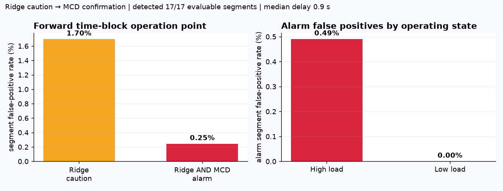
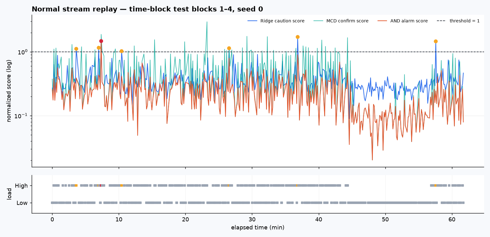
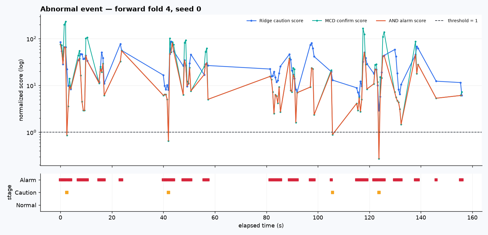

# 주제 ③ 프레스 유압펌프 — Ridge·MCD 최종 경보 대시보드

- 목적: 최종 모델인 Ridge `[first_difference]` 주의와 Ridge AND MCD `[diff_amp]` 경보를 재현 가능한 정적 단일 HTML로 보여 준다.
- 입력: 23번 저장 점수·평가표, 34번 처리시간, `data/processed/segments.csv`
- 출력: `figures/37_ridge_mcd_dashboard_JSC/dashboard.html`과 PNG 3개, `results/37_ridge_mcd_dashboard_JSC/` CSV 3개
- 심사 기준 대응: 4번(현장 활용), 5번(2단계 경보 시각화), 6번(추가 서버 없는 재현성)

## 0. 결론

최종 제출 화면은 Grafana·Tableau가 아니라 **노트북 37이 생성하는 단일 HTML**이다. 브라우저로 직접 열 수 있고 그림·스타일·탭 전환 코드가 파일 안에 들어 있어 인터넷 연결, 외부 계정, DB, 상용 라이선스가 필요 없다.

대시보드는 23번에서 확정한 규칙을 바꾸지 않는다. 주의는 Ridge 점수 `z_ridge_diff > 1`, 경보는 같은 1초 창에서 Ridge와 MCD가 모두 넘는 `z_ridge&mcd > 1`이다. time-block에서 세그먼트 오경보율은 주의 1.70%에서 경보 0.25%로 줄고, 판정 가능한 실제 이상 17/17과 burst 내부 탐지 지연 중앙값 0.9초를 유지한다.

다만 이는 저장 데이터를 시간순으로 보여 주는 **정적 스트림 재생**이다. 실제 설비 통신·시계열 DB·알림 전송을 연결한 실시간 시스템으로 표현하지 않는다.



## 1. 표시 데이터 계약

| 화면 | 표시 범위 | 선택 이유 |
|---|---|---|
| 정상 스트림 | time-block 평가 블록 1~4, seed 0, 정상 417세그먼트 | 정상 test 세그먼트는 fold 간 중복이 없어 약 61.8분 평가 열을 한 번씩 표시할 수 있다 |
| 이상 이벤트 | time-block fold 4, seed 0, 이상 17세그먼트 | 같은 이벤트가 모든 fold에서 반복 평가되므로 가장 많은 과거 정상으로 학습한 마지막 forward fold 한 벌만 대표로 표시한다 |
| 성능 카드 | 23번 `summary.csv`의 전체 time-block fold·seed 평균 | 대표 화면 한 벌의 수치를 전체 평가 수치처럼 오인하지 않게 분리한다 |
| 시간 | 세그먼트 시작 시각 + 창 `t_start` | burst 사이 공백을 포함한 저장 순서를 유지하되 화면에는 각 열의 상대 시간을 표시한다 |

이상 17세그먼트는 독립 고장 17건이 아니라 하나의 실제 이상 이벤트를 나눈 burst다. 화면과 본문 모두 `17/17 판정 가능 세그먼트`로 쓴다.

## 2. 화면 구성

| 탭 | 질문 | 표시 내용 |
|---|---|---|
| 운영 개요 | 어떤 규칙으로 대응하나 | causal 입력 → Ridge 주의 → MCD 확인 경보 → 현장 대응 흐름과 최종 FPR |
| 정상 스트림 | 정상에서 언제 울렸나 | 점수·임계선·운전 상태·주의/경보 타임라인 |
| 이상 이벤트 | 실제 이상에서 점수가 어떻게 변했나 | 대표 forward fold의 창별 Ridge·MCD·AND 점수와 세그먼트 표 |
| 오경보 사례 | 두 모델이 왜 같이 필요한가 | 주의 7건과 최종 경보 `normal_178` 한 건 |
| 현장 확장 | 실제 배포 시 무엇을 연결하나 | 센서/DAQ → 판정 서비스 → 저장소 → 패널 → 알림 구조 `[가정]` |

`normal_331`은 세그먼트 안 Ridge 최대 1.136, MCD 최대 1.195지만 AND 최대는 0.792다. 두 모델이 서로 다른 창에서 넘었으므로 경보가 아니다. 이는 세그먼트 최대 두 개를 나중에 결합하지 않고 **창 단위 `min(z_ridge, z_mcd)`를 먼저 계산**해야 함을 시각적으로 보여 준다.





## 3. 주요 수치

| 항목 | time-block 결과 | 해석 |
|---|---:|---|
| Ridge 주의 세그먼트 FPR | 1.70% | 민감한 후보 등록 단계 |
| Ridge AND MCD 경보 세그먼트 FPR | 0.25% | 두 관점 동시 초과 확인 단계 |
| 경보 고부하 / 저부하 세그먼트 FPR | 0.49% / 0.00% | 남은 오경보는 고부하 `normal_178`에 집중 |
| 주의·경보 실제 이상 | 각각 17/17 | 하나의 실제 이상 이벤트 중 판정 가능한 세그먼트 |
| 탐지 지연 중앙값 | 0.9초 | 1초 창이 완성되는 burst 내부 최초 판정 |
| Ridge 샘플 입력 변환·예측 최댓값 | 0.388 ms | 파일 I/O·센서 통신 제외, 10 Hz 주기 100 ms와 비교 |
| MCD 포함 test 점수 계산 최댓값 | 0.100 ms/창 | 피처 준비 후 점수 계산, 피처 생성·I/O 제외 |

처리시간 두 값은 측정 범위가 다르므로 합쳐서 전체 시스템 지연으로 쓰지 않는다. 10 Hz에서 계산량이 후보가 될 수 있다는 근거일 뿐 현장 지연 보증값이 아니다.

## 4. 외부 대시보드 도구를 제출 경로에서 제외한 이유

- 이 데이터는 실시간 스트림이 아니라 정상 하루와 이상 이벤트 한 건의 배치 데이터다. 제출 화면에서 실시간 표시는 저장 데이터 replay다.
- Grafana는 DB·서버·대시보드 설정을 별도로 재현해야 하고 Tableau는 GUI·라이선스 의존이 생긴다.
- 평가자가 추가 서비스를 띄우지 않아도 노트북 실행 결과와 화면을 확인할 수 있어야 한다.
- 외부 공개 URL·프로필을 쓰지 않아 블라인드 평가와 데이터 외부 노출 위험을 피한다.

Grafana 등은 대회 이후 다설비·장기 보관·알림 연동이 필요할 때의 **모니터링 인터페이스 후보**로만 남긴다. 이번 구현 범위에는 포함하지 않는다.

## 5. 재현 방법

```bash
cd notebooks
PYTHONUTF8=1 jupyter nbconvert --to notebook --execute --inplace 37_ridge_mcd_dashboard_JSC.ipynb
```

노트북은 모델을 재학습하지 않고 23·34번의 커밋된 CSV와 전처리 단계가 만든 `segments.csv`를 읽는다. 다음 파일을 생성한다.

- `figures/37_ridge_mcd_dashboard_JSC/dashboard.html`: 그림을 base64로 포함한 최종 단일 HTML
- `dashboard_preview.png`, `normal_replay.png`, `outlier_replay.png`: 보고서용 정적 그림
- `results/37_ridge_mcd_dashboard_JSC/dashboard_summary.csv`: 카드 수치와 출처
- `replay_segments.csv`: 표시한 세그먼트별 최대 점수·상태·단계
- `contract_checks.csv`: AND 점수 관계, 세그먼트 수, 이상 경보, 저부하 경보 점검

## 6. 한계

- 실제 설비 통신·DB 적재·알림 전송을 검증하지 않았다.
- 정상 하루와 실제 이상 이벤트 한 건만 있어 다른 날짜·설비의 임계 안정성은 알 수 없다.
- 경보가 고장 확률이나 잔여 수명을 뜻하지 않는다.
- 센서 부착 부위가 확정되지 않아 고장 부품을 단정하지 않는다.
- 최종 Ridge의 채널별 근거 카드는 이번 화면으로 이전하지 않았다. 32번 CNN 기반 근거 카드를 Ridge 결과로 표시하지 않는다.
- 36번 p-value는 보조 결과로 남기고, 화면의 최종 판정은 23번 원 규칙 `z > 1`만 사용한다.
