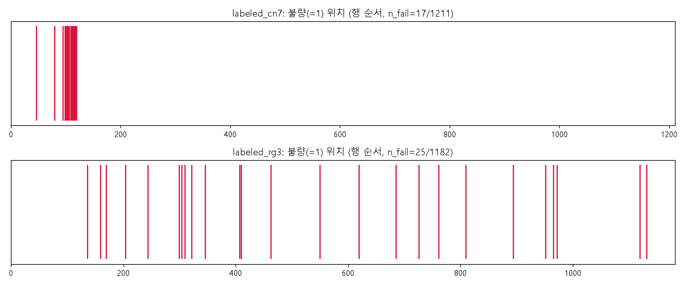
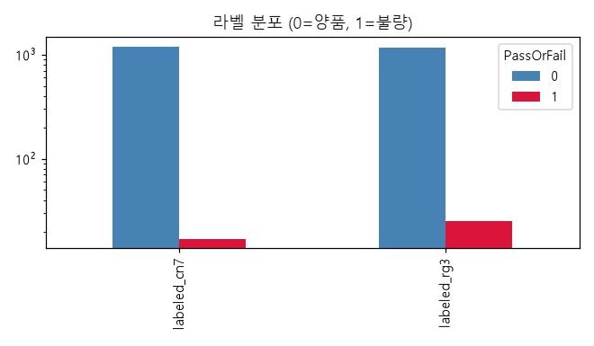
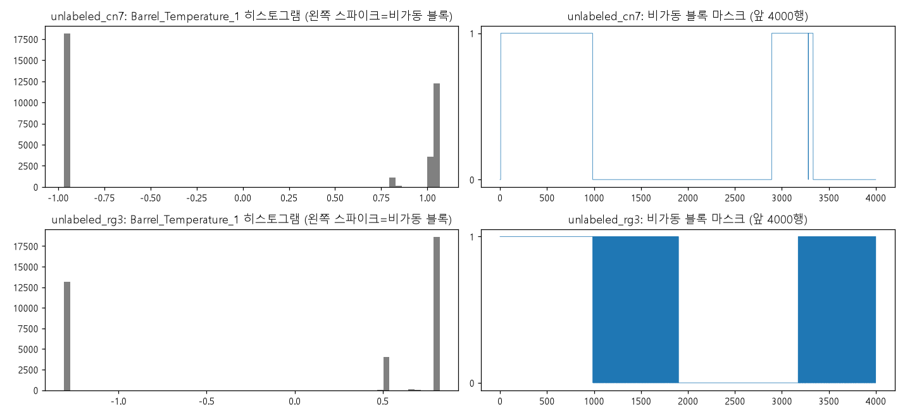
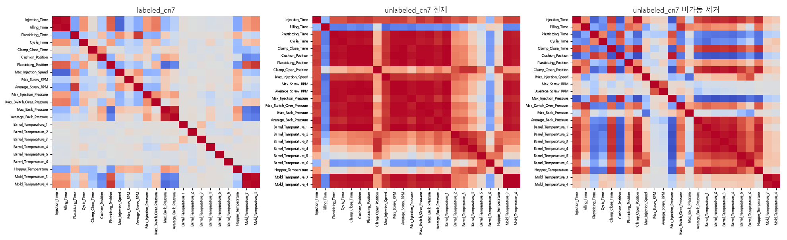
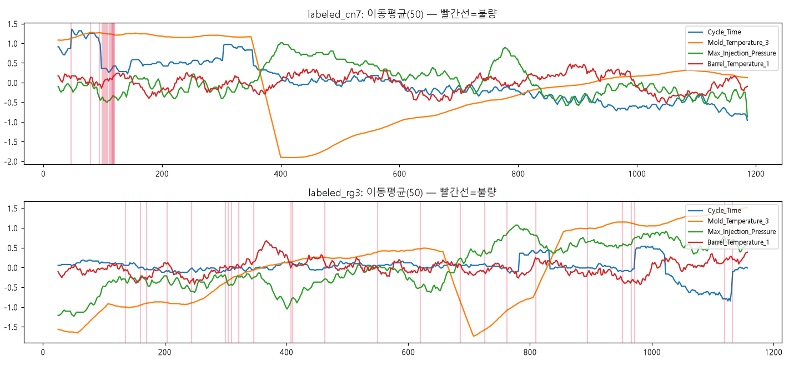
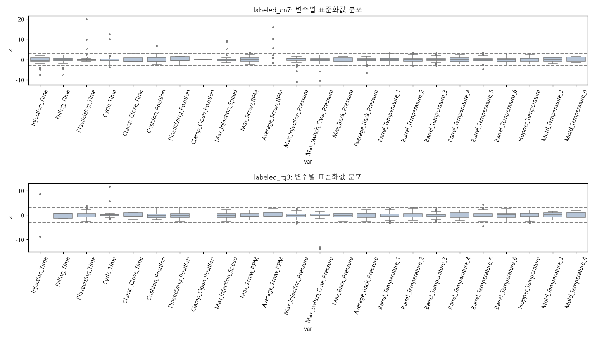

# 주제 ① 사출성형 — 데이터 품질 진단 리포트

- 작성일: 2026-09-25
- 근거 노트북: `notebooks/01_data_quality.ipynb` (전체 실행 결과 포함)
- 목적: 주제 선정용. 데이터 특성과 필요한 전처리(결측·중복·이상치·불균형·누수)를 파악한다. 모델링은 하지 않았다.
- 표기: 확정된 사실은 그대로, 근거가 간접적인 판단은 **(추정)** 으로 표시.

---

## 1. 데이터 한 줄 요약

사출성형기 2개 금형셋(cn7, rg3)의 **샷 단위 공정 요약값 24개 변수**. 라벨 있는 행 약 1,200개(불량 1.4~2.1%) + 라벨 없는 행 약 35,000개. **모든 값이 파일별로 이미 표준화(z-score)** 되어 있고, 시간·설비·제품·로트 컬럼이 없다.

## 2. 데이터 구성

| 파일 | 행 | 열 | 라벨 | 인코딩 | 원본 인덱스 범위 |
|---|---|---|---|---|---|
| moldset_labeled_cn7.csv | 1,211 | 24 + PassOrFail | 있음 | UTF-8 | 0 ~ 1,210 (연속) |
| moldset_labeled_rg3.csv | 1,182 | 24 + PassOrFail | 있음 | UTF-8 | 1,211 ~ 2,392 (연속) |
| moldset_unlabeled_cn7.csv | 35,239 | 24 | 없음 | UTF-8 | 114,610 ~ 777,220 (띄엄띄엄) |
| moldset_unlabeled_rg3.csv | 35,941 | 24 | 없음 | UTF-8 | 119,515 ~ 795,309 (띄엄띄엄) |

- zip 안에 가이드북·변수 설명서 **없음**. 변수 의미는 컬럼명으로 해석(사출성형기 표준 로그 항목).
- 학습/테스트 분할 제공 안 됨. 테스트셋은 대회 측 별도 제공 또는 unlabeled가 그 역할 (추정).
- 변수 그룹: 시간(사출·충전·계량·사이클·형폐), 위치(쿠션·계량·형개), 속도(사출속도·스크류 RPM), 압력(사출·V/P절환·배압), 온도(배럴 6구간·호퍼·금형 2점).

### 2-1. 표준화 상태의 함의
- 파일별 mean≈0, std≈1. `Clamp_Open_Position`은 labeled에서 상수 0(원본도 상수였던 것으로 추정).
- 원본 단위(초, bar, ℃)가 사라져 **물리적 임계값 제시가 불가**하고, labeled와 unlabeled가 **서로 다른 스케일**이라 두 파일을 그대로 합칠 수 없다.

### 2-2. 생산단위 (추정)
- 변수 구성이 샷별 요약값이므로 **1행 = 1샷**.
- 설비/금형/제품 정보는 파일명(cn7·rg3)뿐. 시간 정보는 없고 **원본 행 인덱스(수집 순서)** 만 시간 대용으로 쓸 수 있다.

## 3. 품질 이슈 Top 5

### ① 라벨 데이터가 "쌍"으로 중복되어 있고, 불량 대부분이 라벨 충돌 쌍

| | cn7 | rg3 |
|---|---|---|
| 행 수 | 1,211 | 1,182 |
| 고유 X 벡터 수 | 606 (605쌍 + 1) | 591 (591쌍) |
| 불량 행 수 | 17 | 25 |
| 같은 X인데 라벨이 다른 쌍 | **11쌍** | **25쌍** |
| 라벨이 모호하지 않은 고유 불량 X | **3개** | **0개** |

- 모든 피처 벡터가 정확히 2번 등장하며 약 95%는 인접 행. 원본에서 한 샷이 2행으로 기록됐거나(2캐비티·2검사 등) 복제된 것 (추정).
- rg3 불량 25개 **전부**, cn7 불량 17개 중 11개는 "동일 입력 → 다른 라벨". **피처만으로는 구분이 원리적으로 불가능**한 불량.
- 랜덤 split을 하면 같은 샷의 쌍이 train/test에 갈라져 들어가 **누수**가 생긴다.

### ② 극단적 불균형 + 유효 양성 표본 극소

- 불량률 cn7 1.40%, rg3 2.12%. 중복 제거 후 고유 불량 X는 14개/25개, 그중 모호하지 않은 것은 3개/0개.
- F1은 양성 1~2개 차이로 크게 흔들린다. 모델 간 비교는 반복 CV와 신뢰구간 없이는 의미가 없다.

### ③ unlabeled의 "비가동 블록" (숨은 결측)

- `Max_Screw_RPM`, `Average_Screw_RPM`, `Average_Back_Pressure`, `Barrel_Temperature_1`, `Mold_Temperature_3/4` 6개 변수가 **한 값에 고정**된 행이 cn7 **51.5%**(18,151행), rg3 **36.6%**(13,154행). 원본값 0(설비 정지·대기) (추정).
- 짧은 run(median 2행)으로 전체에 흩어져 있어 구간 잘라내기로는 못 없앤다. `src/data_quality.idle_block_mask`로 행 단위 식별.
- 이 블록이 전 변수를 한 방향으로 끌어 **허위 상관**을 만든다: |corr|>0.9 쌍이 labeled 3개 vs unlabeled 101개, 블록 제거 후 52개.
- labeled에는 이 블록이 없다 → labeled와 unlabeled는 수집 조건 또는 전처리가 다르다.

### ④ 시간 드리프트 + 불량의 시점 집중 (cn7)

- cn7: `Cycle_Time`이 행 순서에 따라 단조 감소(+0.7σ→−0.7σ), `Mold_Temperature`가 크게 이동. 불량 17개 중 14개가 행 99~120(첫 20% 구간)에 몰림 → 연속 불량 사건 1건에 가까움.
- 그 결과 `Mold_Temperature_3/4`의 단일 변수 AUC가 0.89로 높게 나오지만, 이는 "불량 조건"이 아니라 "불량이 난 시기"를 가리킬 가능성이 크다 (**시간 누수성 상관**).
- rg3는 불량이 전 구간에 분산, 단일 AUC 최대 0.64.
- unlabeled 인덱스 간격: median 2, mean 19, 최대 18만 → 큰 공백(정지·타 제품 생산) 다수.

### ⑤ 극단 이상치 — 일부는 불량 신호, 일부는 로그 이상

- |z|>3 값이 각 파일에 존재. 최대 |z|: cn7 `Plasticizing_Time` 20, `Average_Screw_RPM` 16, `Cycle_Time` 12.6; rg3 `Max_Switch_Over_Pressure` −13.8; unlabeled rg3 121.
- cn7에서 `Injection_Time`·`Filling_Time`·`Max_Injection_Pressure`·`Max_Injection_Speed`가 **동시에** 극단인 10행 중 6행이 불량 → 충전 이상을 반영한 **진짜 공정 이상**. 제거하면 불량 신호가 사라진다.
- 반면 `Plasticizing_Time` 20σ 등 단일 변수 극단은 모두 양품 → 정지·재가동 직후 샷 또는 로그 오류 (추정).
- rg3의 `Injection_Time`(고유값 3), `Filling_Time`(고유값 2)은 사실상 이산 변수 — 셋포인트 값 또는 낮은 해상도 (추정).

**이상치 구분 기준 제안**
| 유형 | 판별 | 처리 |
|---|---|---|
| 공정 이상 후보 | 사출·충전 계열 변수가 함께 극단 | 유지 (핵심 신호) |
| 로그/센서 이상 | 한 변수만 단독 극단(>5σ), 라벨 양품 | ±5σ 클리핑 + 플래그 변수 |
| 비가동 행 | unlabeled 6개 마커 변수 고정값 | 제거 또는 "비가동" 플래그 |

## 4. 결측·중복 상세

- **명시적 결측 0개** (4개 파일 모두).
- unlabeled 완전 중복 행 약 18%(cn7 6,468, rg3 6,234), 대부분 인접 2행 반복. 비가동 블록 내부 중복은 1행뿐 → 중복은 가동 중 기록 방식의 흔적 (추정).
- labeled는 §3-① 참고.

## 5. 필요 처리 정리

| 항목 | 필요도 | 근거 | 권장 방법 |
|---|---|---|---|
| 결측치 처리 | 하 (명시적) / **상** (숨은 결측) | NaN 0개. unlabeled 비가동 블록 37~52%가 사실상 무효 행 | `idle_block_mask`로 행 제거 또는 "비가동" 플래그 변수. labeled에는 없음 |
| 중복 처리 | **상** | labeled 전 행 2회 중복, 불량 대부분이 라벨 충돌 쌍 | X-키로 그룹화 → 쌍 단위 집계(라벨 = max 또는 mean → "불량 의심 확률" 타깃). **GroupKFold(X-키)**, 랜덤 split 금지 |
| 이상치 처리 | 중 | 극단값 존재하나 cn7 충전 계열 극단값은 불량과 강하게 연결 | 라벨 확인 전 삭제 금지. 단독 극단은 클리핑+플래그, 다변수 동시 극단은 유지 |
| 불균형 처리 | **상** | 불량률 1.4~2.1%, 모호하지 않은 고유 불량 3/0개 | class_weight·임계값 튜닝 우선. SMOTE는 고유 양성이 너무 적어 위험. 반복 층화 GroupKFold, PR-AUC와 F1 동시 보고, 확률 보정 |
| 도메인 지식 결합 | **상** | 원본 단위 소실, 변수 의미는 표준 항목이라 파생 가능 | 파생 후보: `Filling/Injection` 비, `Cushion−Plasticizing_Position`(계량 안정성), 배럴 온도 구배(T1−T6, 인접차), `Max_Back−Avg_Back`, `Cycle−(Injection+Plasticizing)`(대기시간), 직전 샷 대비 변화량(행 순서). **파일 내부에서만** 계산(스케일 상이) |
| 검증 전략 | **상** | 시간 컬럼 없음, drift 존재, 중복 쌍 | **X-키 GroupKFold**와 **행 순서 시간 블록 split** 둘 다 보고 → 두 결과 차이가 곧 누수 크기. cn7·rg3는 별도 모델 또는 금형 플래그. unlabeled는 사전학습·이상탐지·드리프트 점검용, 성능 평가엔 사용 불가 |

## 6. 주제 ① 관점 총평

- **강점**: 표 형태·소규모라 실험이 빠름. 변수가 사출 공정 표준 항목이라 도메인 해석과 FN/FP 집중 조건 분석(심사 3번)이 쉬움. unlabeled 7만 행으로 이상탐지·반지도 등 차별화(심사 5번) 여지.
- **리스크**: (1) 유효 불량 표본이 3~14개 수준이고 대부분 라벨 충돌 → F1 극도로 불안정, 모델 비교 신뢰도 낮음. (2) 시간·설비·제품 정보가 없어 심사 1번의 "시간·설비·제품 간 관계"는 추정에 그침. (3) 표준화로 원본 단위 손실 → 현장 활용안(심사 4번)의 임계값을 실제 단위로 못 씀.
- **난이도 한 줄 평**: 코드는 쉽지만 **데이터의 정보량이 적어 "높은 F1"이 아니라 "왜 예측이 어려운지(라벨 충돌·검증 누수·드리프트)를 정직하게 진단하고 방어적으로 설계"하는 스토리로 가야 하는 주제**. 데이터 진단(15)·오류분석(15)에서 벌고, 모델(40)은 안정적 비교 설계로 방어.

## 7. 산출물
- `notebooks/01_data_quality.ipynb` — 실행 결과 포함, `jupyter nbconvert --execute`로 재실행 가능
- `src/data_quality.py` — 로딩·품질 체크 함수 (`load_all`, `duplicate_report`, `outlier_table`, `univariate_auc`, `idle_block_mask` 등)
- `figures/*.png` — 본문 그림 6장
