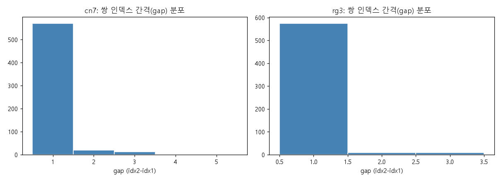
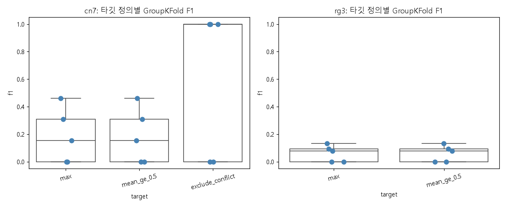
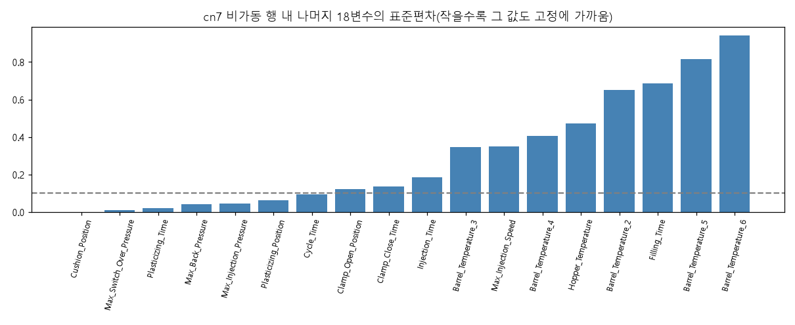
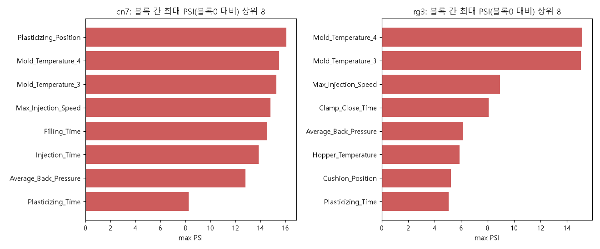
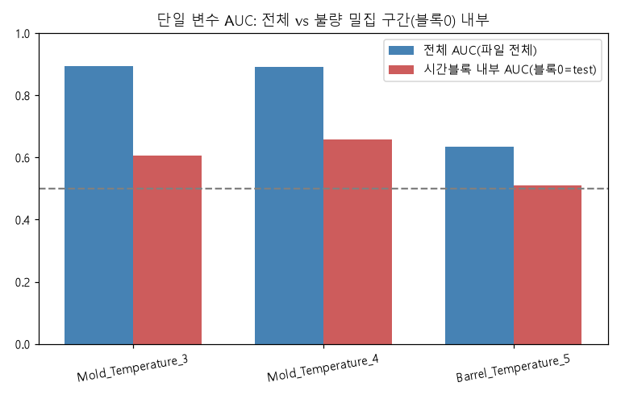
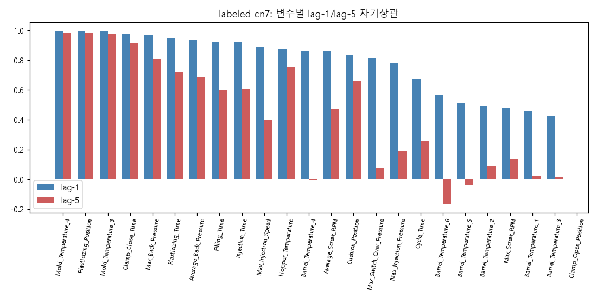
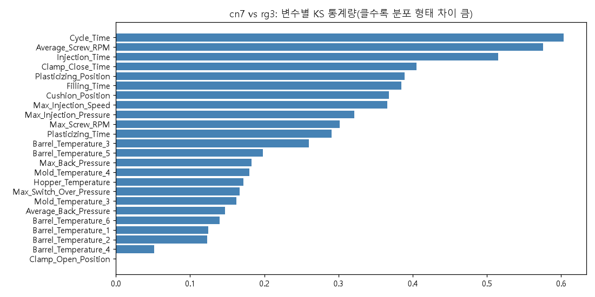
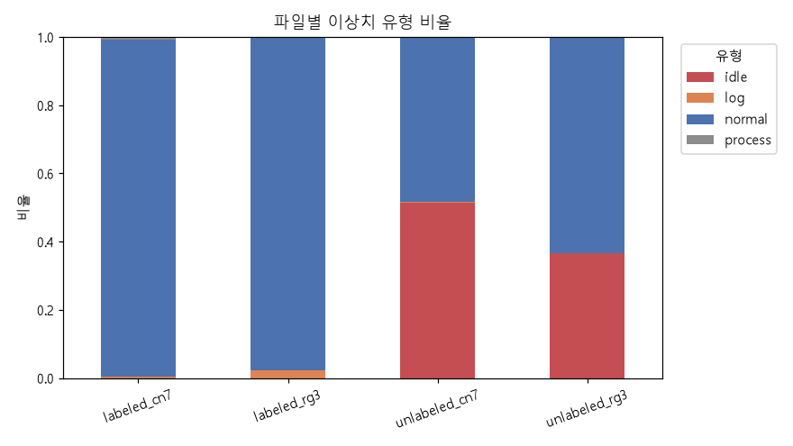

# 주제 ① 사출성형 — 추가 데이터 진단 리포트 (02_diagnosis_deep)

- 작성일: 2026-09-26
- 근거 노트북: `notebooks/02_diagnosis_deep.ipynb` (전체 실행 결과 포함, 에러 셀 0)
- 목적: `01_data_quality.md`에서 "추정"으로 남긴 주장을 검증하고, 다루지 않았던 축(타깃 정의, 비가동 블록 정밀 정의,
  시간 누수 크기, labeled↔unlabeled 관계, 자기상관, cn7·rg3 결합 가능성, 이상치 유형 규칙)을 추가로 진단한다.
  **모델링 경쟁이 아니라 데이터 진단이며**, 아래 로지스틱 회귀·규칙 기반 예측은 성능 경쟁용이 아니라 타깃 정의·베이스라인
  선택을 위한 소형 진단 실험이다.
- 표기: 확정된 사실은 그대로, 근거가 간접적인 판단은 **(추정)** 으로 표시. 모든 수치는 노트북 출력에서 그대로 옮겼다.

---

## ① 쌍 구조 규명

**발견**
- 24변수를 반올림 없이 비교해도 labeled의 모든 쌍이 **완전 일치**한다(cn7 605쌍, rg3 591쌍 전부 `exact_equal=True`).
  8자리 반올림 키가 우연히 일치한 경우는 없다 — 진짜 "같은 입력이 2행으로 기록"된 구조다.
- 비인접 쌍(두 행의 인덱스 차이가 1이 아닌 쌍) 비율: **cn7 5.8%(35/605, gap 최대 5), rg3 2.9%(17/591, gap 최대 3)**.
  비인접 쌍의 첫 행은 cn7 행 295~1190, rg3 행 1351~2268에 흩어져 있고, 서로 다른 두 쌍의 인덱스가 교차하는 패턴(예:
  rg3 1719·1721 쌍과 1720·1722 쌍)이 보인다 → 그 지점에서 기록 순서가 인터리브된 것으로 추정.
- 충돌 쌍(같은 X, 다른 라벨) vs 일치 쌍(00/11)의 변수별 분포 차이(Mann-Whitney U, Bonferroni 보정):
  **cn7은 24개 중 10개 변수가 유의**(주로 `Mold_Temperature_3/4`, `Filling_Time`, `Plasticizing_Position`,
  `Injection_Time`) — cn7 충돌 쌍은 무작위가 아니라 드리프트 구간에 몰려 있음을 시사. **rg3는 24개 중 유의한 변수
  0개**(최소 p_bonf=0.44) — rg3 충돌은 조건과 무관한 순수 라벨 노이즈에 가깝다.
- 충돌 쌍 내 불량 행의 순서 편향: 불량이 **첫 번째 행에 오는 경우가 압도적**이다(cn7 10/11건, 이항검정 p≈0.012;
  rg3 23/25건, p≈2×10⁻⁵). 우연(50%)이라면 나오기 어려운 분포다 → "먼저 기록된 샷이 불합격, 재검사 후 두 번째
  기록이 합격"인 수집 관행일 가능성(추정).

**타깃 정의 3안 비교**

| 파일 | 정의 | 표본(행) | 양성(행) | 그룹(샷) 양성 | GroupKFold F1 (median / mean±std, n=5) |
|---|---|---|---|---|---|
| cn7 | max (하나라도 불량) | 1,211 | 28 | 14 | 0.154 / 0.185±0.201 |
| cn7 | mean≥0.5 | 1,211 | 28 | 14(soft 8.5) | 0.154 / 0.185±0.201 (max와 이진 결정 동일) |
| cn7 | 충돌 제외 | 1,189 | 6 | 3 | 1.000 / 0.600±0.548 (표본 과소로 신뢰 불가) |
| rg3 | max (하나라도 불량) | 1,182 | 50 | 25 | 0.078 / 0.061±0.059 |
| rg3 | mean≥0.5 | 1,182 | 50 | 25(soft 12.5) | 0.078 / 0.061±0.059 (max와 이진 결정 동일) |
| rg3 | 충돌 제외 | 1,132 | **0** | 0 | **실행 불가(양성 0개)** |

- 그룹 크기가 항상 1~2이므로 `max`와 `mean≥0.5`는 **이진 결정이 수학적으로 동일**하다. 차이는 "기대 양성 수"에서만
  드러난다(cn7 14 vs 8.5, rg3 25 vs 12.5, 충돌을 0.5로 카운트).
- `충돌 제외`는 **rg3에서 양성이 0개가 되어 분류 자체가 불가능**하다(rg3 불량 25개 전부가 충돌 쌍이므로). cn7도
  양성 6행뿐이라 F1이 fold마다 0 또는 1로 튀는 착시(median 1.0)일 뿐, 더 나은 정의라는 근거가 아니다.

**시사점 → 활용 아이디어**
- 타깃 정의는 **`max` 확정**, `충돌 제외`는 rg3에서 아예 못 쓰므로 주 정의 후보에서 제외한다.
- 순서 편향(불량이 첫 행에 몰림)은 표본이 작아(11·25건) 규칙화하기엔 이르지만, "재검사 관행" 가설은 현장 활용방안
  (심사 4번: 1차 검사 실패 시 즉시 재작업 프로세스)과 연결할 수 있는 소재로 남긴다.
- cn7 충돌 쌍이 드리프트 구간에 몰려 있다는 사실은 ③의 시간 누수 검증과 직결된다.

---

## ② 비가동 블록 정밀 정의

**발견**
- 6개 마커 변수 모두 **최빈값(고정값) == 파일 최솟값**(cn7·rg3 공통) — 표준화 전 원본값이 물리적 하한(정지 상태, 0)에서
  고정된다는 01의 추정을 뒷받침.
- unlabeled에서 마커 일치 개수 기준 **>=4, >=5, ==6 비율이 전부 동일**(cn7 51.5%, rg3 36.6%) — 4개 이상 일치하면
  항상 6개 전부 일치하는 **all-or-nothing** 현상. "일부만 고정"인 중간 상태는 존재하지 않는다.
- labeled에서 마커가 **정지 상태 값(파일 최솟값)** 과 일치하는 개수는 cn7 최대 3개(3개 2행), rg3 최대 2개(2개 6행)로,
  **4개 이상 일치하는 행은 cn7·rg3 모두 0행**이다 → 01의 "labeled에는 비가동 블록이 없다"는 판단은 부분 고정 기준으로도
  유지된다. labeled 마커 6개의 최빈값은 모두 최솟값과 다르다(최빈값 = 평상 가동 설정값). 따라서 비가동 근접도는
  파일 최빈값이 아니라 최솟값 기준으로 세야 한다.
- 비가동 행에서 나머지 18변수: **압력·사이클·계량 계열(`Cushion_Position` std 0.001, `Max_Switch_Over_Pressure` 0.011,
  `Plasticizing_Time` 0.021, `Max_Back_Pressure` 0.042, `Max_Injection_Pressure` 0.045, `Plasticizing_Position` 0.062,
  `Cycle_Time` 0.093)은 거의 고정**되지만 `Max_Injection_Speed`(0.35)·`Filling_Time`(0.69)·`Injection_Time`(0.19)·
  `Clamp_Close_Time`(0.14)는 고정되지 않는다. **온도 계열(`Barrel_Temperature_2~6`,
  `Hopper_Temperature`, std 0.35~0.94, 고유값 24~186개)은 상당히 퍼져 있다**. 설비가 멈춰도 배럴·금형은 서서히
  냉각되므로 온도만 서서히 변한다는 물리적 설명과 일치.

**시사점 → 활용 아이디어**
- 비가동 마스크는 현재 "6개 마커 전부 일치" 기준 그대로 유지해도 무방하다(4/5/6개 기준이 unlabeled에서 결과가 동일).
- labeled에는 비가동 행이 없으므로 labeled 전용 제거 규칙은 필요 없다. idle 마스크는 unlabeled를 사전학습·이상탐지에
  쓸 때만 적용한다.
- 온도 계열이 비가동 중에도 서서히 변한다는 점은 **"직전 비가동 지속시간 추정"** 같은 파생 변수 후보로 쓸 수 있다
  (심사 5번 창의성 소재).

---

## ③ 드리프트 · 시간 누수 검증

**발견**
- 블록 간 드리프트(5블록, PSI/KS 블록0 대비): **cn7·rg3 둘 다** 여러 변수에서 PSI가 5를 넘는다(PSI>5 변수 cn7 14개·
  rg3 8개, PSI>0.25 변수 cn7 21개·rg3 19개; 통상 PSI>0.25면 "큰 변화"). cn7 최댓값은 `Plasticizing_Position`(PSI 16.08,
  `Mold_Temperature_4` 15.51·`Mold_Temperature_3` 15.28), rg3 최댓값은 `Mold_Temperature_4`(PSI 15.17). PSI 10 이상은
  빈 구간 바닥값(1e-4)에 포화된 값이라 크기 순위가 아니라 "블록 간 분포가 거의 겹치지 않음"으로 읽는다. 01에서 "cn7만 드리프트가 크다"고 서술한 것과 달리 **rg3도 강한 드리프트가 있으나, rg3는 불량이 전
  구간에 분산돼 있어 드리프트가 예측 누수로 이어지지 않을 뿐**이다.
- **시간 누수 정량화(핵심 결과)**: cn7 `Mold_Temperature_3`의 랜덤 5-fold AUC 평균은 **0.899**(std 0.032, 01에서
  보고한 전체 AUC 0.894와 사실상 동일)인 반면, 불량 밀집 구간(행 99~120)을 포함하는 블록(행 0~241)을 test로 쓰는
  시간분할 AUC는 **0.606**으로 급락한다 — **누수 크기 약 0.29**. `Mold_Temperature_4`도 0.894→0.657(누수 약 0.24).
  rg3 최고 단일 AUC 변수 `Barrel_Temperature_5`는 랜덤 0.632(std 0.107) vs 시간분할 0.511 — 애초에 절대 수준이
  낮아 누수 여부와 무관하게 예측력이 거의 없다.
- "충전 계열(`Injection_Time`·`Filling_Time`·`Max_Injection_Pressure`·`Max_Injection_Speed`) 동시 극단 10행"을
  재확인한 결과: **6행(115~120)만 불량 밀집 구간(행 99~120)과 동일 사건**이고, **나머지 4행(1207~1210, 파일 맨 끝)은
  전부 양품인 별개의 극단 이벤트**다. 01의 "동시 극단=공정 이상 신호"라는 해석은 **절반만 성립**한다 — 115~120에서는
  극단값과 불량이 함께 나타나지만, 1207~1210에서는 같은 패턴이 불량과 무관하게 나타난다(설비 정지/재가동 직전 마지막
  샷들과 같은 비정상 종료 패턴일 가능성, 추정).

**시사점 → 활용 아이디어**
- cn7·rg3 모두 **랜덤 split만으로 평가하면 안 된다** — GroupKFold(X-키)와 **시간 블록 split(첫 1/5을 test 등)을
  반드시 병행 보고**해야 하며, 둘의 차이가 곧 "실제 미래 데이터에서 재현 가능한 성능"에 대한 방어선이다.
- `Mold_Temperature_3/4`처럼 랜덤-시간 AUC 격차가 큰 변수는 절대 수준이 아니라 **이동평균 대비 편차 등 상대적
  변화량으로 변환**해 시간 누수를 줄이는 파생 변수 설계를 검토한다.
- "4변수 동시 극단" 규칙은 파일 끝 근처에도 반응하므로 ⑧의 규칙 기반 예측에서 오탐 원인으로 남긴다(FP 분석, 심사
  3번 자료).

---

## ④ labeled ↔ unlabeled 근사 매칭

**발견**
- 파일 내부 순위(percentile rank)로 정규화한 24차원 벡터 기준, labeled→unlabeled 최근접거리 분포(cn7 mean 1.31·
  min 0.84, rg3 mean 1.28·min 0.83)는 **완전 무작위 벡터의 최근접거리 분포(기준선, cn7 mean 1.40·min 0.78, rg3
  mean 1.39·min 0.82)와 거의 같은 범위**에 있다. KS 검정은 두 분포가 통계적으로 다르다고 나오지만(cn7 stat=0.304,
  rg3 stat=0.262, p≪0.001 — 표본이 커서 작은 차이도 유의하게 검출됨) **"거의 같은 샷"에 해당하는 근접 매칭
  (거리<0.3)은 cn7·rg3 모두 0건(0/1,211, 0/1,182)**이다. 임계를 넓혀도 거리<0.8은 0%, <1.0은 cn7 1.0%·rg3 6.1%다.
- **양성 대조군 결과 이 방법은 검정력이 없다**: unlabeled에서 무작위로 뽑은 1,200행을 따로 표준화하면 거리 중앙값
  0.036(cn7)·0.047(rg3)로 전부 매칭되지만, **unlabeled의 진짜 부분집합이라도 비가동을 뺀 연속 1,200행(한 생산 기간)을
  따로 표준화하면 거리 중앙값 1.10~1.28, 거리<0.3 매칭 0%** 로 labeled(1.31·1.29)와 구별되지 않는다. 파일 내부 순위가
  부분집합의 분포(비가동 유무, 기간별 드리프트)에 따라 달라지기 때문이다.
- 따라서 "근접 매칭 0건"은 **누수 부재의 증거가 아니다**. labeled가 unlabeled의 한 기간과 같은 샷인지는 이 방법으로
  판정할 수 없고, 01의 "원본 인덱스 범위가 겹치지 않음"이 현재 유일한 근거다(추정).

**시사점 → 활용 아이디어**
- labeled↔unlabeled 값 중복 여부는 **미확정**으로 둔다. unlabeled를 사전학습(오토인코더 등)·이상탐지에 쓴다면
  사전학습 유무에 따른 labeled 시간 블록 CV 성능 차이를 함께 보고해 누수 가능성을 점검한다.

---

## ⑤ 변수 성격 전수 점검

**발견**
- 스파이크(한 값이 5% 이상 차지) 변수 수: labeled cn7 23개, labeled rg3 23개, unlabeled cn7 22개, unlabeled rg3
  23개(24개 중 대부분). z-score 데이터에서 스파이크가 흔한 것은 셋포인트 제어(설정값 반복 재현) 때문으로 설명
  가능(추정) — 반드시 숨은 결측을 의미하지는 않는다.
- 이산 변수(고유값<=20) 개수: **labeled cn7·rg3 둘 다 24개 중 15개**로 동일(`Injection_Time`, `Filling_Time`,
  `Cycle_Time`, `Clamp_Close_Time`, `Cushion_Position`, `Plasticizing_Position`, `Clamp_Open_Position`,
  `Max_Injection_Speed`, `Max_Screw_RPM`, `Average_Screw_RPM`, `Max_Injection_Pressure`,
  `Max_Switch_Over_Pressure`, `Barrel_Temperature_3`, `Barrel_Temperature_6` + cn7는 `Average_Back_Pressure`/
  rg3는 `Barrel_Temperature_1`). 반면 **unlabeled는 두 파일 다 이산 변수가 0개**(전 변수 고유값 >20) — labeled의
  "이산성"이 unlabeled에서는 재현되지 않는다. 행 수 차이(1,200 대 35,000)만으로 설명하긴 어려워, labeled가
  unlabeled보다 좁은 설정값 범위(또는 다른 수집 조건)에서 모였다는 기존 가설(②의 idle 블록 부재와 같은 맥락)을
  추가로 뒷받침한다(추정).
- `Clamp_Open_Position`은 labeled 2개 파일에서 상수(nunique=1)다. unlabeled에서는 상수가 아니다(상수 변수 0개).
- rg3 `Injection_Time`은 "단일 전환 시점"이 아니라 **주값(-0.029, top_share 98.6%)과 희귀값(-8.63/+8.57)이 총
  15개 세그먼트(주값 8개 + 희귀값 7개: -8.63 구간 2개·+8.57 구간 5개)로 자주 오가는 반복적 단주기 이벤트**다(희귀값
  세그먼트는 대부분 길이 2~4행). 세그먼트 단위 불량률: 주값 구간 **2.14%(25건/1,166행)**, 희귀값 구간은 두 값 모두
  **불량 0건**(-8.63: 0/6행, +8.57: 0/10행, 합쳐서 0/16행). `Filling_Time`도 유사하게 108개의 짧은 세그먼트로 자주
  전환된다(단일 전환점 없음).

**시사점 → 활용 아이디어**
- `Clamp_Open_Position`은 labeled 학습 입력에서 제거(labeled 상수라 정보 없음).
- rg3 희귀값 세그먼트는 불량과 무관(오히려 0건)하므로 제거하지 말고, **"저해상도 셋포인트 전환 샷 여부"** 이진
  플래그로 남겨 모델이 활용 여부를 판단하게 한다.
- 스파이크 변수 다수는 트리 기반 모델에는 문제되지 않지만 선형 모델에서는 이산화(구간화)를 검토한다.
- unlabeled에서 labeled의 이산성이 사라지는 현상은 **주제 채택 시 "labeled·unlabeled가 동일 모집단인가"를 리포트
  한계로 명시**할 근거가 된다(심사 1번).

---

## ⑥ 샷 간 자기상관

**발견**
- 원본 행 순서 기준 lag-1 자기상관 중앙값: labeled cn7 0.859, unlabeled cn7 0.821, labeled rg3 0.801, unlabeled rg3
  0.749. 단 **labeled 값은 인접 쌍 복제(①)로 부풀려져 있다** — 쌍마다 첫 행만 남기면 lag-1 중앙값이 cn7 0.746·rg3 0.606
  (0.7 이상 변수 12/24·7/24)으로 낮아지고, lag-5는 cn7 0.306·rg3 0.121로 급감한다. labeled cn7 lag-1은 변수별
  0.426~0.996 범위다(`Barrel_Temperature_6`은 lag-1 0.562, lag-5 -0.167).
- unlabeled는 비가동 행을 빼면 lag-1 중앙값이 cn7 0.990·rg3 0.869, lag-5도 0.972·0.889로 오히려 높아진다 — unlabeled
  가동 구간은 샷 간 변화가 매우 완만하다.
- 불량 run-length: cn7은 **길이 1(산발) 11건 + 길이 6짜리 연속 run 1건**(행 115~120, ③의 드리프트 사건과 동일
  사건) — "17건의 독립 사건"이 아니라 **11개 독립 사건 + 1개 군집 사건**에 가깝다. rg3는 **전부 길이 1**(25건 모두
  산발) — 연속 사건이 없다.

**시사점 → 활용 아이디어**
- 쌍 복제를 제거한 labeled에서도 lag-1 중앙값이 0.61~0.75이므로 **"직전 샷 값", "직전 샷 대비 차이"** 류의 파생
  변수는 후보가 된다(심사 5번 창의성 후보). 단 labeled에서 직전 행은 대개 같은 샷의 복제이므로 차분은 **쌍 단위(직전
  쌍 대비)** 로 계산해야 한다(행 단위 차분은 대부분 0).
- 이 정도 자기상관에서는 **랜덤 split이 사실상 미래 정보 누수와 같다**(인접 행이 거의 같은 값). GroupKFold(X-키)만
  으로는 못 막으므로 **시간 블록 split을 사실상 주 평가 방식으로 승격**해야 한다.
- cn7 불량은 "11개 독립 + 1개 군집(6연속)"이므로 **유효 표본 수를 17이 아니라 약 12건으로 보수적으로 잡아** F1
  신뢰구간을 과소평가하지 않도록 한다(심사 2번 모델 비교 시 반영).

---

## ⑦ cn7 · rg3 결합 가능성

**발견**
- 24개 공통 변수 중 **22개(92%)** 가 KS p<0.001로 분포 형태가 통계적으로 다르다. 예외 2개는 `Clamp_Open_Position`
  (양쪽 다 상수)과 `Barrel_Temperature_4`(p=0.082, 유의하지 않음)뿐이다. KS 통계량 중앙값 0.229, 상위 변수는
  `Cycle_Time` 0.603, `Average_Screw_RPM` 0.576, `Injection_Time` 0.515.
- 왜도·첨도 차이도 극단적이다: `Average_Screw_RPM` 첨도 cn7 128.4 vs rg3 0.09, `Injection_Time` 첨도 cn7 6.1 vs
  rg3 70.8 — 어느 파일이 "더 뾰족한지"조차 변수마다 뒤바뀐다. 단순 스케일 차이가 아니라 금형/설비별로 서로 다른
  공정 특성(설정값 반복 패턴, 이산화 수준)을 반영하는 것으로 보인다(⑤의 rg3 저해상도 관찰과도 일치).

**시사점 → 활용 아이디어**
- z-score 표준화 이후에도 두 금형의 분포 형태가 근본적으로 다르므로 **"cn7·rg3 별도 모델"을 기본안으로 확정**한다.
- 굳이 합치고 싶다면 트리 기반 모델 + 금형 플래그 조합으로 한 번 더 검증할 수 있으나, 이번 진단 결과만으로는
  결합의 이점보다 위험(서로 다른 분포를 한 결정 경계로 학습)이 커 보인다.

---

## ⑧ 이상치 유형 규칙 코드화

**규칙**: idle(unlabeled 6마커 전부 고정) > process(사출·충전 4변수 중 2개 이상 동시 |z|>3) > log(어떤 변수든
단독 |z|>5) > normal, 우선순위 순으로 분류(`src/outliers.py: classify_outliers`).

**파일별 이상치 유형 비율**

| 파일 | idle | process | log | normal |
|---|---|---|---|---|
| labeled_cn7 | 0.00% | 0.83% | 0.50% | 98.68% |
| labeled_rg3 | 0.00% | 0.17% | 2.20% | 97.63% |
| unlabeled_cn7 | 51.51% | 0.00% | 0.12% | 48.38% |
| unlabeled_rg3 | 36.60% | 0.00% | 0.01% | 63.39% |

**규칙 기반(`outlier_type=='process'`) 불량 예측 정밀도·재현율**

| 파일 | precision | recall | F1 | 예측 양성 | 실제 양성 | 적중 |
|---|---|---|---|---|---|---|
| cn7 | 0.60 | 0.353 | 0.444 | 10 | 17 | 6 |
| rg3 | 0.0 | 0.0 | 0.0 | 2 | 25 | 0 |

- **cn7 수치는 독립 평가가 아니다(in-sample)**: 규칙의 변수군(사출·충전 4변수)과 "동시 극단" 기준은 01에서 같은
  labeled cn7의 불량 행을 보고 정했으므로, precision 0.60은 01의 관찰("동시 극단 10행 중 6행 불량")을 다시 센 값이다.
  적중 6행은 3쌍(115~120), 오탐 4행은 2쌍(1207~1210)으로 샷 단위로는 3/5다.
- rg3에서 규칙이 실패하는 이유는 ①·③에서 이미 확인했다: rg3 불량은 피처와 무관한 라벨 충돌이 대부분(25/25)이라
  어떤 규칙을 세워도 원리적으로 못 잡는다.

**시사점 → 활용 아이디어**
- cn7 규칙(F1 0.444, in-sample)을 **cn7 전용 베이스라인 0호**로 채택하되 "같은 데이터에서 도출한 규칙이라 낙관적"임을
  표기하고, 모델과는 시간 블록 split의 test 구간에서 같은 조건으로 비교한다. 또한 심사 2번의 "베이스라인 포함 2개 이상 모델 비교"에서
  로지스틱/트리 모델과 나란히 제시한다.
- rg3에는 이 규칙을 적용하지 않는다(정밀도·재현율 0) — rg3는 처음부터 "규칙/모델로 설명 안 되는 라벨 노이즈가
  지배적"이라는 사실을 그대로 반영해 무리한 성능 주장을 피한다.
- unlabeled의 idle 마스크(cn7 51.5%, rg3 36.6%)는 전처리 1순위 필터로 그대로 사용한다.

---

## 종합 — 02 추가 진단이 01 대비 갱신한 것

| 01의 주장 | 02 검증 결과 |
|---|---|
| labeled 모든 X가 정확히 2회, 8자리 반올림 키 | 반올림 없이도 완전 일치 확인(①) |
| labeled에는 비가동 블록 없음 | 정지 상태 값(최솟값) 4개 이상 일치 행 cn7·rg3 0행 — 부분 고정 기준으로도 유지(②) |
| `Mold_Temperature` AUC 0.89는 "추정상" 시간 누수성 | 시간블록 AUC 0.606(누수 약 0.29)로 정량 확인(③) |
| 충전 계열 동시극단 10행 중 6행 불량 = 공정 이상 신호 | 6행만 불량구간과 동일 사건, 4행은 파일 끝 별개 이벤트로 불량과 무관 — 절반만 성립(③) |
| labeled/unlabeled 원본 인덱스 안 겹침 | 순위 기반 근사 매칭 근접 매칭(거리<0.3) 0건이나, unlabeled 연속 구간 양성 대조군도 0건 → 검정력 없음, 값 중복 여부 미확정(④) |
| cn7 드리프트 큼(rg3는 상대적으로 적다는 뉘앙스) | rg3도 다수 변수에서 강한 드리프트(PSI>5 변수 cn7 14개·rg3 8개) — 다만 불량과 무관(③) |
| (미언급) 자기상관 | lag-1 중앙값 원본 0.75~0.86(labeled는 쌍 복제 제거 시 0.61~0.75, unlabeled는 비가동 제외 시 0.87~0.99) — 랜덤 split 위험 재확인(⑥) |
| (미언급) cn7·rg3 결합 가능성 | 24변수 중 22개 KS p<0.001, 왜도·첨도 극단적으로 다름 — 별도 모델 권장(⑦) |

## 모델 단계 반영 사항

| 항목 | 결정 |
|---|---|
| 타깃 정의 | `max`(그룹 내 하나라도 불량이면 양성) 기본. `충돌 제외`는 rg3에서 양성 0개로 사용 불가, cn7도 표본 과소(양성 6개)로 참고용에 그침 |
| split 방식 | GroupKFold(X-키) + 시간 블록 split(예: 첫 1/5을 test) **병행 필수**, 랜덤 split 단독 사용 금지(쌍 복제 제거 후 자기상관 lag-1 0.61~0.75, 드리프트 PSI>5 변수 cn7 14개·rg3 8개) |
| 결합 여부 | cn7·rg3 **별도 모델** 기본안(24변수 중 22개 KS p<0.001) |
| 제거 규칙 | `Clamp_Open_Position`(labeled 상수) 제거. unlabeled idle 마스크(6마커 전부 고정) 유지 |
| 유지 규칙 | labeled에는 비가동(정지 상태 값 4개 이상 일치) 행이 없어 별도 제거·플래그 불필요 |
| 파생 변수 후보 | 직전 쌍 대비 변화량(쌍 단위 lag-1 차분, 쌍 복제 제거 후 lag-1 중앙값 0.61~0.75), rg3 `Injection_Time`·`Filling_Time` 희귀 세그먼트 플래그, cn7 시간블록 상대위치(이동평균 대비 편차) |
| 베이스라인 | 규칙 기반(`outlier_type=='process'`) cn7 precision 0.60/recall 0.353/F1 0.444(in-sample, 규칙을 같은 데이터에서 도출) — cn7 한정 0호 베이스라인으로 채택, rg3는 부적용(정밀도·재현율 0) |

## 산출물
- `notebooks/02_diagnosis_deep.ipynb` — 실행 결과 포함, `jupyter nbconvert --execute`로 재실행 가능(에러 셀 0)
- `src/pairs.py` — 쌍 구조, 타깃 정의 비교, labeled↔unlabeled 매칭, 변수 성격 점검
- `src/drift.py` — 블록 드리프트, 랜덤/시간분할 AUC, 자기상관, cn7·rg3 분포 비교
- `src/outliers.py` — 비가동 블록 정밀 정의, 이상치 유형 규칙
- `figures/02_*.png` — 본문 그림 8장
